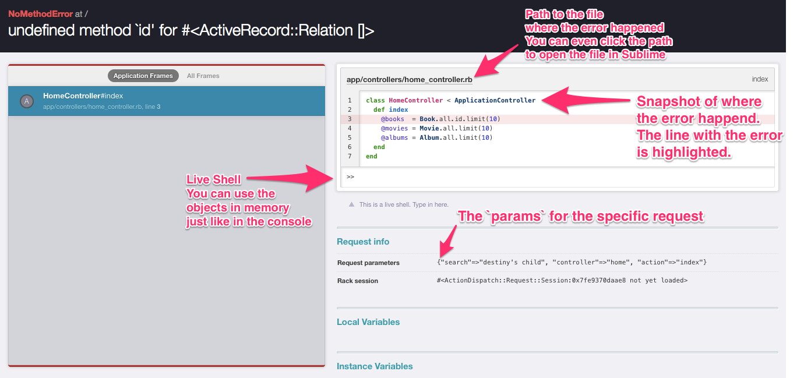
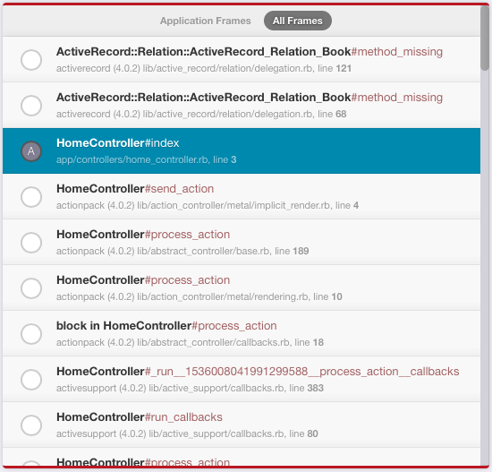
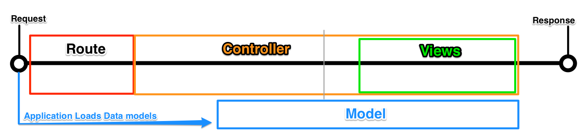

# Rails Debugging
## Learning Goals
- Practice tracking and identifying the _state_ of a Rails application at any point
- Practice with a _better errors_, a debugging tool to help us understand _state_
- Better understand the _scope_ of variables, instances, and requests in a Rails application


## Better Errors
Let's start by adding a tool generate better error pages. The [Better Errors](https://github.com/charliesome/better_errors) gem will change the Rails error page to be much more descriptive and add a "live shell" we can use to interact with objects in memory and scope at the time of the error.

To add this functionality, we need to modify the `Gemfile`:

```ruby
#Gemfile
group :development do
  gem "better_errors"
  gem "binding_of_caller"
end
```

The `binding_of_caller` gem is optional, but it enables some of the more advanced features of `better_errors`. They work great together.

__NOTE: ALWAYS wrap this gem in the development group, if the gem is available in your production environment you will open major security holes within your application.__

Now, when our application experiences an error we will see an error message like this:



There are a lot of helpful tools here, but the main features are:

1. The clickable path to the file where the error occurred.
2. Snapshot of the code, with the error line highlighted
3. A "live shell" which mimics your rails console, but it will have all of the current variables with their current values assigned
4. Request information, such as `params`

__Note:__ Better Errors will trigger for every error. We can leverage this fact by purposefully inducing an error in our code using `raise`. This is sneaky and awesome.

## Reading a `stack trace`
Clicking on the `All Frames` link within `bettor_errors` we can see a _stack_ of different classes, methods, and files.



Ruby code works by calling a series of methods.  Each time a method is called, ruby adds the file and line that called the method to a history. A _stack trace_ shows us this history of methods. A _stack trace_ is composed of _stack frames_, with each _stack frame_ indicating a call. The deepest frames  -- those called last before the error -- are the frames at the top. The _stack trace_ is the same thing we see in our console, development logs, or regular rails error page with ruby. Learning to read it can be difficult, but it can be very useful.

If we take a look at the _stack trace_ above we will see the error we encountered. We can skip the first two lines because we didn't write that code. These were added *after* the error occurred, as the app was trying to figure out if it could rescue itself. The third line, highlighted, is where our error actually happened. Below that third line is the history of files, classes and methods leading up to the error.

Only a few times in my career has the error been the fault of code I didn't write, like a bug in Rails or similar. In almost every case, I broke it. When reading a _stack trace_, start at the top and go down until you find a reference to some code that _you_ wrote and begin your debugging/research there.

## Debugging _state_

At any given moment running code has some definite _state_. If we were to stop code in it's tracks, there would be available variables that have some value, as well as the current object in memory, i.e. `self`. Learning to figure out what the exact _state_ of the application is when an error occurs is the best way to solve the problem and fix the error. We've seen a few debugging techniques to determine the state of an application at a certain point in the code, using `raise`, `puts`, and `inspect`.

`better_errors` provides a very powerful tool to help with this during an error. Using the _live shell_ we can type into this console to interact, query, and inspect all of the variables, objects, and methods available at the state when the error happened.

### Differentiating Rails Components

In the rails request cycle, we jump through some major components, routes, controllers, views, and models. Each of these components can be visualized along the timeline of the request cycle like this:



We can define a couple rules based on this representation for how the state should act.

1. Instance Variables can go from parent to child squares, but they cannot cross between boxes without any overlap
2. The `request` data (`params`, `session`, `request`) is available within "Controllers" and it's children.
3. Controller methods (`render`, `redirect_to`, and any custom methods) are only available within "Controllers", and not any of it's children.
4. _View helpers_ (`link_to`, `image_tag`, `form_for`, etc.) are available only to "Views".

## Identifying state
Given these tools and facts we can determine:

1. What the current value of `self` is and the current scope.
2. Which variables are available, and what their current values are.
3. Where the application has previously run.
4. What data exists in the _request_.
5. Test data and methods on the current state.

Determine and give an example of the 5 ideas listed above for the error raised in the following code on line 6:

```ruby
class HomeController < ApplicationController
  def index
    @books  = Book.limit(10)
    @movies = Movie.limit(10)
    @albums = Album.limit(10)
    raise "Stop the code here!"
  end
end
```
