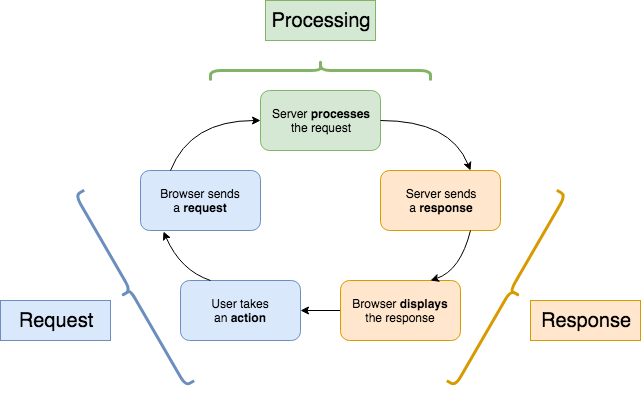

# Requests and Responses: HTTP Verbs, CRUD, and Status Codes
## Learning Goals

- Learn about the different kinds of HTTP requests (the HTTP _verbs_)
- Discuss the situations for which each _verb_ is suited
- Explore how the acronym _CRUD_ (<b>C</b>reate <b>R</b>ead <b>U</b>pdate and <b>D</b>elete) relates to both making interactive web applications and HTTP _verbs_.
- Return a status code from a Rails application

## Introduction

One of the most important ideas in web development is the _request-response cycle_:

1. **User** (a human) takes some action in the browser (click a link, submit a form) to begin the cycle
1. **Client** (the browser) makes a _request_ to the server
1. **Server** (Rails) receives the request and processes it
1. **Server** sends a _response_ for the request to the client
1. **Client** receives the response and displays it to the user (rendering the page)
1. **User** takes another action, and the cycle begins anew

We can shorten this to 3 major steps:
1. Request
1. Processing
1. Response


<!-- https://www.draw.io/#G17ynKwAoksm5XSU5tqEsDiGuMz_UwZByl -->

In our Rails unit we will mostly be focused on the processing step, but it is important to understand the context in which it occurs. This step is also the main difference between the static _websites_ we built previously and the dynamic _web applications_ we will now build - with a static site, there's no processing.

In this lesson, we'll dive deeper into each of these three steps.

## Request

The first part of the request-response cycle is the request. A request is made by the browser to the Rails server. Here is an example of a real-life request:

```
GET /books HTTP/1.1
User-Agent: curl/7.30.0
Host: localhost:3000
Content-Length: 6
Accept: */*
```

This is the literal text that is sent over the internet by the browser. There are two components of the request that are important to us right now:
- `GET`, an HTTP verb
- `/books`, path

There's a bunch of other stuff in there too, but we won't be worrying about that for a while (if at all).

### Verbs and Paths

The _verb_ tells the server what sort of thing the client wants to do. There are a bunch of verbs, but the most common are:

Verb             | Meaning
---              | ---
`GET`            | Send me some data
`POST`           | Here is some data, please save it
`PATCH` or `PUT` | Make a change to existing data
`DELETE`         | Remove data

There's quite a few default _verbs_ in the HTTP spec, though we (Ruby/Rails devs) mostly just use `GET`, `POST`, `PUT` (and `PATCH`), and `DELETE`.

The _path_ tells the server what resource the client is interested in. In our example above this is the list of books at `/books`. Later we'll see it looking at individual books via the path `/books/3` (where 3 is the ID of the book in question).

A request may also contain a _payload_, like the data submitted through a form. We'll talk about this more later in the week.

## Processing

Once the request has been sent to the server, the server must do some work before it sends back a response. This is where the MVC architecture of Rails comes into play.

Most often the processing step involves doing some action to the data stored in our database. Those actions are to:
- **Create** new data
- **Read** existing data
- **Update** existing data
- **Delete** existing data

You'll hear this set of actions referred to as **CRUD**.


### CRUD and HTTP verbs

When creating these CRUD actions for our web application, we can use the **HTTP Verb** in our request to make decisions about what action we want to take.

In the table below, you can see the starter mapping between the HTTP Verb and the CRUD Action.

| HTTP Verb | CRUD Action |
|-----------|-------------|
| `GET`     | Read        |
| `POST`    | Create      |
| `PATCH` or `PUT` | Update|
| `DELETE`  | Delete      |

By specifying the appropriate HTTP Verb, we will give our web application the information it needs to construct the appropriate response. If we send a `GET` request, our web application should understand that we don't want to _change_ anything in our data, we just want to _read_ it.

So what is the difference between HTTP verbs and CRUD actions?
- HTTP verbs are part of the HTML standard - they are codes that the browser will send us to indicate intent
- CRUD actions are English descriptions of what our server should do when it gets a request

In short, Rails' job is to translate an HTTP verb into a CRUD action.

## Response

Once the server has finished processing a request, it must send back a response. This lets the client know that the work is done, and gives them any information they requested.

Here is the response for the request we saw earlier:

```
HTTP/1.1 200 OK
Content-Type: text/html
Server: WEBrick/1.3.1 (Ruby/2.1.2/2014-05-08)
Date: Mon, 22 Sep 2014 19:19:57 GMT
Content-Length: 21
Connection: Keep-Alive

# then a bunch of HTML
```

There are two important things here. At the top we see the _status code_, in this case `200 OK`. A 200 response indicates that the server was able to process the request without any problems.

We also see "a bunch of HTML", more formally referred to as a _payload_. This is the HTML generated by the view. The payload is optional, and is usually only included in the response to a GET request.

Again, we can see there's a bunch of other HTTP stuff in there that we're ignoring for right now.

### Status Codes

Status codes are an important part of the HTTP protocol - they let the client know how things went. Every response must have a status code attached.

Each status code is a 3-digit number paired with an English word or phrase. The first digit of the number indicates what sort of status it is, and the last two tell the details. It's sort of like how the first two digits of a room number are the floor that room is on.

Here are some common status codes:

Code    | Text             | Meaning
---     | ---              | ---
**2XX** | **Success**      |
200     | OK               | Standard success response, typically has an HTML payload (common for `GET` requests)
201     | Created          | We made a new resource for you (common for `POST` requests)
204     | No Content       | We did what you asked and it went fine, but there's no HTML to give you (common for `DELETE` requests)
**3XX** | **Redirection**  |
302     | Found            | Go look at this other URL
**4XX** | **Client Error** |
400     | Bad Request      | The data you sent doesn't make sense
401     | Unauthorized     | You need to log in to do that
403     | Forbidden        | The person you're logged in as doesn't have permission to do that
404     | Not Found        | The resource you requested doesn't exist
**5XX** | **Server Error** |
500     | Internal Server Error | There's a bug in this Rails project. As engineers, we see this one a lot!

So far, we've let Rails handle sending the response for us, and by default Rails will send back a `200 OK` status code along with the HTML from the view. If we want to send something different, we have to say so explicitly.

**Question:** Which part of Rails should be responsible for setting the status code of a response?

There are a few ways to send back a status code from the controller, but here is one:

```ruby
head :not_found
```

When added to a controller action, the `head` method indicates that only HTTP headers should be sent back (i.e. no payload). The only argument, the symbol `:not_found`, is the text-version of the status code to use (404).

Typically you would do this inside of a conditional:

```ruby
def show
  book_id = params[:id]
  @book = BOOKS[book_id]
  if @book.nil?
    head :not_found
  end
end
```

In this code, if the book we're looking for isn't in the list, then we will return status code 404. If the book is in the list then we won't enter the conditional, and Rails will do its default operation: render the `show` view and send back the result with a 200 status.

## Summary

The request-response cycle is one of the key concepts in web development. The three main pieces of the cycle are:

- Client / browser makes a request
  - HTTP verb, path, optional payload
- Server processes the request
  - This is where MVC happens
- Server sends a response
  - HTTP status code, optional payload

## Additional Resources

- [Description of the various HTTP verbs](http://www.restapitutorial.com/lessons/httpmethods.html)
- [Difference between HTTP verbs and CRUD](http://softwareengineering.stackexchange.com/questions/120716/difference-between-rest-and-crud)
- [HTTP Status Dogs](https://httpstatusdogs.com/)
- [HTTP Basics](https://www.ntu.edu.sg/home/ehchua/programming/webprogramming/HTTP_Basics.html)
