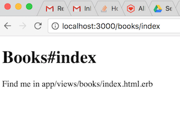

# Routes and Controllers
## Learning Goals
- Refresh on the http request cycle
- Discuss how a request makes it way through a Rails application
- Dissect the _routes file_ and learn how to define routes
- Explore the role of _controllers_ in a Rails application
- Create a basic controller using the Rails generate command

## HTTP Request
HTTP is the language of the internet. Browsers send HTTP requests to our servers. Here's a simplified HTTP request:

    GET /books HTTP/1.1
    Host: adadevelopersacademy.org
    User-Agent: Web-sniffer/1.0.46 (+http://web-sniffer.net/)
    Referer: http://web-sniffer.net/

The two most important parts of this request are:

- `GET`, which is the _request method_. As we have seen, the most common request methods are `get`, `post`, `put`, `patch`, and `delete`.
- `/books`, which is the _path_.

In a Rails app when a request comes in for a specific _path_ the Rails router	matches it with a controller and passes the request to the appropriate method in that controller.   


## Anatomy of `routes.rb`
The combination of _request method_ and _path_ comprise the first half of a Rails _route_. The second half is the route _action_, the Ruby class and method that will handle the incoming request.

_Routes_ are analogous to an old-timey telephone switch board. When Rails receives a new HTTP request, the _routes_ connect the request data to the correct _controller action_.

We define routes in our `config/routes.rb` file, which is generated when we run the `rails new` command.

```ruby
Rails.application.routes.draw do
  # method path => action
  get "/books", to: "books#index"
end
```

Let's break down this code:

- `Rails.application.routes.draw do`: This method's responsibility is knowing about all the _routes_ to which the application can respond.
- The **route definition**:
  - **request method**: `get` in this example
  - **path**: what will be matched with the URL in the HTTP request, `"/books"` in this example
  - **controller and action**: defining the controller and action, split by the `#`. `"books#index"` in this case this would point to the `index` method in the `BooksController` class.

### Naming Routes

A `routes.rb` file which lists all the CRUD operations would look like this:

```ruby
# config/routes.rb
Rails.application.routes.draw do

  get "/books/new", to: "books#new", as: "new_book"
  post "/books", to: "books#create", as: "books"

  get '/books/:id/edit', to: 'books#edit', as: "edit_book"

  get "/books/:id", to: "books#show", as: "book"

  patch '/books/:id', to: 'books#update'

  get "/books", to: "books#index"

  delete "/books/:id", to: "books#destroy"
end
```

You may be saying, "Wait what's that `as: <STUFF>` part?"  This allows us to name a path.  It's very helpful to give each path for a resource, like books, a name.  The name can then be used later in your code to link actions together without having to give a hardcoded path like `'/books/new'` each time.  That way if we change a path, we only have to edit the `routes.rb` file instead of each line in our code where we use the route.  So `edit_book` is the name of the `/books/:id/edit` path.  

You will see how these named paths are used when we delve into view helpers.

You can always view the routes in your application by typing `rails routes` in the terminal.  Given the `routes.rb` file above, typing `rails routes` will result in the following:

```bash
$ rails routes
        Prefix Verb   URI Pattern               Controller#Action
      new_book GET    /books/new(.:format)      books#new
         books POST   /books(.:format)          books#create
     edit_book GET    /books/:id/edit(.:format) books#edit
               PATCH    /books/:id(.:format)    books#update
               GET    /books(.:format)          books#index
          book GET    /books/:id(.:format)      books#show
   delete_book DELETE /books/:id(.:format)      books#destroy
```

Notice that the name of each route is listed in the `Prefix` column.  Using the `rails routes` command allows you to quickly verify your routes and check the `routes.rb` file for errors.  


### Custom Path Names

We can use anything for a path name.  We could for example use:  `get "/books/:id", to: "books#show", as: "banana"`, if we wanted to have a path named `banana`.  That would not be a good name for a path, but it would function.  Rails convention suggests we name such a path `book`, but nothing stops us from using another name.  

So for example for:

-  route:  `get "/books/:id", to: "books#show", as: "banana"`
	-  Prefix: `banana`
	-  Path Helper: `banana_path`.  

Additionally any route beyond the standard set of CRUD routes should be named descriptively.  

For example a path to mark a book as read could be:

```ruby
patch '/user/:user_id/books/:id', to: 'books#mark_read', as: 'mark_read'
```

Below is a table with example routes, prefixes and paths.  

|   Route	|   Prefix	|   Path Helper	|	Example  |
|---	|---	|---	|---	|
|   `get "/books/new", to: "books#new", as: "new_book"`	|   `new_book`	|   `new_book_path`	|	`<%= link_to "New book", new_book_path %>`
|   `get "/books/:id/edit", to: "books#edit", as: "edit_book"`	|   `edit_book`	|   `edit_book_path`	|  `<%= button_to "Edit #{book.title}", edit_book_path(book.id) %>`	|
|   `post "/books", to: "books#create"`, as: 'books'	|   `books`	|   `books_path`	| `<%= form_for @book, action: books_path, method: :post %>`	|
|   `get "/books", to: "books#index"`	|   `books`	|   `books_path`	| `<%= link_to "All Books", books_path %>`  |
|	`get "/books/:id", to: "books#show", as: "book"` | 	`book`  |	`book_path`  |	`<%= link_to "View #{book.title}", book_path(book.id) %>`	|
|	`patch "/books/:id", to: "books#update"` | 	`book`  |	`book_path`  |	`<%= form_for @book, action: book_path(@book.id), method: :patch %>`  |
|	`delete "/books/:id", to: "books#destroy"` | 	`book`  |	`book_path`  |	`<%= link_to "Delete", book_path(book.id) %>`  |


Notice that the `update`, `show` & `destroy` actions both use the `book_path`.  The path helpers are identical because the routes all include `/books/:id`.  

### Order Matters

It's also important to note that the Router selects the first route that matches the request.  So if you swapped `get "/books/new", to: "books#new", as: "new_book"` with `get "/books/:id", to: "books#show", as: "book"` then when a GET request came in for `/books/new` the router would match it to the `books#show` action because the `:id` placeholder can match any value, not just an ID number.  

Because of this it's important to list your routes from most specific to least specific.

## Setting Up a Controller
Before we go further lets set up our own Controller class.  A Rails Controller is the central manager of a Rails application.  It takes requests from the web server, pulls information from data models and makes decisions.  It then hands information to the views for rendering the data back to the user.  Below we will setup a Controller to list a set of book titles.

Rails can go ahead and create a Controller and View for us with the following commands.

```bash
bin/rails generate controller Books index
```

This command has Rails generate a Controller and Views for the /books path, so when you bring up http://localhost:3000/books you will get the following HTML file.  



### The Controller Class

Rails places controller classes in the `app/controllers` folder.  In the case of the Controller we just generated it will be in the `books_controller.rb` class.

Opening the Controller file you will find the code below:

```ruby
class BooksController < ApplicationController
  def index
  end
end
```
Notice that the `BooksController` class inherits from the `ApplicationController` class in the Rails library.  For the `books/index` path we can handle it with the index method in the controller.  After the logic is finished in the controller method control is passed to a layout and view for rendering the content back to the user.  

In the following notes we will look at layouts and views and look at how to render our content in the browser.  For now lets modify the `index` method to add an instance variable for use in the view.

```ruby
  def index
    @books = [{ title: "Hidden Figures", author: "Margot Lee Shetterly"},
              { title: "Practical Object-Oriented Design in Ruby", author: "Sandi Metz"},
              { title: "Kindred", author: "Octavia E. Butler"}]
  end
```
