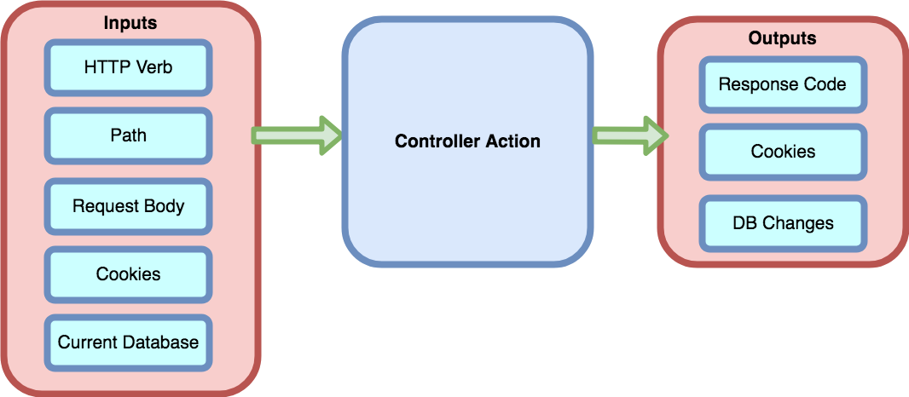

# Integration Testing

## Learning Goals
By the end of this lesson, students should be able to...

- Differentiate between _integration_ tests and _unit_ tests
- Describe the role of integration tests in Rails
- Enumerate the inputs and outputs of a controller action

## Introduction
**Integration testing** is a kind of testing that is distinct from _unit testing_, which is what we've used primarily until now. While unit tests focus on a very specific piece of code, usually a single method, integration tests are about testing how multiple units work together to produce larger-scale program behavior.

### Example
|  Test Type  | Test | Scope of the test |
|:------------|:-----|:------------------|
| Unit        | Verify that a `Book` model's `valid?` method returns `false` when its `title` attribute is blank. | The test checks the behavior of a single method within a single class. |
| Integration | Verify that filling out a form to create a new book and leaving the title field empty does not create a new `Book` in the database. | The test checks how the `valid?` method combines with the database persistence code, the routes configuration, and the controller code. |

## Integration Testing in Rails
All of our model tests, as well as all of the tests we wrote before Rails, are unit tests. On the other hand, all of our controller tests will be integration tests.

This is a natural dichotomy because controllers, when following the "heavy model, light controller" approach, are mostly "glue" between models and views. If you try to strip them of their entire context, as you should with a unit test, there's not much to test.

So instead we create integration tests which _use_ the controller actions we've defined, but also involve testing additional code from the models and routes.

## Controller Inputs & Outputs
What information does a controller depend on?  The browser makes a request to Rails with the following items:

-   An HTTP Verb & Path (the route)
-   The request body, including any form values
-   Cookie settings (session, to be discussed later)

The Rails router takes these inputs and forwards them to a matching controller (if any).

The Rails server uses these inputs and **the current state of the database** to perform it's task.

The controller will then run and provide the following outputs:

- An HTTP Response code such as 200 OK, 404 Not Found, redirect, etc
- Cookie settings (session & flash)
- Changes to the database

<!-- Image source:  https://www.draw.io/#G1eHnA4Fko9GRA8wi5fwHs66UKKJv-C_Gz -->

When we test the controller we will provide the given inputs and verify that controller responds with the correct response code, cookie settings and database changes.

Exactly what's worth testing depends on your site, but here are some general guidelines.
- If your controller action reads a Model ID from the URL, you need at least 2 cases:
  - The ID corresponds to a model in the DB
  - The ID is not found in the DB
- If your controller action reads form data and creates a model object, you need at least 2 cases:
  - The data was valid
  - The data was bad and validations failed
- If your controller action reads something like a user ID from the session (we'll talk about this soon), you need 2 or more cases:
  - Someone is logged in
  - No one is logged in
  - If the action touches a Model that belongs to a user, then you also need to test when the wrong user is logged in

That's not an exhaustive list, but it's a good starting point.

In general, controller tests should operate at a higher level than Model tests. For example, in Model testing you need 2 or more test cases for every validation.  When testing the corresponding Controller you only need to test the case where all validations pass, and the case where one or more fail, since those are the two different behaviors your Controller action can exhibit. You do, however, need to test those cases for both the `create` and `update` actions.

## Summary

- Unit tests exercise a small part of the application in isolation
- Integration tests exercise the application as a whole, simulating realistic user workflows
- In Rails, controller testing is integration testing
    - Inputs include HTTP verb and path, the request body, cookies, and the state of the database
    - Outputs include HTTP status code, cookies, and changes to the database

## Additional Resources

- [What is integration testing](https://searchsoftwarequality.techtarget.com/definition/integration-testing)
- [Martin Fowler on integration testing](https://martinfowler.com/bliki/IntegrationTest.html)
