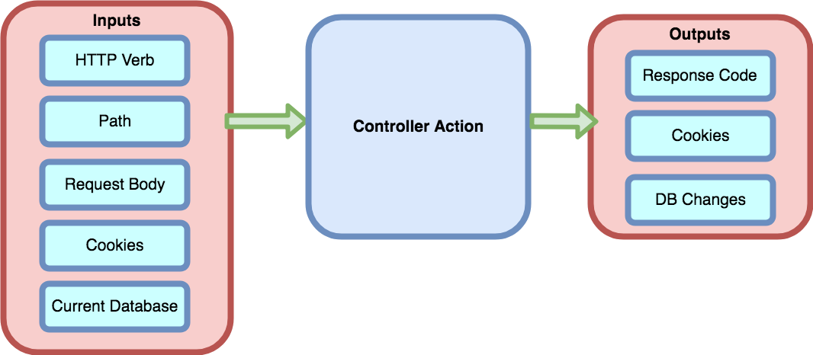

# Testing Controllers Revisited

## Learning Goals

By the end of this lesson, students should be able to...

- Understand that controller tests are an example of integration tests
- Differentiate between integration tests and unit tests
- Describe the role of integration tests in Rails
- Enumerate different expected tests for common controller logic

## Recontextualize: What is Controller Testing?

[When we introduced controller testing](intro-to-testing-controllers.md), we established the following things:

When a browser makes a request, the request sends the following information:

- An HTTP Verb & Path (the route)
- The request body, including any form values
- Cookie settings (session, to be discussed later)

The Rails server uses these inputs and **the current state of the database** to perform its task.

The controller will then run and provide a combination of the following outputs:

- An HTTP Response code such as 200 OK, 404 Not Found, redirect, etc
- Cookie settings (session & flash)
- Changes to the database



<!-- Image source:  https://www.draw.io/#G1eHnA4Fko9GRA8wi5fwHs66UKKJv-C_Gz -->

When we test the controller we will provide the given inputs and verify that controller responds with the correct response code, cookie settings and database changes.

However, in some ways, these tests should have felt different compared to the other kinds of testing we've done. They were tests at a "high-level," meaning that we thought about the high-level flow at the app. We did not test certain details, like what was on the views or model logic or model validations.

That's because _controller tests aren't unit tests._

### Controller Tests are examples of Integration Tests

**Integration testing** is a kind of testing that is distinct from _unit testing_, which is what we've used primarily until now. While unit tests focus on a very specific piece of code, usually a single method, integration tests are about testing how multiple units work together to produce larger-scale program behavior.

Because our ways to test controller action validity requires us to test how the entire Rails system gels together (we send a request, which goes to our router, which leads to the controller, which touches other parts of the app), _controller tests are examples of integration tests_.

|  Test Type  | Test | Scope of the test |
|:------------|:-----|:------------------|
| Unit        | Verify that a `Book` model's `valid?` method returns `false` when its `title` attribute is blank. | The test checks the behavior of a single method within a single class. |
| Integration | Verify that filling out a form to create a new book and leaving the title field empty does not create a new `Book` in the database. | The test checks how the `valid?` method combines with the database persistence code, the routes configuration, and the controller code. |

Unit tests, in comparison, test methods in isolation. Edge cases of unit tests involve different forms of input, but the tests overall are still in isolation. Our _model tests are unit tests_.

Our controller tests _use_ the controller actions we've defined, but also involve testing additional code from the models and routes. Therefore, they are not unit tests, but integration tests.

## The Mega Controller Testing Summary

### Summary: The Components of a Controller Test

Examine the example tests below:

```ruby
let(:existing_work) { works(:album) }

describe "show" do
  it "succeeds for an extant work ID" do
    get work_path(existing_work.id)

    must_respond_with :success
  end

  it "renders 404 not_found for a bogus work ID" do
    destroyed_id = existing_work.id
    existing_work.destroy

    get work_path(destroyed_id)

    must_respond_with :not_found
  end
end
```

The tests have:
- arranged all of the set up:
  - It uses a fixture named `album` in `works.yml`
  - It sets it to a local variable in this test using `let(:existing_work) { works(:album) }`
- an _act_ step that sends a request: `get work_path(existing_work.id)`
- an _assert_ step that checks the response with `must_respond_with`

Examine the example test below:

```ruby
describe "create" do
  it "creates a work with valid data for a real category" do
    new_work = { work: { title: "Dirty Computer", category: "album" } }

    expect {
      post works_path, params: new_work
    }.must_change "Work.count", 1

    new_work = Work.find_by(title: "Dirty Computer")

    new_work.wont_be_nil

    must_respond_with :redirect
    must_redirect_to work_path(new_work.id)
  end
end
```

The tests have:
- arranged all of the set up:
  - uses a local variable `new_work` that mimics the form data structure that our form sends
- an _act_ step that sends a request, sending the form data into the request with `params`: `post works_path, params: new_work`
- an _assert_ step that checks the response with:
  - checking different aspects of the database:
    - the number of `Work`s in the database with `expect { ... }.must_change "Work.count", 1`
    - the work by the new attributes won't be `nil` (it is found in the database)
  - checking for the right response code with `must_respond_with`
  - checking for a redirect if there is a redirect with `must_redirect_to`

**Note:** We do _not_ test details such as if the created work is valid, or if the form data is valid. Those details are reserved for model tests/unit tests.

### How do I think of test cases for...

#### CRUD

- You should have controller tests for every CRUD operation that exists per controller:
  - Create
    - What should happen if the controller executes creation of something with valid data?
    - ... with invalid data?
  - Read (Show)
    - What should happen if the controller tries to read/show an ID of a model that exists in the DB?
    - ... that doesn't exist in the DB?
  - Update
    - What should happen if the controller executes an update of something with valid data?
    - ... with invalid data?
  - Delete
    - What should happen if the controller tries to delete an ID of a model that exists in the DB?
    - ... that doesn't exist in the DB?

#### Other Pieces of Controller Logic

- Every controller action that has rendering, routing, or HTTP status logic should be tested on those qualities
- Every controller action that updates a model record should be tested on the updated attributes

- Every piece of custom controller logic and custom routes (not private) should have tests:
  - Remember to think about nominal cases and edge cases

#### Authentication & Authorization

- Every controller action that has logic requirements around logged-in status should be tested. You should...
  - test for expected behavior for if a user is logged in
  - test for expected behavior for if **no user** is logged in at all
- Every controller action that has logic requirements around authorizing specific types of users should be tested. You should...
  - test for expected behavior for if an **authorized user** is logged in
  - test for expected behavior for if an **unauthorized user** is logged in

Examine the example tests below:

```ruby
describe "going to the detail page of the current user" do
    it "responds with success if a user is logged in" do
      perform_login

      get current_user_path

      must_respond_with :success
    end

    it "responds with a redirect if no user is logged in" do
      get current_user_path
      must_respond_with :redirect
    end
  end
end
```

These tests have:
- arranged the necessary setup steps to log in a user:
  - it does a valid login with the request `post login_path, params: login_data`
  - it organizes this into a helper method named `perform_login` and calls that method
- an _act_ step that sends a request: `get work_path(existing_work.id)`
- an _assert_ step that checks the response with `must_respond_with`

The implementation details of what the `perform_login` method looks like depending on if you are mocking OAuth or not.

**If the site uses OAuth, you will need to set up these tests to enable OAuth by _mocking_ OAuth**


## Summary