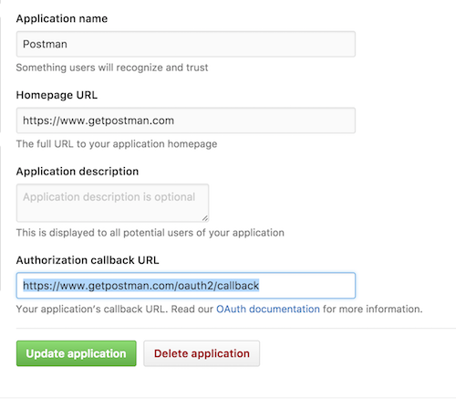
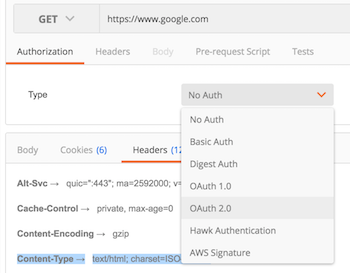
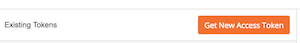
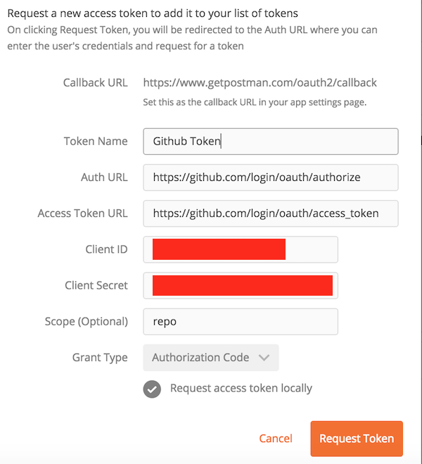
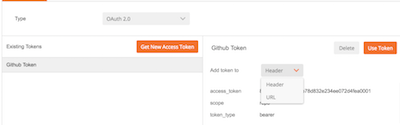
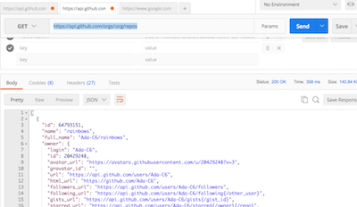
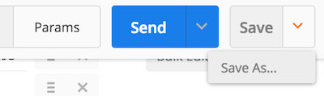

# API Tools - Authentication

## Learning Goals
-  Practice logging into an API with Postman
-  Use OAuth Logins with Postman

## The Github API

Github has a robust series of [APIs](https://developer.github.com/v3/) to enable users to get a rich variety of information and make changes to repositories, and more.  

We will set up a sample request to see the repositories of the Ada-Gold organization.  

1.  In Github [register a new OAuth Application](https://github.com/settings/developers) and save the client_id and secret.  
	- The Homepage URL:  [https://www.getpostman.com](https://www.getpostman.com)  
	- The Authorization Callback URL:  [https://www.getpostman.com/oauth2/callback](https://www.getpostman.com/oauth2/callback)
	- By doing this we will create an OAuth token for Postman to log into Github without using our username/password.  

    

1.  Then in Postman go to Authorization (under the URL line) and select OAuth 2.0.  

     
1.  Click on `Get New Access Token`   
      
1.  Then fill in the form with:
	- Auth URL:  **https://github.com/login/oauth/authorize**
	- Access Token URL:  **https://github.com/login/oauth/access_token**
	- Client ID:  **Your Client ID**
	- Client Secret:  **Your Client Secret**
	- Scope:  **repo**
		- Github grants different levels of access depending on the scope variable.  You can read more about it [here](https://developer.github.com/v3/oauth/#scopes).
	- Grant Type:  **Authorization Code**  
  
1.  Then Choose to add the token you have created into the header.
	- Now you have set up Postman to log in with your Github account via OAuth.  
  
1.  Next enter:  `https://api.github.com/orgs/:org/repos` into the URL bar.
	- `:org` just like in Rails is a placeholder or variable which we can fill in with any value we like.
1.  Click on Params and add a parameter for `:org` as Ada-Gold
1.  Then click send and look at the results:  
  

Congratulations you've made your first Postman API call to Github.  Note that the Content type is `application/json; charset=utf-8` and that the result looks like a Ruby Hash.  One of the key uses of APIs is to retrieve data from remote servers.  JSON is a modern format to transfer information over a web API.  

Using an API like Github's you can write a program to dynamically pull 3rd party information or make changes on another platform.  In this instance with the correct API call you could create or delete repositories, add or remove members to teams etc.   

##### Saving the Request

We can save or bookmark our API call by clicking on the save-as button and save the request into a folder on the left sidebar.  
  

##### Going Further:  

Take a look at the [Github API Documentation](https://developer.github.com/v3/) and see if you can make another API call.

##### Note:  Testing

You can write your own [automated tests with Postman](https://www.getpostman.com/docs/writing_tests) to test APIs that you right or verify assumptions you have about APIs that you use.  

## Resources
- [TutorialsPoint curl docs](https://www.tutorialspoint.com/unix_commands/curl.htm)  
- [Sending Requests with Postman](https://www.getpostman.com/docs/requests)
- [Github API](https://developer.github.com/v3/)
