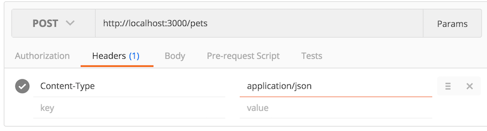
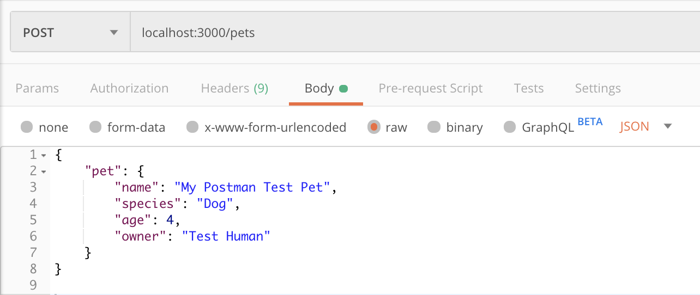

# Creating an API

## Learning Goals
Students should be able to...

- Compare and contrast web applications and APIs
- Develop a Rails API to provide CRUD functionality
- Use HTTP status codes to communicate outcomes

### Introduction
Last week, we learned about using APIs that already exist. Now, our goal is to create APIs ourselves.

When creating an API, usually the goal is to provide data to a consumer, whether that be a human (not normally) or another system (usually). This could be a mobile app, a single-page application written in JavaScript, or something else entirely.

#### Vocabulary
| Word | Definition | Example
|------|------------|--------
| Resource | Some piece of data we want to share with the world | A single pet, the list of all pets
| Endpoint | A unique URL + HTTP verb that provides access to some resource | `GET /pets/7`
| Client   | Who- or whatever is consuming our API | A mobile app

### APIs vs Web Apps
When we think about using an API vs using a web application, what is the key difference?

- Web apps produce **HTML** for humans to consume
- APIs produce **JSON** for machines to consume

What are some of the key similarities? They both use **routes** to provide structure, and there is also some sort of **data** involved. Many APIs (including the one we'll build today) provide some sort of CRUD functionality, and our RESTful design principals and general Rails knowledge will continue to serve us well.

### Create an API

Let's build a small Rails app that will act as an API for providing data about our amazing, adorable pets to other applications. The app will have the following routes:

- `GET /pets` show all pets
- `GET /pets/:id` shows a pet with the provided id
- `POST /pets` add a pet to the collection

Given the context of our application, we should have a model and controller that reference our main resource, pets. Once you clone this repo, you'll notice that we have these things already created for you!

[https://github.com/AdaGold/ada-pets](https://github.com/AdaGold/ada-pets)

To make it go:

```bash
$ git clone git@github.com:AdaGold/ada-pets.git
$ cd ada-pets
$ bundle install
$ rails db:migrate
$ rails server
```

Once you've downloaded it, take a few minutes to go through this Rails app with the person next to you.

- What components does the project have?
- What steps would you perform to set up a project like this from scratch?

## Listing Pets
We are going to approach this application creation from a TDD approach. Right now, you'll see that we have a few tests already created for you. You can run the tests using the usual `rails test`.

You'll notice that we have one basic get route created for pets, and one basic controller action that corresponds with that route.

The error below is where we diverge from our "normal" rails approach. Normally, we'd create a view that would correspond with our controller action.  The error should be something like:

```bash
Missing a template for this request format and variant.
```

Since we are building a JSON API, we don't want to render an HTML template (or really use any of the view layer). Instead we want to return the requested data in a standard format. Using the `render` method in the controller with some new options, we can choose to return json:

```ruby
# pets_controller.rb
def index
  render json: { ready_for_lunch: "yassss" }
end
```

Notice that we didn't for realsies write any JSON. We provided a plain Ruby hash and let Rails do the conversion for us (with the `render json:` call.

When we run `rails test` again we see that our test is expecting an `Array` rather than a Ruby `Hash` which is what our controller method passes in the render call.

To create the appropriate data and ensure we send back an array, we could do something like:

```ruby
# pets_controller.rb
def index
  pets = Pet.all
  render json: pets
end
```

Note that we have removed the `@pets` instance variable here that we are normally used to creating. Why do you think we've done that?

Now run your tests and examine the next error. What is the test expecting that your code isn't handling?

### Filtering Fields
You won't always want to send _everything_ in your database to the user. Databases often contain sensitive data that should be treated judiciously. Or, that data might just not be relevant, like `created_at` or `updated_at`. Right now Rails is sending all these fields back in the JSON response.

To filter what Rails sends back, you can use the `as_json` method as follows:

```ruby
# pets_controller.rb
def index
  pets = Pet.all
  render json: pets.as_json(only: [:id, :name, :age, :human])
end
```

Rails is smart enough to know how to use `as_json` for both a Collection and an individual Model, so this same technique will work later when we test and implement `show`. Now, lets run our tests again to see how we're doing!

### Response Codes

We've built a simple API that responds with some data. We could let the consumer of our API parse that data to figure out if their request was successful or if there was an error of some sort, but that seems cumbersome for them. Instead, we should use HTTP status codes to provide a quick and easy way for our API's users to see the status of their request.

To set status code in your controller, you can pass `status` to our render method.

```ruby
def index
  pets = Pet.all
  render json:  pets.as_json(only: [:id, :name, :age, :human]), status: :ok
end
```

Notice in the example above, we've used `:ok` instead of the official numeric value of 200 to inform the consumer that the request was a success. It's good to use the built-in Rails symbols for this, as they're easier to read, but its good to know at least the most common [HTTP status codes](http://billpatrianakos.me/blog/2013/10/13/list-of-rails-status-code-symbols/).

+ 200 - :ok
+ 204 - :no_content
+ 400 - :bad_request
+ 401 - :unauthorized
+ 403 - :forbidden
+ 404 - :not_found
+ 500 - :internal_server_error

## Showing Pet Details
Working with the person next to you, and following the same pattern we used for `index`, implement the `show` endpoint.

Questions to consider:
- How will `show` be different than `index`?
- How will this endpoint be accessed?
  - HTTP verb
  - URI
- What fields should be returned?
- What should the API do if the client asks for a pet that doesn't exist?
  - Status code
  - Response body
- What test cases might be useful for this endpoint?
  - There should be at least one test already in the project but see if you should add more
- How do the two endpoints we've implemented so far compare to similar functionality in a non-API Rails app?

## Creating a New Pet
Now that we can send data via our API, the next step is to consume data sent to us. To demonstrate this, we'll create an endpoint that allows a client to add their own pet to our list.

### Adding a Create Action
Questions:
- What should the URI be for our new endpoint? Why?
- What HTTP verb should it use? Why?
- In a web app, we would need both a `new` action and a `create` action. Do we need both for an API?

For this endpoint, we'll be handling `POST` requests to the `/pets` URI, routing them to `pets#create`. Set up the route and add a stub controller action now, and check your work with `rails routes`.

The `create` action will look very similar to how it would in a web app. Rails provides the data sent by the user via `params`, so we'll pull this data out and use it to create a pet. Remember to use strong params to make sure only the fields you want go through.

```ruby
# app/controllers/pets_controller.rb
def create
  pet = Pet.new(pet_params)
  pet.save!
  render json: { id: pet.id }, status: :ok
end

private
def pet_params
  params.require(:pet).permit(:name, :age, :human)
end
```

As before, the big difference from a web app is in what we send back. While in a web app we would probably redirect the client to the resource they created, that doesn't make sense for an API. Instead, we just send back some JSON containing the ID of the newly created pet as well as the appropriate status code.

### Cross-Site Request Forgery (CSRF)
**ALERT!** Rails is built with CSRF protection which essentially prevents malicious requests. You might remember seeing notes in passing about this in our forms curriculum, where we had to explicitly add an _authenticity token_ to each form.

Since preventing these cross site requests doesn't apply in an API context, we will add a Rails helper method to our controller to allow these `POST` requests to go through:
```ruby
class PetsController < ApplicationController
  protect_from_forgery with: :null_session

  ...
```

You can [read more about CSRF](http://guides.rubyonrails.org/security.html#cross-site-request-forgery-csrf) in the Rails documentation.

### Sending POST Data
While we could use our browser to exercise the `index` and `show` endpoints, sending data to our API is a little trickier. For this, we'll use Postman.

First, the setup. Select `POST` from the list of verbs and type in your endpoint's URI. Then, in the `Headers` tab, add a new key-value pair: `Content-Type` -> `application/json`. Postman should try to autocomplete these fields for you.



Next, the data. Click the `Body` tab, select `raw`, and enter your JSON data in the text area.



Click send, and see what the new pet ID is.

### Handling Errors
So far our pet creation endpoint assumes everything goes swimmingly, but this won't always be the case. For example, our Pet model has some validations - what happens if they fail? What should we send back to the client?

We need to make sure we set an appropriate status code - `:bad_request` will do nicely. It would also be polite to send back some information about what went wrong.

```ruby
def create
  pet = Pet.new(pet_params)
  if pet.save
    render json: { id: pet.id }, status: :ok
  else
    render json: { errors: pet.errors.messages },
      status: :bad_request
  end
end
```

## What Have We Accomplished?
- Build an _API_ - a web server that serves JSON for machines rather than HTML for humans
- Read client data and use it to create a new resource
- Handle errors in a polite and helpful manner

## Resources
- [`.as_json` documentation](http://api.rubyonrails.org/classes/ActiveModel/Serializers/JSON.html#method-i-as_json)
- [ActiveModel Serializers](http://railscasts.com/episodes/409-active-model-serializers)
- [blog post by thoughtbot about serialization](http://robots.thoughtbot.com/better-serialization-less-as-json)
- [Rails API Development Guide](http://edgeguides.rubyonrails.org/api_app.html)
