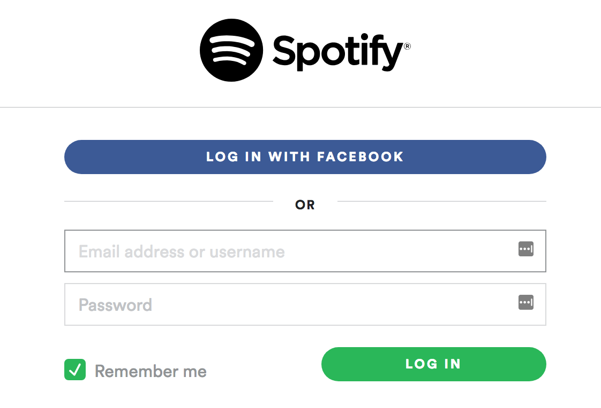

# Introduction to Authentication and OAuth

## Learning Goals

By the end of this lesson, students should be able to answer the following questions or do the following things:

- What is authentication?
- Why is authentication an interesting problem?
- What is _OAuth_, and how do we recognize that we are using an OAuth system as a user?
- Have exposure to OAuth's process and the following vocab:
  - OAuth Provider
  - User
  - Client (as our Rails application)
- What are trade-offs between OAuth and building our own system?

## What is Authentication?

We've learned about creating user login functionality in Rails using Rails' `session` hash.

### Authentication != Authorization

- **Authentication:** Who are you, and how can I trust you?
- **Authorization:** Are you allowed to do that action?

## What is OAuth?

OAuth is an **authentication** framework. OAuth is short for **Open Authentication**, and it is an open standard that describes how users can use one service to log into another.

If you've ever logged into a website using Facebook, you've used OAuth. Using OAuth, a user can securely **authenticate** (log in) to one service like Github, Google or Facebook, and allow a second service, like our Rails App, to access that user's data. 

So users log into one service, and use that account to log into the second service.

### What is OAuth to an end user?

"In product development, an _end user_ is a person who ultimately uses or is intended to ultimately use a product."

If you've ever followed a link to "log in with Facebook" (or Google, Twitter, GitHub, etc) then you've used OAuth.

## OAuth Roles and Vocabulary

In an OAuth application the following entities play roles in the process:

* The **User** is the person using the browser to access the site. Perhaps you.
* The **Client** is an application which wants access to the user's account. For us this means the Rails server that we have built. Note that the Rails _server_ is an OAuth _client_. Out in the wild, this might be something like Spotify.
* The **OAuth Provider** is the service providing OAuth access to the client. For us this means GitHub. It hosts the user accounts and provides information about the user to clients. The most common OAuth Provider is currently Facebook.

## Authentication Process

Before the client site can use OAuth from the provider, the client must be registered with the provider.  This is something you as the engineer will do manually by visiting GitHub's website.  When the client registers, they provide a callback URL, a website (for a web app) and an application name.  In return it receives a **Client ID** and **Client Secret**. You may remember something similar from working with Slack's API. 

The **Client ID** is a publicly available string which identifies the service with the API and the **Client Secret** is kept hidden, like a password and used to authenticate with the service.

### In the Authentication Process:

1. The User clicks on the link to "login with **Github**" on the Client website (our Rails app). The Client application redirects the user to the **Authentication Server** (part of our OAuth Provider, Github).
1. The **Authentication Server** (part of our OAuth Provider, Github) responds by asking the user to grant the client (our Rails app) access to the requested data.  This can be as simple as the user's identity and email, but could include other data.
1. If the user grants access the Authentication Server (part of our OAuth Provider, Github) redirects the user to a specific **callback** address on the client (our Rails App).  This redirect includes an **authorization code** from the Authentication Server (Github).
1. Next the Client (our Rails app) will request an access token from the Authentication Server (Github) using it's **secret key** and **authorization code** to verify it's identity.
1. The Authentication Server (Github) responds with an **access token** to use in this session.

Once this is done the Client (our Rails app) can request information from the OAuth provider with it's **access token**. This might be information such as:

- The user's Alias or Full Name
- The user's Profile Picture
- The user's Email

## After Authentication

After the authentication process completes the client (our Rails app) application has access to the requested data from the user's profile and can then associate that user with an account on the client application (our Rails app).

## OAuth vs. Building Our Own Login System

The alternative to OAuth is building your own system to manage credentials, and having the user log in with a username and password. However, providing a secure way for users to authenticate is complex, difficult and risk-laden. Using OAuth, we can delegate authentication to another service so we can rely on that service's security rather than build and maintain our own.

A big company like Twitter, Facebook or Google, while not immune to being hacked, has a much stronger first line of defense against hackers, and can employ teams of people to monitor the most current security threats. Additionally, a user on those platforms can always revoke permissions from Client programs and websites in the event of a security breach. Finally, if the worst case scenario does come to pass, these larger companies can bear the financial burden of litigation that you or your company may not be able to.

## Trust and Data On the Web
It's important to note that OAuth, while a valuable tool to help developers protect themselves and their clients, does not protect users from themselves.

Cambridge Analytica is an interesting case study. Much of the data that they collected came from users who had used Facebook's OAuth to sign into quiz programs or games, without any idea the degree to which their data could be extracted.

***Just because a source uses OAuth, does not mean that any user should trust them with access to a user's data.***

## Conclusion
OAuth is an industry standard way of keeping our clients information secure, and a trusted method to reduce the liability and workload for developers. Users, Clients and Providers are the core actors in an OAuth interaction, with the Providers verifying the identity of the User for the Client.

## Resources
-  [OAuth2 Overview](https://www.digitalocean.com/community/tutorials/an-introduction-to-OAuth-2)
- [OAuth2 Video](https://youtu.be/CPbvxxslDTU)
