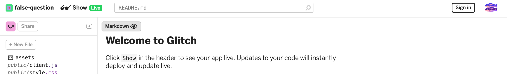
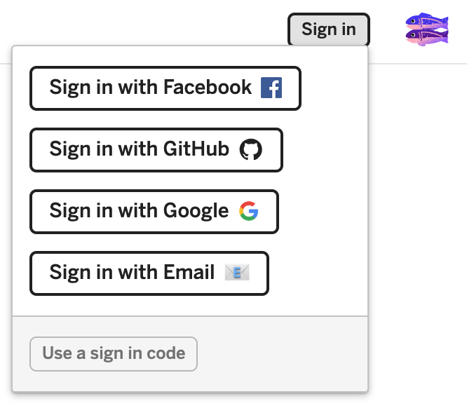
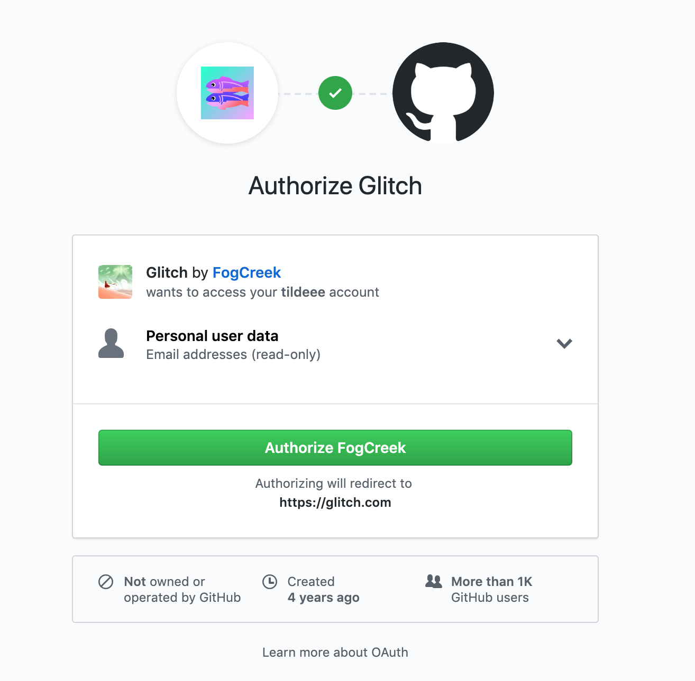
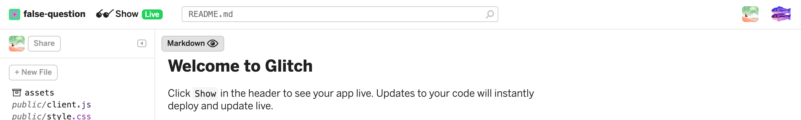
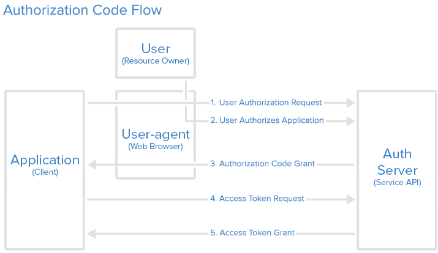

# Introduction to Authentication and OAuth

## Learning Goals

By the end of this lesson, students should be able to answer the following questions:

- What is authentication?
- Why is authentication an interesting problem?
- What is _OAuth_, and how do we recognize that we are using an OAuth system as a user?
- What do the following terms mean in terms of OAuth?
  - OAuth Provider
  - User
  - Client (as our Rails application)
- What are trade-offs between OAuth and building our own system?

## What is Authentication?

Authentication is a process in web apps which verifies that a user is who truly who they say they are. This process usually comes in when we log in to websites.

We've already learned about creating user login functionality in Rails using Rails' `session` hash. This "login functionality" was really just a person declaring they were a certain user by filling out a name in a form.

However, that person could have been lying. Chris could have gone to a website and filled out the name "Dee," even though Dee is not his name. Currently, we don't have a great way to authenticate, or verify, this fake "Dee" user in Rails, because we don't have an authentication process.

In the web, we'll want to augment our login systems so that they can confirm the identity of a user, whether through some evidence or using some system that knows how to authenticate.

### Authentication != Authorization

The words "authentication" and "authorization" are related, and the words are very similar, so we want to clear up this misunderstanding at the start.

| Vocab | What it is | Example in Web apps |
| --- | --- | --- |
| Authentication | a process that asks and answers "Who are you, and how can I trust you?" | If you are the one user claiming to have the name "Ada Lovelace," how does the website know that is true and trust the user?
| Authorization | a process that asks and answers "Are you allowed to do that action?" | Even if you are the one and only Ada Lovelace, should you be on this web page? Should you have permissions to see this information, edit, delete, etc?

These are both processes that deal with users login functionalities. They are both problems and aspects of web development that we will cover in the Ada curriculum. However, today we will focus on authentication only.

## What is OAuth?

[**OAuth**](https://en.wikipedia.org/wiki/OAuth) is an authentication framework. OAuth is short for Open Authentication. It is [an open standard](https://en.wikipedia.org/wiki/Open_standard), and it is a solution beyond one specific technology. It describes how users can log into one service by logging into another service, and allow access.

If you've ever logged into a website using Facebook and given that website permissions to look at your Facebook account, you've used OAuth. Using OAuth, a user can securely **authenticate** (log in) to one service like Github, Google or Facebook, and allow a second service, like our Rails App, to access that user's data.

### What is OAuth to an end user?

"In product development, an _end user_ is a person who ultimately uses or is intended to ultimately use a product."

If you've ever followed a link to "log in with Facebook" (or Google, Twitter, GitHub, etc) then you've used OAuth.

The process of the end user coming across OAuth is usually like this:

1. The user, Dee, is on the website [Glitch.com](https://glitch.com/)
1. Dee needs to sign-in in order to save their project, and clicks the "sign in" button

1. Dee doesn't have an account on Glitch, but sees the "Sign in with GitHub" option

1. Dee clicks on it, and is redirected to a page in GitHub styling and branding that asks them to log in to GitHub
1. Then, after successful login, GitHub automatically goes to another GitHub page that asks Dee to give GitHub permission to authorize Glitch. By agreeing, Dee says "Yes, GitHub, I trust Glitch, and Glitch may use my GitHub user information"

1. After Dee clicks on the big green button, Dee is redirected back to Glitch
1. Dee sees that on Glitch, they are fully logged in, and all of the Glitch UI reflects their user icon and user name

## The Authentication Process Details

Our learning goal is that we get familiar with the details of the authentication process in the beginning. We will practice coding through the details slowly through the next few projects.

### OAuth Roles and Vocabulary

In an OAuth application, the following entities play roles in the process:

* The **User** is the person using the browser to access the site. Perhaps you.
* The **Client** is an application which wants access to the user's account. For us this means the Rails server that we have built. Note that the Rails _server_ is an OAuth _client_. Out in the wild, this might be something like Glitch.
* The **OAuth Provider** is the service providing OAuth access to the client. For us this means GitHub. It hosts the user accounts and provides information about the user to clients. The most common OAuth Provider is currently Facebook.

### Before the Client can use OAuth

Before the client site can use OAuth from the provider, the client must be registered with the provider.  This is something you as the engineer will do manually by visiting GitHub's website.  When the client registers, they provide a callback URL, a website (for a web app) and an application name.  In return it receives a **Client ID** and **Client Secret**. You may remember something similar from working with Slack's API. 

The **Client ID** is a publicly available string which identifies the service with the API and the **Client Secret** is kept hidden, like a password and used to authenticate with the service.

### In the Authentication Process:

1. The User clicks on the link to "login with **Github**" on the Client website (our Rails app). The Client application redirects the user to the **Authentication Server** (part of our OAuth Provider, Github).
1. The **Authentication Server** (part of our OAuth Provider, Github) responds by asking the user to grant the client (our Rails app) access to the requested data.  This can be as simple as the user's identity and email, but could include other data.
1. If the user grants access the Authentication Server (part of our OAuth Provider, Github) redirects the user to a specific **callback** address on the client (our Rails App).  This redirect includes an **authorization code** from the Authentication Server (Github).
1. Next the Client (our Rails app) will request an access token from the Authentication Server (Github) using it's **secret key** and **authorization code** to verify it's identity.
1. The Authentication Server (Github) responds with an **access token** to use in this session.

Once this is done the Client (our Rails app) can request information from the OAuth provider with it's **access token**. This might be information such as:

- The user's Alias or Full Name
- The user's Profile Picture
- The user's Email

### After Authentication

After the authentication process completes the client (our Rails app) application has access to the requested data from the user's profile and can then associate that user with an account on the client application (our Rails app).

## OAuth vs. Building Our Own Login System

The alternative to OAuth is building your own system to manage credentials, and having the user log in with a username and password. However, providing a secure way for users to authenticate is complex, difficult and risk-laden. Using OAuth, we can delegate authentication to another service so we can rely on that service's security rather than build and maintain our own.

A big company like Twitter, Facebook or Google, while not immune to being hacked, has a much stronger first line of defense against hackers, and can employ teams of people to monitor the most current security threats. Additionally, a user on those platforms can always revoke permissions from Client programs and websites in the event of a security breach. Finally, if the worst case scenario does come to pass, these larger companies can bear the financial burden of litigation that you or your company may not be able to.

## Trust and Data On the Web
It's important to note that OAuth, while a valuable tool to help developers protect themselves and their clients, does not protect users from themselves.

Cambridge Analytica is an interesting case study. Much of the data that they collected came from users who had used Facebook's OAuth to sign into quiz programs or games, without any idea the degree to which their data could be extracted.

***Just because a source uses OAuth, does not mean that any user should trust them with access to a user's data.***

## Conclusion
OAuth is an industry standard way of keeping our clients information secure, and a trusted method to reduce the liability and workload for developers. Users, Clients and Providers are the core actors in an OAuth interaction, with the Providers verifying the identity of the User for the Client.

## Resources
-  [OAuth2 Overview](https://www.digitalocean.com/community/tutorials/an-introduction-to-OAuth-2)
- [OAuth2 Video](https://youtu.be/CPbvxxslDTU)
