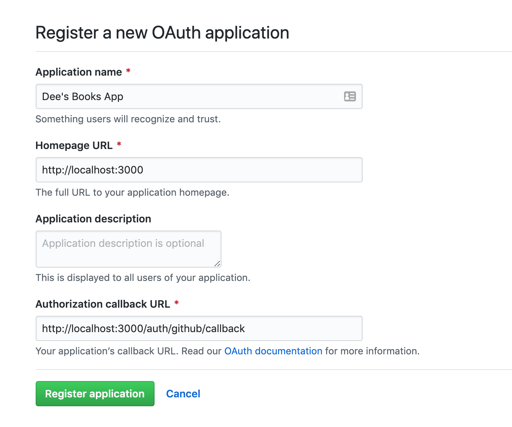
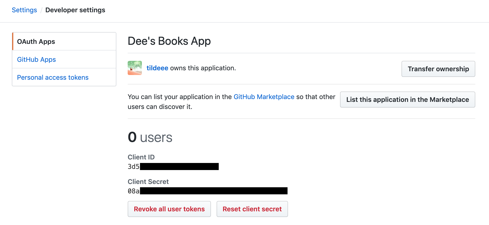
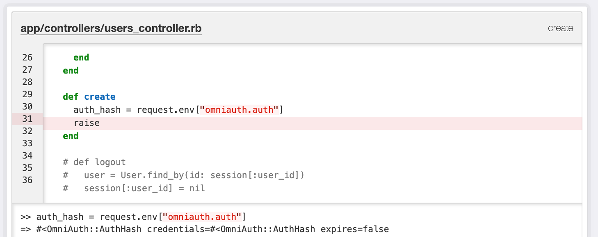

# Implementing an OAuth Solution in Rails

## Learning Goals

At the end of this lesson, students should be able to

- Have a list of steps to repeat to implement the user login/logout feature using GitHub as an _OAuth provider_ in Rails using `OmniAuth`
- Practice using environment variables in Rails
- On a high level, understand the OAuth process

## Our Approach

[OAuth](https://oauth.net/) is an open standard for authorization, commonly used as a way for users to log in websites using 3rd-party credentials (like Google, Facebook, Twitter, etc).

When we want to implement an OAuth solution for authorization in our Rails apps, we will use many different tools. Specifically, we are going to make the following decisions:

- we will use GitHub as our **OAuth Provider**, so our users will log in via their GitHub credentials
- we will use [OmniAuth](https://github.com/omniauth/omniauth), a Ruby gem that standardizes the authentication process using the OAuth protocol and integrates well with Ruby on Rails apps
- we will use [dotenv](https://github.com/bkeepers/dotenv), a Ruby gem to keep client IDs and client secrets hidden
- we will use a specific pattern of URLs to configure our routes: `get /auth/github` and `get /auth/github/callback`

### Tip: Test in Incognito Mode

While we work on this exercise, when you need to check things in the browser, try always your development in an private-browsing session/incognito mode!

If you are making changes and end up getting stuck, you may need to [clear your browser's cookies](https://support.google.com/chrome/answer/95647).

## Our Steps to Implementing Our Authentication Feature

In Rails, we will use the following big steps towards building this feature:

### Configuration: Make sure that the app is all set up

1. Ensuring that the OmniAuth gem is installed
1. Ensure that GitHub is expecting requests for Authentication to happen that come from your Rails server  from a specific endpoint `localhost:3000/...SOME ENDPOINT` as an OAuth Application (Client application)
1. Ensure that your Rails app knows how to talk to GitHub as an OAuth Application, given that it knows the right _secrets_
1. Change the configurations of Rails to recognize and use OmniAuth, GitHub, the established secrets connected to GitHub when it needs to

### Teach your Rails app how to do it

1. Add a route that will go to GitHub given a specific path that OmniAuth is looking for
1. Add a route to your Rails app that will wait for requests _from_ GitHub at a specific endpoint
1. Handle and process the information from the request (and the new authenticated user information!) to log in
1. Update your `User` model's attributes so you can handle, process, and store this information correctly
1. Don't forget to implement the logout feature!

## Exercise: Where?

For each step listed above, **predict**: Are there code changes I need to make in the Rails app? If there is, where would those be located? Are there changes I need to make outside of the app?

Spend five minutes thinking to yourself what the answer is for each step. Then, spend ten minutes talking about it with the person next to you. Spend only a little bit of time on predictions for pieces that seem very unfamiliar.

<details>

  <summary>
    Then, check your predictions together by expanding this section!
  </summary>

  #### Configuration

  1. Installing the OmniAuth gem should change the `Gemfile`
  1. We will go to Github.com literally to make some configurations for a new OAuth application
  1. We store our "secrets" using `env`! This means we'll need to make sure that the gem `dotenv` is installed using our `Gemfile`, we'll need to add our `.env` file to `.gitignore`, and we'll need to put new pieces of information in our `.env`
  1. We will add some new Rails app configurations in a folder called `config/initializers/` in order to teach OmniAuth where to look for our specific secrets in the `.env` file

  #### Teach your Rails app how to do it

  1. We will add a new special OmniAuth route that a link from our Rails app will _go to_ in order to start the login process in our `routes.rb` file
  1. We will add a new route that will wait for requests _from_ GitHub at a specific path in our `routes.rb` file
  1. We will handle and process the user information from the request in our controller that handles logging in, continuing to use the `session` hash
  1. We will update our `User` model's attributes using migrations
  1. We will implement our logout features with modifying our routes and controllers, continuing to use the `session` hash

</details>

# Exercise: Implement an Authentication Feature in the Books app!

Review the following diagram and quickly check it against the flow detailed above.


First, make sure that you have a fresh, clean, up-to-date clone of the classroom's Books app!

You and your pair are ready to follow these steps to get GitHub OAuth up and running for your app. Here are some following tips:

1. Work through this with one partner. If both want to follow the steps together, that's great! If one person wants to navigate while the other drives because of computer problems, that is okay too
1. Don't sweat the details at this moment. Right now, the important thing is getting through the activity in completion and successfully. Please don't focus on committing the steps to memory at this time

## Configuration

### 1. Install `OmniAuth`

1. Add the following lines to the bottom of the `Gemfile`
    ```ruby
    gem "omniauth"
    gem "omniauth-github"
    ```
1. `$ bundle install`
1. Restart the Rails server

Notice that there's a specific gem for authenticating with GitHub. Each _provider_ has a small Ruby gem that's responsible for the specifics of how to authenticate with that service.

### 2. Get Credentials: Configure an OAuth Application on Github.com

Each provider requires you to provide some credentials for your application, so they can keep track of which website is authorizing which user.

1. Go to Github.com and make sure you're logged in
1. Go to [your own user settings page](https://github.com/settings/profile) by navigating through the menus in the top right corner
1. On the left-hand vertical side bar, find an option named [Developer Settings](https://github.com/settings/developers) (towards the bottom)
1. By default, you should be on a page titled "OAuth Apps" within these Settings / Developer Settings. On the top right side, find the button that says [New OAuth App](https://github.com/settings/applications/new)
1. On this form to register a new OAuth app, use the following pieces of information in this form:

    - Application name: whatever you feel like, like "OmniAuth in Books App Test" or "Dee's Books App"
    - Homepage URL: `http://localhost:3000`
    - Application description: Leave blank, or fill in whatever you feel like
    - Authorization callback URL: `http://localhost:3000/auth/github/callback`



After you register your app, you should be taken to the OAuth application detail page. This page will tell you what the app's issued Client ID and Client Secret is. **Keep this web page open; you will need to have your Client ID and Client Secret on hand.**



**Note:** These credentials are the equivalent of passwords to your GitHub account. Keep them safe; never, ever post them in public places and never commit them in git.

You can always go back to this page through the [Developer Settings](https://github.com/settings/developers).

### 3. Teach Your Rails Apps the _Secrets_

Because they cannot be committed to git, the GitHub application credentials must be loaded external of the Rails application. Similar to the work we've done on previous projects, we will use a `.env` file to store these credentials securely, though the process for using them in Rails will be slightly different.

To use a `.env` file with Rails, you **must** do all of these steps to gain access to the data you set in the `.env` file.

1. Add `gem 'dotenv-rails'` to the `:development` group in the Gemfile, meaning: within the code block of `group :development do` and before its `end`
1. `$ bundle install`
1. Add the `.env` file to our `.gitignore`
1. Create the `.env` file in the root directory

    This file is a collection of key/value pairs. We will choose to put the value of the Client ID (from above) in a key named `GITHUB_CLIENT_ID`. We will choose to put the value of the Client Secret (from above) in a key named `GITHUB_CLIENT_SECRET`. Therefore, our `.env` file should look like this, but with the values replaced with our own from Github.com's registered OAuth app:

    ```bash
    GITHUB_CLIENT_ID: fd6XXXXXXXX
    GITHUB_CLIENT_SECRET: y6wXXXXXXX
    ```

1. Restart the Rails server. Similar to installing new gems, changes to the `.env` file will not be picked up without a server restart.

**With that done, the GitHub application credentials will now be available to Rails via the `ENV` constant.**

### 4. Configure Rails to Access Credentials

Now that you have application credentials, let's configure Rails to use them. To do this, create a new _initializer file_. Initializers are files that run as part of the Rails start-up process, which means that **if you change an initializer, you must restart the server**.

Initializers go in the `config/initializers/` directory.

1. Create a new initializer: `$ touch config/initializers/omniauth.rb`
1. Open `config/initializers/omniauth.rb` and add the following code:
    ```ruby
    # config/initializers/omniauth.rb
    Rails.application.config.middleware.use OmniAuth::Builder do
      provider :github, ENV["GITHUB_CLIENT_ID"], ENV["GITHUB_CLIENT_SECRET"], scope: "user:email"
    end
    ```
1. Restart the server so that the initializer is run

This initializer tells Rails to use OmniAuth for authentication. Specifically, it tells Rails that it will be communicating with GitHub, and where it can find the application credentials that GitHub expects: in the `ENV` file we populated earlier with the keys we defined before.

## Use it in our Rails app!


Note: This diagram implies that the Rails controller we will used is named `SessionsController`. This is not a hard or fast rule, and it is possible that the example code differs. The remaining code examples will assume that you are using `UsersController`.

### OmniAuth

The **OmniAuth** gem provides pretty much everything you need to use OAuth to authenticate users. It assumes that you will have this route: `/auth/:provider`.

`:provider` is a named parameter that will equal the name of the service we are using (`github`, in this example). When a user visits this route, OmniAuth will redirect the user to GitHub, beginning the authentication process. _All of this is handled automatically by OmniAuth_ - we do not have to define the route or the controller action ourselves.

Once the user has OKed our application, GitHub will redirect the user to `/auth/github/callback`, along with information about who they are. At this point, it's up to our application what to do next. Because the next steps are less prescribed, OmniAuth does not do this for us - _we will need to define the callback route and controller action ourselves_.

### 1. Add the Rails route that sends users to GitHub

1. In our routes file, add the new following route:
    ```ruby
    get "/auth/github", as: "github_login"
    ```

    The `get '/auth/github'` is a special path that OmniAuth is looking for. [You can read more details about how and why here](https://github.com/omniauth/omniauth#integrating-omniauth-into-your-application).

    Note: You are free to modify the `, as: 'github_login'` path helper however you'd like
1. Modify the `app/views/layouts/application.html.erb` file (or whatever view has the existing login button) so that it goes to this new route instead. Your modified login link may look like this:
    ```ruby
    <%= link_to("Login with GitHub", github_login_path) %>
    ```

#### Let's Test it Out

1. Start the Rails server
1. Navigate on your Rails app and click on the new "Login with GitHub" button. Note the following things:
    - The server _does_ send you to `localhost:3000/auth/github`
    - This automatically redirects you to a special Github.com OAuth page that asks the user to login/authorize our GitHub app that we established earlier
    - After authorizing the app, GitHub redirects back to `localhost:3000`... to a path `http://localhost:3000/auth/github/callback`, and we should see a "No route matches" error. We haven't made this yet, so this error is good!
1. Celebrate/high five your pair for getting this far! Let's keep going!

### 2. Add the Rails route that GitHub points back to

1. In your routes file, comment out the three routes that were the original login form, login, and logout routes (likely something along the lines of `post "/login", to: "users#login"`)
1. Go to your Users Controller, or wherever the original login form, login, and logout actions were defined, and comment out those three actions
1. In our routes file, add the new following route, modifying the controller `users` if that seems necessary:
    ```ruby
    get "/auth/:provider/callback", to: "users#create"
    ```
1. In the Users Controller, create a new action: `create`. Add in the following code:
    ```ruby
    class UsersController < ApplicationController
    # ...
      def create
        auth_hash = request.env["omniauth.auth"]
        raise
      end
    # ...
    end
    ```
1. In the browser, navigate back to `localhost:3000` and attempt again to login with GitHub. Notice the following things:
    - After the user authorizes the GitHub app, now we no longer see the "No route matches" error, because we _have_ defined that route!
    - Now we see a different error: A runtime error, caused by the `raise` that was in the code we asked you to copy and paste into the Users Controller just now.
    - This means that our user, who just went from our Books app, TO Github.com, authorized the Books app, was now successfully REDIRECTED BACK to our Books app, and now the user is seeing code that was defined in our Books app... in the `UsersController` `create` action!
    - Now that we've been redirected back to the Rails app from GitHub, GitHub has given us a present: a bunch of data, in the form of an `auth_hash`
1. Observe the `auth_hash` by using the error page to print out the result of these expressions:
    - `auth_hash = request.env["omniauth.auth"]`
    - `auth_hash["uid"]`
    - `auth_hash["info"]["name"]`
    - `auth_hash["info"]["email"]`



#### What's going on with this `auth_hash`?

Our controller code assigned the local variable `auth_hash` to the value of `request.env["omniauth.auth"]`. This is information stored in the `headers` of the HTTP request that came back from GitHub.

This data is a hash that will likely have some combination of the following:
  - data described in the [OmniAuth README](https://github.com/intridea/omniauth/wiki/Auth-Hash-Schema)
  - key/value pairs specified by the OAuth provider

GitHub will return the following important keys that we looked at above, and these are the keys that we will pay attention to:

| Expression/key, if `auth_hash = request.env["omniauth.auth"]` | What it is |
| --- | --- |
| `auth_hash` | Information that comes from GitHub |
| `auth_hash["uid"]` | the `uid` is an identifier for the user from the provider's system. We will use `uid` plus the provider type (`github`) to uniquely identify a user |
| `auth_hash["info"]` | a hash that contains specifics of the user's account |
| `auth_hash["info"]["name"]` | the name associated with the user's account |
| `auth_hash["info"]["email"]` | the email address associated with the user's account |

With this information returned by GitHub, you can create a database record for uniquely identifying a user, so keep these fields from `auth_hash` in mind.

### 3. Handle and Process the Callback

In the auth callback (the actions kicked off from Github's process returning back to the Rails app), we will have access to a bunch of credentials about the user from GitHub.

Do the following things:

1. Read through the strategy below
1. Read through the pseudocode below

We'll come back and finish implementing our controller code after we update the model in the next step.

#### Strategy

1. Check if there's already a `User` record matching on the credentials of `uid` and `provider` in our database
1. If there is no existing `User`, try to create a new `User`
1. Save the user's ID in the `session` (just like we did previously)
1. Redirect the user back to the `root_path`

#### Pseudocode

```ruby
# app/controllers/users_controller.rb
# NOTE: this version is not final
class UsersController < ApplicationController
  # ...
  def create
    auth_hash = request.env["omniauth.auth"]
    user = User.find_by(uid: auth_hash[:uid], provider: "github")
    if user
      # User was found in the database
      flash[:success] = "Logged in as returning user #{user.name}"
    else
      # User doesn't match anything in the DB
      # TODO: Attempt to create a new user
    end

    session[:user_id] = user.id
    redirect_to root_path
  end
  # ...
end
```

Recall that before the `session` is sent to the browser, it is encrypted. This means its contents are _opaque_ to the browser. All the browser sees is several KB of garbled nonsense, which it can neither interpret nor change. This makes the `session` ideal for things like storing the ID of an authenticated user, since there's no way for a malicious browser to fake a login.

### 4. Updating the `User` Model

Our strategy above means that we need to make sure that our `User` model has the attributes `uid` and `provider` saved on them... meaning that every instance of `User` will either have a value for those two things because they logged in with GitHub, or they will be `nil` because they did not log in with GitHub.

Also, while we're here, let's evolve our `User` model so that it can save the `name` and `email` attributes.

1. Generate a new migration with `rails generate migration add_uid_and_provider_to_users`
1. Modify that migration so that it resembles this code:
    ```ruby
    <!-- ... -->
    def change
      add_column :users, :uid, :integer
      add_column :users, :provider, :string
    end
    <!-- ... -->
    ```
1. Generate a new migration with `rails generate migration add_name_and_email_to_users`
1. Modify the migration so that it resembles this code:
    ```ruby
    <!-- ... -->
    def change
      add_column :users, :name, :string
      add_column :users, :email, :string
    end
    <!-- ... -->
    ```
1. Run the migrations

### Finish Implementing In `UsersController`

Now everything is here! Our routes are set up, GitHub is giving us back the user information we need, our app can store and find the right users with the right information... High five you and your partners for getting this far!

This is the final stretch: Let's tie everything up in our controller code.

As we write this controller code, we get to think about the answers to the following questions. Our answers will determine some design decisions we make. Take a few seconds to consider your answers with your team:

- What should we do if data is missing from our provider (GitHub)? What data is the most important for the database table we just created?
- What do we want our controller method to do upon successful or unsuccessful login?
- Creating a user from the information in `auth_hash` is going to be complex, and look like this. Where should this code belong? Why?
    ```ruby
    user = User.new
    user.uid = auth_hash[:uid]
    user.provider = "github"
    user.name = auth_hash["info"]["name"]
    user.email = auth_hash["info"]["email"]
    ```

<details>

  <summary>
    Consider our answers to the questions above.
  </summary>

  1. The most important data is `uid` and `provider`. If GitHub fails to give us a `uid`, we may want to declare that the login is unsuccessful. We could do that by creating a validation in the model.
  1. If the login was successful, we may want to redirect to some page, like the `root_path`, and display a `flash` message that is happy. If the login was unsuccessful, we may want to redirect to some page, like the `root_path`, and display a `flash` message that displays an error or warning.
  1. Creating a `User` with that complex logic would be a great helper method that lives in the model because it is only relevant to `User`s, and not to controllers. It might work best as a _class_ method, because it doesn't operate off of a single instance. We might design it to take in the `auth_hash` as a parameter, so it doesn't need a reference to the `request`.

</details>

#### Our Final Implementation of `UsersController`'s `create`

```ruby
# app/controllers/users_controller.rb
#  ...
  def create
    auth_hash = request.env["omniauth.auth"]

    user = User.find_by(uid: auth_hash[:uid], provider: "github")
    if user
      # User was found in the database
      flash[:success] = "Logged in as returning user #{user.name}"
    else
      # User doesn't match anything in the DB
      # Attempt to create a new user
      user = User.build_from_github(auth_hash)

      if user.save
        flash[:success] = "Logged in as new user #{user.name}"
      else
        # Couldn't save the user for some reason. If we
        # hit this it probably means there's a bug with the
        # way we've configured GitHub. Our strategy will
        # be to display error messages to make future
        # debugging easier.
        flash[:error] = "Could not create new user account: #{user.errors.messages}"
        return redirect_to root_path
      end
    end

    # If we get here, we have a valid user instance
    session[:user_id] = user.id
    return redirect_to root_path
  end
# ...
```

#### Our Helper Method `User.build_from_github`

What was the line `user = User.build_from_github(auth_hash)` above about? Observe our own implementation of a helper method to make the User from the `auth_hash`. Add this code so that your `User` model resembles this! Feel free to adjust this code with whatever makes sense on your projects.

```ruby
class User < ApplicationRecord
  def self.build_from_github(auth_hash)
    user = User.new
    user.uid = auth_hash[:uid]
    user.provider = "github"
    user.name = auth_hash["info"]["name"]
    user.email = auth_hash["info"]["email"]

    # Note that the user has not been saved.
    # We'll choose to do the saving outside of this method
    return user
  end
end
```

## 5. Wait! How Do I Log Out?!

We have authentication working now, but the user cannot actually log out.  The user is instead permanently logged in.  To log the person out we need to clear the session.

1. Add a route for logging out:
    ```ruby
    delete "/logout", to: "users#destroy", as: "logout"
    ```
1. In the `UsersController`, add the `destroy` action to handle logout:
    ```ruby
    #  app/controllers/sessions_controller.rb
    class UsersController < ApplicationController
      # ...
      def destroy
        session[:user_id] = nil
        flash[:success] = "Successfully logged out!"

        redirect_to root_path
      end
    end
    ```
1. Update our application view (`/app/views/layouts/application.html.erb`) to have links for the user to log in and log out:
    ```erb
    <% if session[:user_id] %>
      <%= link_to "Log out", logout_path, method: "delete" %>
    <% else %>
      <%= link_to "Login with Github", github_login_path %>
    <% end %>
    ```
1. Test! Restart your server, open up an incognito window in Google Chrome, go to `localhost:3000`, and see what you get! Patiently debug if something goes wrong. Celebrate your victories!

**Question**: How could you display the name or email address of the logged-in user?

## Bonus: Refactor and Clean up!

This exercise has left a bunch of comments in your code. Don't forget to clean up and delete any unused code!

## Conclusion

To use OAuth and implement a logging in and logging out feature, we used the following steps:

### Configuration

1. Installing the OmniAuth gem should change the `Gemfile`
1. We will go to Github.com literally to make some configurations for a new OAuth application
1. We store our "secrets" using `env`! This means we'll need to make sure that the gem `dotenv` is installed using our `Gemfile`, we'll need to add our `.env` file to `.gitignore`, and we'll need to put new pieces of information in our `.env`
1. We will add some new Rails app configurations in a folder called `config/initializers/` in order to teach OmniAuth where to look for our specific secrets in the `.env` file

### Teach your Rails app how to do it

1. We will add a new special OmniAuth route that a link from our Rails app will _go to_ in order to start the login process in our `routes.rb` file
1. We will add a new route that will wait for requests _from_ GitHub at a specific path in our `routes.rb` file
1. We will handle and process the user information from the request in our controller that handles logging in, continuing to use the `session` hash
1. We will update our `User` model's attributes using migrations
1. We will implement our logout features with modifying our routes and controllers, continuing to use the `session` hash

## Additional Resources
- [OAuth Youtube video overview](https://youtu.be/CPbvxxslDTU)
- [Sessions, Cookies and Authentication ](http://www.theodinproject.com/courses/ruby-on-rails/lessons/sessions-cookies-and-authentication)(not including 'Rolling Your Own Auth')  
- [How to Set Environment Variables in Heroku](https://devcenter.heroku.com/articles/config-vars)
- [Logout Route delete or get?](https://stackoverflow.com/questions/26018471/routing-trouble-for-logout-link-delete-vs-get-action)
- [Stack Overflow: Create named routes for OmniAuth](https://stackoverflow.com/questions/4361994/create-named-routes-for-omniauth-in-rails-3)
