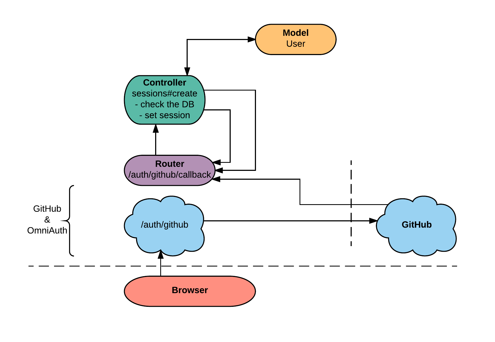
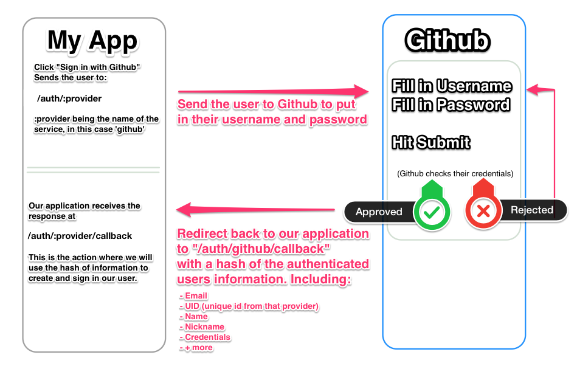
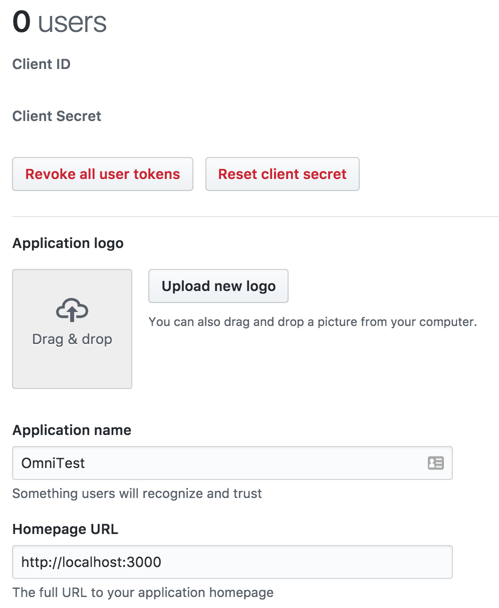

# User Authentication and Authorization using OAuth
## Learning Goals
- Discover what's really happening when we "Sign in with Facebook" (or any other 3rd party provider)
- Understand the basic workflow of OAuth, and how it protects users
- Implement user login/logout using GitHub as an _OAuth provider_
- What is an environment variable?
- How do we deal with needing to know data _across_ multiple HTTP requests?

## Our Approach
We are going to use a few new tools to accomplish our goal of user authentication and authorization. We are going to work with GitHub as our **provider** which means our users will log in via their GitHub credentials. We will use  [OmniAuth](https://github.com/omniauth/omniauth) which is a Ruby gem that standardizes the authentication process. It uses the [OAuth](https://oauth.net/) protocol for authenticating and authorizing users. **OAuth** is an open standard for authorization, commonly used as a way for users to log in websites using 3rd-party credentials (like Google, Facebook, Twitter, etc) without exposing their password.



## OmniAuth
The **OmniAuth** gem provides pretty much everything you need to use OAuth to authenticate users. It starts by adding new routes to your application:

- `/auth/:provider`
- `/auth/:provider/callback`

In both of these examples `:provider` is a named parameter that will equal the name of the service we are using (`github`, in this example). These two routes are how to start and end the authentication interaction with the provider. Sending the user to `/auth/github`, will start the authentication process. When authentication is complete, GitHub will redirect the user to `/auth/github/callback`. It goes something like this:



### Installing OmniAuth
Enough with talking, lets implement this into a quick application. Head over to your sandbox Rails app and open your Gemfile. Add the following lines to it:

```ruby
gem "omniauth"
gem "omniauth-github"
```

Save your Gemfile, then head over to your terminal, where you'll need to `$ bundle`. Notice that there's a specific gem for authenticating with GitHub. Each _provider_ has a small Ruby gem that's responsible for the specifics of how to authenticate with that service.

### GitHub Credentials
Each provider requires you to provide some credentials for your application, so they can keep track of which website is authorizing which user. [Login to GitHub and register a new "application"](https://github.com/settings/applications/new).


After registration you will be given a `client id` and a `client secret`:



**Note:** These credentials are the equivalent of passwords to your GitHub account. Keep them safe; never, ever post them in public places or commit them in git.

#### Storing Credentials
Because they cannot be committed to git, the GitHub application credentials must be loaded external of the Rails application. The most common way to do this is to create a file called `.env` in the project root. Dot files (called that because they start with a dot) are typically excluded from version control and are well suited for secrets. __NEVER COMMIT A `.env` TO GIT!__  (This also means if you are working with a partner, you'll need to share this information since it won't be be in git)

To use a `.env` file with Rails, you **must** do all of these steps to gain access to the data you set in the `.env` file.
1. Add `gem 'dotenv-rails'` to the `:development` group in the Gemfile  

    __QUESTION:__ Why add it to the `:development` group? Why does the group matter?

1. Install the gem using `bundle`
1. Add the `.env` file to our `.gitignore`  

    This will help prevent us from accidentally publishing it on GitHub.

1. Create the `.env` file in the root directory with `$ touch .env`.

  This file is a collection of key/value pairs. We will add the application credentials from GitHub like this:

  ```bash
  GITHUB_CLIENT_ID: fd6XXXXXXXX
  GITHUB_CLIENT_SECRET: y6wXXXXXXX
  ```

**With that done, the GitHub application credentials will now be available to Rails via the `ENV` constant.**

#### Accessing Credentials
Now that you have application credentials, let's configure Rails to use them. To do this, create a new _initializer file_. **Initializers are files that run as part of the Rails start-up process**. Initializers go in the `config/initializers/` directory. From the terminal, create a new initializer with `$ touch config/initializers/omniauth.rb`. Open this file and add the following code:

```ruby
Rails.application.config.middleware.use OmniAuth::Builder do
  provider :github, ENV["GITHUB_CLIENT_ID"], ENV["GITHUB_CLIENT_SECRET"], scope: "user:email"
end
```

This tells Rails to use OmniAuth for authentication. Specifically, it tells Rails that it will be communicating with GitHub, and where it can find the application credentials that GitHub expects: in the `ENV` variable we populated earlier. **Note** that any code added or updated in the initializers will require a rails server restart since this code is loaded when the server is started.

## Let's Test it Out

Start the Rails server and point a browser at `http://localhost:3000/auth/github`. Amazingly, the request is redirected to GitHub to login and grant permission! After authenticating and granting, GitHub redirects the browser to `localhost:3000/auth/github/callback`. Here, you'll see a bunch of information in the url parameters. Let's create a route to better explore this information.

Open `routes.rb` to add:

```ruby
get "/auth/:provider/callback", to: "sessions#create"
```

This route points to a `create` action in the sessions controller. Note that we are not going to use the login/logout implementation we created in our previous version of the `SessionsController`, so we should comment out the routes and controller actions.  Open the controller in your editor and add a `create` action that looks like this:

```ruby
class SessionsController < ApplicationController
  def create
    auth_hash = request.env['omniauth.auth']
    raise
  end
end
```

Refresh the page in the browser and have a look at `auth_hash`, the local variable assigned to the value of `request.env['omniauth.auth']`. This is information stored in the `headers` of the HTTP request. This data is a hash that will likely have some combination of the data described in the [OmniAuth README](https://github.com/intridea/omniauth/wiki/Auth-Hash-Schema), but the key/values returned varies by provider. GitHub will return the following important keys:

```ruby
# the `uid` is an identifier for the user from the provider's system
# using it plus the provider type (github in this case),
# we can uniquely identify a user
auth_hash["uid"]

# the info hash contains specifics of the user's account
auth_hash["info"]["name"]
auth_hash["info"]["email"]
```

With information returned by GitHub you can create a database record for uniquely identifying a user.

### Modeling Users
Start with a `User` model and migration: `$ rails generate model user`. Open the generated migration and add some columns to the database table:

```ruby
class CreateUsers < ActiveRecord::Migration[5.0]
  def change
    create_table :users do |t|
      t.string :name
      t.string :email
      t.integer :uid, null: false # this is the identifier provided by GitHub
      t.string :provider, null: false # this tells us who provided the identifier

      t.timestamps
    end
  end
end
```

Remember to migrate the database: `$ rails db:migrate`.

**Question**: What should we do if data is missing from our provider? What data is the most important for the database table we just created?

**Question**: What do we want our controller method to do upon successful or unsuccessful login?

### Handling the Auth Callback
Now everything is in place to initialize a User using the hash that is returned from the provider request:

```ruby
# app/controllers/sessions_controller.rb
# NOTE: this version is not final
class SessionsController < ApplicationController
  def create
    auth_hash = request.env['omniauth.auth']

    if auth_hash['uid']
      @user = User.find_by(uid: auth_hash[:uid], provider: 'github')
      if @user.nil?
        # User doesn't match anything in the DB
        # Attempt to create a new user
      else
        flash[:success] = "Logged in successfully"
        redirect_to root_path
      end
    else
      flash[:error] = "Could not log in"
      redirect_to root_path
    end
  end
end
```

**Exercise**: Let's implement a new model method in our `User` model which will accept the `auth_hash` as a parameter and construct a new `User` and save it to the database using the info from the `auth_hash`.

Now that we've successfully authenticated a user and built a database entry for them, what happens next? The login ought to be _persistent_ - that is, the user should be logged in as long as they are on the site, even if they move from page to page. Moreover, we don't want to embed the user ID in the URI, since then you could impersonate a user just by changing the address.

<!--
```ruby
# app/models/user.rb
class User < ActiveRecord::Base

  def self.build_from_github(auth_hash)
   user       = User.new
   user.uid   = auth_hash[:uid]
   user.provider = 'github'
   user.name  = auth_hash['info']['name']
   user.email = auth_hash['info']['email']
     return user
  end
end
```-->

#### The `session`

The most common use of `session` is to store the id of an authenticated user. From within a controller, we can get and set `session` keys using the familiar hash access syntax:

```ruby
# app/controllers/sessions_controller.rb
class SessionsController < ApplicationController
  def create
    auth_hash = request.env['omniauth.auth']

    if auth_hash['uid']
      user = User.find_by(uid: auth_hash[:uid], provider: 'github')
      if user.nil?
        # User doesn't match anything in the DB
        # Attempt to create a new user
        user = User.build_from_github(auth_hash)
      else
        flash[:success] = "Logged in successfully"
        redirect_to root_path
      end

      # If we get here, we have the user instance
      session[:user_id] = user.id
    else
      flash[:error] = "Could not log in"
      redirect_to root_path
    end
  end

  def index
    @user = User.find(session[:user_id]) # < recalls the value set in a previous request
  end
end
```

Before the `session` is sent to the browser it is encrypted. This means its contents are _opaque_ to the browser. All the browser sees is several KB of garbled nonsense, which it can neither interpret nor change. This makes the `session` ideal for things like storing the ID of an authenticated user, since there's no way for a malicious browser to fake a login.

## Additional Resources
*  [oauth Overview Notes](https://docs.google.com/presentation/d/1lIQ4F8gpXwaIEBHlsussoIEN31sqCY2upGIV_L81zi4)
*  [oAuth Youtube video overview](https://youtu.be/CPbvxxslDTU)
*  [Sessions, Cookies and Authentication ](http://www.theodinproject.com/courses/ruby-on-rails/lessons/sessions-cookies-and-authentication)(not including 'Rolling Your Own Auth')  
*  [How Sessions Work](http://www.justinweiss.com/articles/how-rails-sessions-work/)  
[Rails Guides: Accessing the Session](http://guides.rubyonrails.org/action_controller_overview.html#accessing-the-session)
*  [How to Set Environment Variables in Heroku](https://devcenter.heroku.com/articles/config-vars)
