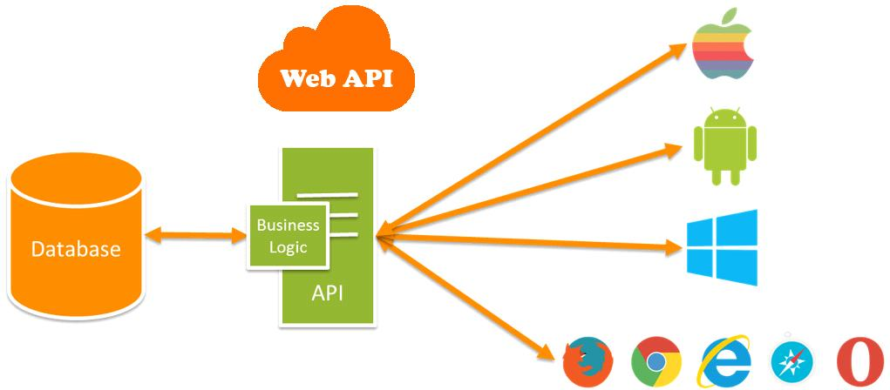

# Introduciton To Building An API In Rails

## Learning Goals

Students should be able to...

- Compare and contrast web applications and APIs
- Generate an Rails API Application
- Create and test a CRUD index action

## Introduction

Previously, we learned about using APIs that already exist. Now, our goal is to create APIs ourselves.

When creating an API, usually the goal is to provide data to a consumer, whether that be a human (not normally) or another system (usually). This could be a mobile app, a single-page application written in JavaScript, or something else entirely.



### Vocabulary

| Word | Definition | Example
|------|------------|--------
| Resource | Some piece of data we want to share with the world | A single pet, the list of all pets, or a channel or user in Slack.
| Endpoint | A unique URL + HTTP verb that provides access to some resource | `GET /pets/7`
| Client   | Who- or whatever is consuming our API | A mobile app, or something like our command-line slack interface.

### APIs vs Web Apps

<details>
  <summary>
    When we think about using an API vs using a web application, what is the key difference?
  </summary>

- Web apps produce **HTML** for humans to consume
- APIs produce **JSON** for machines to consume
</details>

What are some of the key similarities? They both use **routes** to provide structure, and there is also some sort of **data** involved. Many APIs (including the one we'll build today) provide some sort of CRUD functionality, and our RESTful design principals and general Rails knowledge will continue to serve us well.

## Creating an API

We want to build a small Rails app that will act as an API for providing data about our amazing, adorable pets to other applications. The app will have the following routes:

- `GET /pets` show all pets
- `GET /pets/:id` shows a pet with the provided id
- `POST /pets` add a pet to the collection

Given the context of our application, we should have a model and controller that reference our main resource, pets. Once you clone this repo, you'll notice that we have these things already created for you!

[https://github.com/AdaGold/ada-pets](https://github.com/AdaGold/ada-pets)

To get started, run the following:

```bash
$ git clone https://github.com/AdaGold/ada-pets.git
$ cd ada-pets
$ bundle install
$ rails db:reset
$ rails server
```

Once you've downloaded it, take a few minutes to go through this Rails app with the person next to you.

### Questions

- What components does the project have?
- What routes are in the project currently?
  - Do they work?
- What steps would you perform to set up a project like this from scratch?

## Listing Pets

We are going to approach this application creation from a TDD approach. First we will create a test and then write controller methods to make them pass. You can run the tests using the usual `rails test`.

You'll notice that we already have one basic get route created for pets, and one basic controller action that corresponds with that route.

Try go to to `/pets` route.  What happens?

The terminal should show something like:

```bash
Completed 204 No Content in 4ms (ActiveRecord: 0.0ms)
```

This is because an API application does not have a standard view template and our controller does not tell Rails what content to render back to the user.

```ruby
  def index
    @pets = Pet.all
  end
```

So lets write a test to specify what we **want** to be rendered back to us on `get '/pets'`.  Take a look at the [slack API's documentation](https://api.slack.com/methods/channels.info) to see an example response to a get request.

### So... What Do We Want

With your neighbor answer the following questions:

1. What kind of information should be returned here?  HTML?
1. How much information should be returned?
1. What information about each pet should be included?
1. What response code should be returned?  Should it ever vary?

<details>
  <summary>Our Answer</summary>
  In this we will expect:

- JSON Data to be returned and not HTML
- All of our fixture data returned in an array
- We will make the executive decision to only include the:
  - id
  - name
  - age
  - human

Which means we will need to exclude some fields here.

We will also expect the action to always return 200 ok.
</details>


### Writing our 1st Test

So in our test we will first verify that the action returns JSON and gives the correct response code:

```ruby
  describe "index" do
    it "responds with JSON and success" do
      get pets_path

      expect(response.header['Content-Type']).must_include 'json'
      must_respond_with :ok
    end
  end
```

We're testing to make sure that the content type is JSON and that it's giving a response code 200 (ok or success).

Now if we run it we'll get:

```bash
test_0001_responds with JSON and success                        FAIL (0.16s)
        Expected nil (NilClass) to respond to #include?.
        test/controllers/pets_controller_test.rb:9:in 'block (3 levels) in <top (required)>'
```

This is **OK** we expect our test to fail, we haven't made the test pass yet!

### Responding with JSON

To make our test pass we will need to have our controller respond with json data and an response code of 200.

We can convert any array or hash into JSON like this:

```ruby
# pets_controller.rb
def index
  render json: { ready_for_lunch: "yassss" }, status: :ok
end
```

In the code above we told Rails to render JSON instead of HTML and we passed in a Ruby hash, which it converted into JSON.  If you load the page into the browser you will get:

```json
{"ready_for_lunch":"yassss"}
```

So we have Rails returning JSON data and a 200 response code, but it's not the data we want yet.  Instead we will want a list (array) of pets.  

In the [next lesson](./creating-apis.md) we will continue to build this app and include data from our models.

## Aside - Creating An API From Scratch

Normally we create new Rails applications with `rails new <APPLICATION-NAME>`.  However a generic Rails application adds a good deal of material a pure API does not need, like CSS, HTML templates, and JavaScript.  So we can generate a new Rails application in pure API mode with:

```bash
$ rails new <APPLICATION-NAME> --api
```  

The `--api` flag indicates to Rails that this app will not need any CSS, HTML or JavaScript and does not need to generate views for any controller actions.  Our Rails template is already cunningly written to handle this situation.

That said, we will use the pre-generated rails application [Ada Pets](https://github.com/AdaGold/ada-pets) in our classroom lessons.

## Resources

- [`.as_json` documentation](http://api.rubyonrails.org/classes/ActiveModel/Serializers/JSON.html#method-i-as_json)
- [ActiveModel Serializers](http://railscasts.com/episodes/409-active-model-serializers)
- [blog post by thoughtbot about serialization](http://robots.thoughtbot.com/better-serialization-less-as-json)
- [Rails API Development Guide](http://edgeguides.rubyonrails.org/api_app.html)
