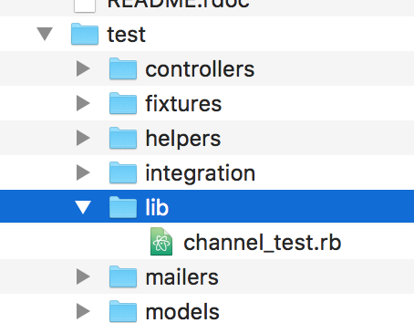

# Testing Class In the Lib Folder

## Learning Goals

At the end of this lesson you should be able to:
- Write general Minitest Spec code for classes in a Rails app's /lib folder.
- Run Tests for lib code individually or with controller/model tests

## Setting Up For Testing

### Creating Folders & Files
We try to mirror the setup of the code we are testing in the /test directory.  So we will create a folder named `lib` directly inside the `test` folder.  

```bash
$ cd test
$ mkdir lib
```

Then we can create a test file (a ruby file ending in `_test.rb` inside the folder.  For example if we are going to test our `Channel` class we can create a file named `channel_test.rb`.




### Test Structure

You can then create a test cases with this template:

```ruby
require 'test_helper'

describe <ClassName> do

  # it blocks are placed here.

end
```

## Executing Tests

You can run tests on lib classes with the command `rails test test/lib` and run all tests, including lib classes with `rails test`

## Example Testing The Channel Class

In our Slack API App, we created a `Channel` class.  We can test the Channel by creating a file named:  `channel_test.rb`

```ruby
require 'test_helper'

describe Channel do
  it "Cannot be initialized with less than 2 parameters" do
    proc {
      Channel.new
    }.must_raise ArgumentError

    proc {
      Channel.new "Name"
    }.must_raise ArgumentError
  end

  it "Must initialize name & id properly" do
    channel = Channel.new("Name", "ID")
    channel.name.must_equal "Name"
    channel.id.must_equal "ID"
  end
end
```

**Practice:**  Add additional tests for the optional fields.


## What Did We Accomplish
We have:
-  Created a folder to test our lib code
-  Written tests using spec-style testing
-  Run the tests either individually or as part of all app testing.
