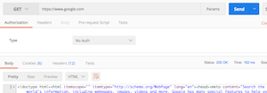
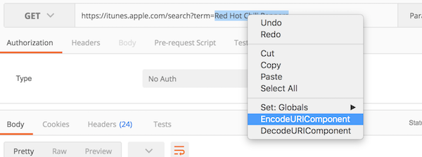
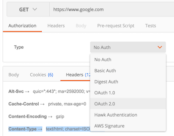
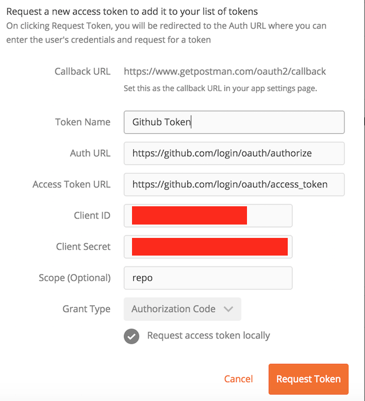
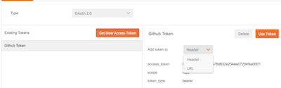
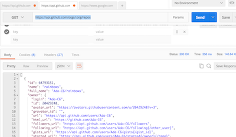
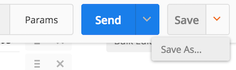

# API Tools

## Learning Goals
- Identify the need for tools to assist with making API requests
- Play with `curl`
- Play with Postman

### Tools Intro
Making API requests from your browser directly (typing in a URL) has it's limitations. Oftentimes, API requests require you to pass in additional data (params) or use HTTP Verbs other than `get` (which is all your browser can give you). There are many different ways to interact with APIs that give you much more control.

### curl
`curl` is a command you can run in your terminal that will allow to you make HTTP requests. Note that `curl` is extremely powerful and does a lot more than what we'll show, but will act as a starting point for us right now.

In the most basic way, `curl` allows you to retrieve output from HTTP requests.

The response from Google:
```bash
$ curl http://www.google.com
```

A much more complex example, passing params in on a post request:
```bash
$ curl -H "Accept: application/json" -H "Content-type: application/json" -X POST -d '{"id":100}' http://localhost:3000/api/data/
```


### Postman
[Postman](https://www.getpostman.com/) is a browser plug-in or standalone app that you can utilize to send API requests. This is much better than `curl` (in someone's opinion) because it provides a user interface to interact with your requests as well as responses. Postman also keeps a history of requests for you so you can track your progress.

#### Using The Native Mac Postman App

To use the Postman Native App you can download it from [getpostman.com](https://www.getpostman.com) and download the App.  You can paste it into your Applications folder to install it.  [It has a few advantages over the Chrome extension](https://www.getpostman.com/docs/why_native).


The Postman App has two main sections.  The left **Sidebar** keeps track of previously created requests.  The main section is called the **Request Editor** and in that section you can put together an API request, run it and view the results.  


##### Getting a Normal Webpage

In the URL Bar place:  https://www.google.com/ and click **Send**.  



Take a look at the Body, Cookies & Headers returned.  Postman sends http requests just like a browser, but it lets you examine the content more easily and tailor your requests to examine the response.  Notice the cookies returned, which Google uses to track your session across their site.  

In the Header section you can see the Content-Type `Content-Type →text/html; charset=ISO-8859-1` which tells the client which type of information is being returned.  

#### Reading from a JSON API

You can also use the iTunes API to search for content on Apple's platform.  

In the URL bar enter:  `https://itunes.apple.com/search?term=` followed by anything you want to search by.  If your term has spaces or other characters not allowed in a URL, you can highlight the term and right click to make it URL friendly.  Select `Encode URI Component`  



So `https://itunes.apple.com/search?term=Red Hot Chili Peppers` becomes `https://itunes.apple.com/search?term=Red%20Hot%20Chili%20Peppers`

Examine the results.  Can you find links to album covers?  What about music samples?

##### Github API

Github has a robust series of [APIs](https://developer.github.com/v3/) to enable users to get a rich variety of information and make changes to repositories, and more.  

We will set up a sample request to see the repositories of the Ada-c6 organization.  

1.  In Github [register a new oAuth Application](https://github.com/settings/developers) and save the client_id and secret.  
	- The Homepage URL:  [https://www.getpostman.com](https://www.getpostman.com)  
	- The Authorization Callback URL:  [https://www.getpostman.com/oauth2/callback](https://www.getpostman.com/oauth2/callback)
	- By doing this we will create an oAuth token for Postman to log into Github without using our username/password.  

  
1.  Then in Postman go to Authorization (under the URL line) and select oAuth 2.0.
 
 
1.  Click on `Get New Access Token`  
  

1.  Then fill in the form with:
	- Auth URL:  **https://github.com/login/oauth/authorize**
	- Access Token URL:  **https://github.com/login/oauth/access_token**
	- Client ID:  **Your Client ID**
	- Client Secret:  **Your Client Secret**
	- Scope:  **repo**
		- Github grants different levels of access depending on the scope variable.  You can read more about it [here](https://developer.github.com/v3/oauth/#scopes).
	- Grant Type:  **Authorization Code**  
  
1.  Then Choose to add the token you have created into the header.
	- Now you have set up Postman to log in with your Github account via oAuth.  
  
1.  Next enter:  `https://api.github.com/orgs/:org/repos` into the URL bar.
	- `:org` just like in Rails is a placeholder or variable which we can fill in with any value we like.
1.  Click on Params and add a parameter for `:org` as ada-c6
1.  Then click send and look at the results:  
  

Congratulations you've made your first Postman API call to Github.  Note that the Content type is `application/json; charset=utf-8` and that the result looks like a Ruby Hash.  One of the key uses of APIs is to retrieve data from remote servers.  JSON is a modern format to transfer information over a web API.  

Using an API like Github's you can write a program to dynamically pull 3rd party information or make changes on another platform.  In this instance with the correct API call you could create or delete repositories, add or remove members to teams etc.   

##### Saving the Request

We can save or bookmark our API call by clicking on the save-as button and save the request into a folder on the left sidebar.  
  

##### Going Further:  

Take a look at the [Github API Documentation](https://developer.github.com/v3/) and see if you can make another API call.

##### Note:  Testing

You can write your own [automated tests with Postman](https://www.getpostman.com/docs/writing_tests) to test APIs that you right or verify assumptions you have about APIs that you use.  


## Resources
- [TutorialsPoint curl docs](https://www.tutorialspoint.com/unix_commands/curl.htm)  
- [Sending Requests with Postman](https://www.getpostman.com/docs/requests)
- [Github API](https://developer.github.com/v3/)
