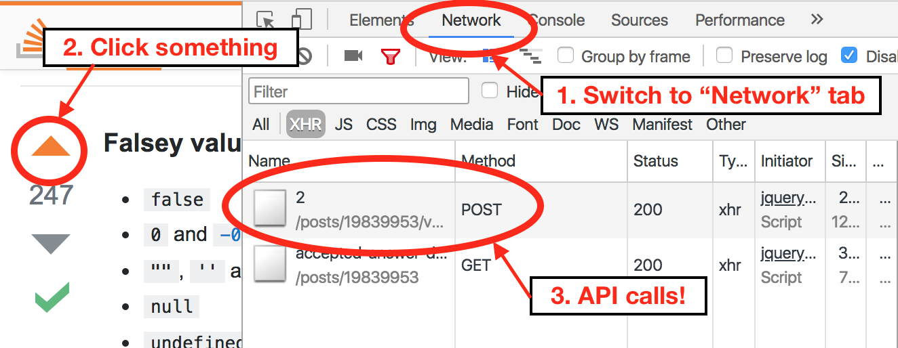

# Intro to axios

## Learning Goals
- Request data from an API to render client-side using JavaScript
- Render data from server without reloading a page
- Use axios to make HTTP GET requests

## Introduction

Single page applications (SPAs) have gained popularity in recent years for many reasons, one being that they can load data _dynamically_, rather than having to do it all up front.

Learning to make HTTP requests with JavaScript is a stepping stone to understand how the dynamic, single page web applications we know today work.

### You have made requests from the browser before
Like, a lot.  

When you scroll through Facebook, Instagram or Pinterest and you see the page loading more content as you continue to endless scroll and procrastinate, that's a request.

When you want to upvote a post on HackerNews or StackOverflow, and the number changes without you refreshing the page, that's a request.

Let's procrastinate a bit and hop on Pinterest. While browsing, if we open the Chrome developer tools and switch to the `Network` tab, we can SEE REQUESTS HAPPENING!



### How It Works


A request is made to the server. The server processes that request and sends a response back to the client. Nothing new there. However we use **JavaScript** to change the parts of a page that need to be changed, instead of reloading a whole new page.

When we make a request with AJAX, we are not asking for the entire pages's content. Instead our request is only asking for the relevant parts which we want to update.

### History

(there's more than one way to do it)

JavaScript programs have been able to make HTTP requests since Microsoft added the functionality to Internet Explorer in 1995. It originally went by the name of XMLHttpRequest, or XHR, sometimes also called AJAX.

**AJAX** stands for **'Asynchronous JavaScript And XML'**
  - **Asynchronous** means that you can do many things at once. With AJAX, that means you can still interact with a web page while waiting for a request/response. Your page won't freeze and with for the response to come back. Even better, you can send multiple AJAX requests at a time!
  - **JavaScript** is the programming language that is used to make AJAX do it's thing.
  - **XML** was originally the format responses were preferred to be sent in. However, nowadays, JSON has taken over as the preferred response format.

The original XHR interface is clunky and difficult to use, so people built wrapper libraries around them to make common tasks easier. Two examples of this are jQuery's `$.ajax` function and the standalone axios library (which we're about to learn). You can still make old-fashioned XHR requests without a library, but almost no one does.

The `fetch` function was added to the core JavaScript language in the last few years as a replacement for XHR. `fetch` uses modern syntax and functionality without loading an external library. However, `fetch` provides a much lower-level view of HTTP requests than we need, and ends up being somewhat complex to use.

**In this course, we will be making AJAX requests using the axios library.**

## AJAX with axios

All of the JavaScript we write in this lesson and the next will reference the HTML and CSS files in the [reference/axios](reference/axios) folder. If you want to follow along, you should go ahead and copy that code now.

With that HTML in mind, read through the following code and see if you can figure out what's going on. Specific questions to answer:

- Program Structure:
  - When does our code make the GET request? What would we need to change if we wanted it to happen as soon as the page loads?
  - Why is the click handler added in `$(document).ready`? What would happen if we moved it out to the top level?
  - Where on the page does our program put the list of pets? How does it know to do that?
  - Would this code behave differently if we had used old-style functions instead of arrow functions?
- axios:
  - Where does the variable `axios` come from in our program?
  - What is (are) the argument(s) to `axios.get`?
  - What is `.then` and `.catch` being called on?
  - How does axios know what to do when the response comes back from the server?
  - How does axios let us know if something went wrong?
  - What do you imagine axios is doing behind the scenes?
  - How does making a request with axios compare to using HTTParty?
- Error handling:
  - What might count as an error?
  - What does our application do if there's an error talking to the API?
  - How could we improve this user experience?

```javascript
// index.js
const URL = 'https://petdibs.herokuapp.com/pets';

const loadPets = () => {
  // Prep work
  const petList = $('#pet-list');
  petList.empty();

  // Actually load the pets
  axios.get(URL)
    .then((response) => {
      response.data.forEach((pet) => {
        petList.append(`<li>${pet.name}</li>`);
      });
    })
    .catch((error) => {
      console.log(error);
    });
};

$(document).ready(() => {
  $('#load').click(loadPets);
});
```

It might be hard to see split onto multiple lines, but `.then()` is being called on the _return value_ of `axios.get()`. And then `.catch()` is being called on the return value of `.then()`! This is called _call chaining_ (sometimes just _chaining_), and is a common pattern in JavaScript.

`axios.get()` returns something called a _promise_. We won't be studying these in depth, but if you want to do some digging on your own they're very interesting. Just know that `.then` will do work when the call succeeds, and `.catch` will do work when it fails.

### Status Messages

Let's improve our user experience a bit. Instead of logging to the console when there's an error (which most users don't even know exists), we should place a visible status messages on the screen when our app is doing something. Notice the `status-messages` section at the top of the `<body>`:

```html
<section id="status-messages"></section>
```

Add the following function at the top of `index.js`, just under the URL:

```javascript
const reportStatus = (message) => {
  $('#status-message').html(message);
};
```

And finally, adjust the `loadPets` function to use our new status reporter:

```javascript
const loadPets = () => {
  reportStatus('Loading pets...');

  // Prep work
  const petList = $('#pet-list');
  petList.empty();

  // Actually load the pets
  axios.get(URL)
    .then((response) => {
      reportStatus(`Successfully loaded ${response.data.length} pets`);
      response.data.forEach((pet) => {
        petList.append(`<li>${pet.name}</li>`);
      });
    })
    .catch((error) => {
      reportStatus(`Encountered an error while loading pets: ${error.message}`);
      console.log(error);
    });
};
```

Now our application keeps the user informed about what's going on. Neat!

## Summary

- axios is a JavaScript library that handles interacting with an API
    - It builds on a (hard to use) built-in interface
    - There are many ways to send requests, but axios is the most straightforward for our purposes
- We can call `axios.get(URL)` to make a HTTP GET request
    - Call `.then(callback)` to do something with the response
    - Call `.catch(callback)` to do something when the response fails
- There are many questions to answer regarding API calls and user experience
    - When do you make the call (page load, button click)?
    - How do you let the user know what's going on?
    - What do you do with the results?

## Additional Resources
- [axios documentation](https://github.com/axios/axios)
- [Google Developers on Promises](https://developers.google.com/web/fundamentals/primers/promises)
  - Most excellent reading! Promises are where the `.then` / `.catch` pattern comes from.
- [Why I won’t be using Fetch API in my apps](https://medium.com/@shahata/why-i-wont-be-using-fetch-api-in-my-apps-6900e6c6fe78)
  - Why aren't we teaching the shiny new thing called `fetch`?
- [MDN: Using Fetch](https://developer.mozilla.org/en-US/docs/Web/API/Fetch_API/Using_Fetch)
  - In case you don't trust us.
