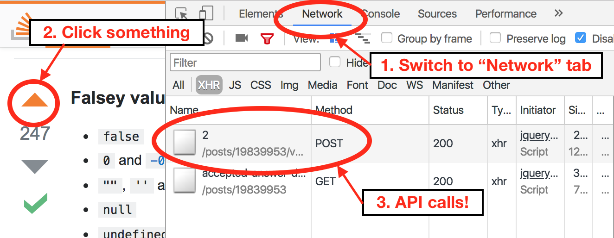

# Making `GET` Requests using `axios` in JavaScript

## Learning Goals
- Request data from an API to render client-side using JavaScript
- Render data from server without reloading a page
- Use axios to make HTTP GET requests

## Review: `GET` Requests in Ruby

Let's remember when we first introduced making API requests in Ruby:

```ruby
url = 'http://api.open-notify.org/iss-pass.json'
query_parameters = {
  lat: 47.6062,
  lon: 122.3321
}
response = HTTParty.get(url, query: query_parameters)
```

You may want to refer to the [Open Notify ISS Pass Times Documentation](http://open-notify.org/Open-Notify-API/ISS-Pass-Times/).

Answer the following questions:

1. What is the API we're using?
2. What is the API endpoint?
3. What kind of request are we making? What are the parts of this request?
4. What is the syntax that _makes_ the request?
5. What happens with the response that comes back?

<details>

  <summary>
    Check your answers here.
  </summary>

  1. We are using the Open Notify API
  1. We are using an endpoint to find ISS Pass Times, also known as `/iss-pass.json`
  1. We are making a `GET` request. The parts of the request are the verb, the endpoint, and any data we're sending with it, which is `query_parameters` in this case.
  1. The syntax that makes the request is `HTTParty.get(...)`
  1. When the response comes back to us, we store the response in the variable `response`.

</details>

## Introduction

Just like in Ruby, in JavaScript, we can make `GET` requests and `POST` requests. Just like in Ruby, in JavaScript, we'll likely use an external library to help us make these API requests.

The key difference to making API calls in JavaScript is that typically, these API calls will execute **asynchronously.**

Therefore, in order to make a `GET` request in we should answer the following questions today:
1. What is the library/tool that will help us make `GET` requests in JavaScript?
1. How do we make the `GET` request, which is now an asynchronous call?
1. What will happen if the `GET` request finishes successfully, and gives us back a successful response?
1. What will happen if the `GET` request does **not** finish successfully, and gives us back a failure response code?

## Writing Our First HTTP Request in JS

### Our tool, `axios`

There are a lot of technologies and tools that enable JavaScript to make HTTP Requests. Actually, we could argue that using JavaScript to make HTTP Requests is foundational the Internet experience that we know today!

In our curriculum, we chose to use the package [`axios`](https://github.com/axios/axios).

Now we've answered what the library/tool/package that helps us make `GET` requests is.

Take 5 minutes to read through the [`axios` documentation](https://github.com/axios/axios) and find the following:

1. How do we install the `axios` package onto our machine?
2. How do we include/load the `axios` package into our JavaScript file?
3. How do we make the `GET` request?
4. How do we determine what to do if the `GET` request finishes successfully?
5. How do we determine what to do if the `GET` request fails?
6. What does "finish successfully" mean to `axios`?

### The Answers

Observe the following code that would be in a file like `axios-practice.js`:

```js
const axios = require('axios');

axios.get('https://dog.ceo/api/breeds/image/random/')
  .then((response) => {
    // Code that executes with a successful response goes here
  })
  .catch((error) => {
    // Code that executes with an unsuccessful response goes here
  });
```

Read the code and our walk-through of the code.

1. We install the `axios` package onto our machine with `$ npm install -g axios`
2. We made a JS file `axios-practice.js`, and loaded `axios` with the line `const axios = require('axios');`. This should feel like requiring a gem in Ruby, but specifically, this is utilizing something that `npm` defined: the `require` function, which will look for the right `npm` package, and put those contents into a `const axios` variable.
3. We make the `GET` request using the syntax `axios.get(SOME API ENDPOINT/URL)`
4. We determine what happens after a successful response comes back within the `.then((response) => { })` portion
4. We determine what happens after a failure response comes back within the `.catch((error) => { })` portion
6. `axios` defines "success" as any response with a `2XX` status code. Therefore, responses with a `2XX` status code will go into `then`, and all responses outside of a `2XX` status code will go into `catch`.

#### Exercise:

Do the following:

1. Install `axios` onto your machine with `$ npm install -g axios`
2. Create a file `axios-practice.js`
3. Copy and paste the code sample from above, including the `require` statement
4. Add inside of the anonymous function passed into `.then` (underneath the comment of a successful response) this line: `console.log('Success!');`
5. Add inside of the anonymous function passed into `.catch` (underneath the comment of an unsuccessful response) this line: `console.log('Failure!');`
6. Run this file with node using `$ node axios-practice.js` and observe either a success or failure printed to the terminal
7. High-five or celebrate, if that's your jam!

## What's Happening With `then` and `catch`?

### Chaining

Let's pause on the syntax that we see. Note the `.` that is before `then` and `catch`. What's going on?

Let's look at this code with no newlines, and with some of the information taken away:

```js
axios.get( ... ).then( ... ).catch( ... );
```

`get()` is a function that is called onto `axios`

`then()` is a function that is called onto `axios.get()`

Similarly, `catch()` is a function that is called onto `axios.get().then()`

These function calls are chained onto each other. This is a pattern we see sometimes in JavaScript. For now, it's good to know that `axios` is specifically looking for this syntax whenever we make an HTTP Request.

**Be mindful to not accidentally put a `;` before calling `then()` or `catch()`!**

### Anonymous Functions

Now that we have confirmed that `then()` and `catch()` are functions themselves, it's good to pause and figure out: What is it taking in?

```js
  .then((response) => {

  })

  .catch((error) => {

  });
```

Adding spacing may help us see that `then` takes in a function. Specifically, `then()` takes in a function that in itself takes in one argument.

Here, we give it an anonymous function that takes in one argument named `response`.

<details>

  <summary>
    By the way, we <strong>could</strong> pass in functions that aren't anonymous functions and it would work. Click here to see an example.
  </summary>

  ```js
  const axios = require('axios');

  const printSuccess = () => {console.log('success!')};
  const printError = () => {console.log('error!')};

  axios.get('https://dog.ceo/api/breeds/image/random/')
    .then(printSuccess)
    .catch(printError);
  ```

</details>
<br/>

Typically, our code is so specific, that an anonymous function is better and cleaner, but feel free to do what works best for you.

### `response` and `error`

We saw that the function `then()` takes in a function that takes in an argument. In our sample code, this argument is named `response`.

`response` is the object that `axios` gives us that represents the HTTP response we get back for successful cases.

Similarly, we saw that `catch()` takes in a function, which takes in a different object. In our sample code, we've named this `error`.

`error` is the object that `axios` gives us that represents the HTTP response we get back for errors.

Copy and paste the following code into `axios-practice.js`:

```js
const axios = require('axios');

axios.get('https://dog.ceo/api/breeds/image/random/')
  .then((response) => {
    console.log('The value of response is:', response);

    console.log('The value of status inside of response is:', response.status);

    console.log('The date inside header inside response is:', response.headers.date);

    console.log('The data given back by the API response is:', response.data);
  })
  .catch((error) => {
    console.log('The value of error is:', error);
    console.log('The value of status inside of response is:', error.response.status);


    console.log('The data given back by the API response is:', error.response.data);
  });
```

### Exercise: Get a Random Dog Picture and Handle Errors

Assuming you get a successful response with the code above:

1. Run the code as is. What are some name/value pairs we see in the `response` object?
1. Run the code as is. What does the value of `response.data` represent?
1. The [DOG CEO DOG API](https://dog.ceo/dog-api/) says that we should get back response data that has a URL for a random dog image. Take two minutes to read through the documentation and see what the response data should look like.
1. Knowing that, find out how to `console.log()` the random DOG image URL.

Now, change the URL to `'https://dog.ceo/api/breeds/image/notarealendpoint/'`, so we can look at what happens when we get an error response.

1. Run the code with the fake endpoint. What are some name/value pairs we see in the `error` object?
1. What does the value of `error.response.data` represent?
1. The documentation from DOG CEO DOG API doesn't detail what happens on an error case. From what we see in the terminal, what kind of data is included?

### `finally`

`axios` supports a `finally` clause, which will run after either the `then` or `catch` no matter what.

The example syntax looks like this:

```js
const axios = require('axios');

axios.get('https://dog.ceo/api/breeds/image/random/')
  .then((response) => {
    console.log('success!');
  })
  .catch((error) => {
    console.log('error!');
  })
  .finally(() => {
    console.log('this is always executed, no matter what!');
  });
```

## Query Params

To add query params to our `GET` request, one syntax we can do is to **utilize the optional argument object, which is the second argument.**

Inside of the object, we will utilize the specific name `params`. The value of `params` should be an object, which is where we put in all of the name/value pairs of the data we want to send as query params.

```js
const axios = require('axios');

axios.get('http://api.open-notify.org/iss-pass.json', {
    params: {
      lat: 47.6062,
      lon: 122.3321,
    }
  })
  .then((response) => {
    console.log(response.data);
    
  })
  .catch((error) => {
    console.log('error!');
  });
```

Take some time to copy this code, run it, and observe the syntax.

The value of `params` is an object. Where do the curly braces start and end? `params` is itself inside of an object. Where do the curly braces that contain params start and end?

Take a minute to play with the white space if it helps.

## Exercise: Get ISS Times for Seattle

Write the pseudocode for a script that sends a request for ISS pass times for Seattle, then loops through the times in the response and prints them out to the command line.

<details>

  <summary>
    When you're finished with the pseudocode, check our implementation and talk about it with a neighbor. Our implementation did research on how to convert from a unix time stamp to a readable date in JavaScript.
  </summary>

  ```js
const axios = require('axios');

axios.get('http://api.open-notify.org/iss-pass.json', {
    params: {
      lat: 47.6062,
      lon: 122.3321,
    }
  })
  .then((response) => {
    response.data.response.forEach((passes) => {
      const risetime = passes.risetime;
      const date = new Date(risetime * 1000);
      console.log(date.toString());
    });    
  })
  .catch((error) => {
    console.log('error!');
  });
```

</details>

## So What Makes This Asynchronous?

A key difference between this code and what we wrote in Ruby is that now our API call (GET Request) is executed asynchronously. What does that mean?

Run this code and observe:

```js
const axios = require('axios');

console.log()
axios.get('http://api.open-notify.org/iss-pass.json', {
    params: {
      lat: 47.6062,
      lon: 122.3321,
    }
  })
  .then((response) => {
    response.data.response.forEach((passes) => {
      const risetime = passes.risetime;
      const date = new Date(risetime * 1000);
      console.log(date.toString());
    });    
  })
  .catch((error) => {
    console.log('error!');
  });

console.log('I broke free on a Saturday morning');
console.log('I put the pedal to the floor');
console.log('Headed north on Mills Avenue');
console.log('And listened to the engine roar');
```

When we run this code, we should see that our console output prints out the lyrics at the bottom first, **before** our API call. But our song lyrics were written *below* the lines where we made our API call. **WHY?!**

Our JavaScript still gets executed from top to bottom. However, when we make our GET request, our JavaScript **does not wait for it to finish executing, and proceeds with executing the next line of code.**

That's what makes the `then` and `catch` blocks so special. They are setting up our expectations for what happens when a response comes back.

## JavaScript is Special Because of the Browser

The `fetch` function was added to the core JavaScript language in the last few years as a replacement for XHR. `fetch` uses modern syntax and functionality without loading an external library. However, `fetch` provides a much lower-level view of HTTP requests than we need, and ends up being somewhat complex to use.

**In this course, we will be making AJAX requests using the axios library.**

## Introduction

Single page applications (SPAs) have gained popularity in recent years for many reasons, one being that they can load data _dynamically_, rather than having to do it all up front.

Learning to make HTTP requests with JavaScript is a stepping stone to understand how the dynamic, single page web applications we know today work.

### You have made requests from the browser before
Like, a lot.  

When you scroll through Facebook, Instagram or Pinterest and you see the page loading more content as you continue to endless scroll and procrastinate, that's a request.

When you want to upvote a post on HackerNews or StackOverflow, and the number changes without you refreshing the page, that's a request.

Let's procrastinate a bit and hop on Pinterest. While browsing, if we open the Chrome developer tools and switch to the `Network` tab, we can SEE REQUESTS HAPPENING!



### How It Works


A request is made to the server. The server processes that request and sends a response back to the client. Nothing new there. However we use **JavaScript** to change the parts of a page that need to be changed, instead of reloading a whole new page.

When we make a request with AJAX, we are not asking for the entire pages's content. Instead our request is only asking for the relevant parts which we want to update.

### History

(there's more than one way to do it)

JavaScript programs have been able to make HTTP requests since Microsoft added the functionality to Internet Explorer in 1995. It originally went by the name of XMLHttpRequest, or XHR, sometimes also called AJAX.

**AJAX** stands for **'Asynchronous JavaScript And XML'**
  - **Asynchronous** means that you can do many things at once. With AJAX, that means you can still interact with a web page while waiting for a request/response. Your page won't freeze and with for the response to come back. Even better, you can send multiple AJAX requests at a time!
  - **JavaScript** is the programming language that is used to make AJAX do it's thing.
  - **XML** was originally the format responses were preferred to be sent in. However, nowadays, JSON has taken over as the preferred response format.

The original XHR interface is clunky and difficult to use, so people built wrapper libraries around them to make common tasks easier. Two examples of this are jQuery's `$.ajax` function and the standalone axios library (which we're about to learn). You can still make old-fashioned XHR requests without a library, but almost no one does.

The `fetch` function was added to the core JavaScript language in the last few years as a replacement for XHR. `fetch` uses modern syntax and functionality without loading an external library. However, `fetch` provides a much lower-level view of HTTP requests than we need, and ends up being somewhat complex to use.

**In this course, we will be making AJAX requests using the axios library.**

## AJAX with axios

All of the JavaScript we write in this lesson and the next will reference the HTML and CSS files in the [reference/axios](reference/axios) folder. If you want to follow along, you should go ahead and copy that code now.

With that HTML in mind, read through the following code and see if you can figure out what's going on. Specific questions to answer:

- Program Structure:
  - When does our code make the GET request? What would we need to change if we wanted it to happen as soon as the page loads?
  - Why is the click handler added in `$(document).ready`? What would happen if we moved it out to the top level?
  - Where on the page does our program put the list of pets? How does it know to do that?
  - Would this code behave differently if we had used old-style functions instead of arrow functions?
- axios:
  - Where does the variable `axios` come from in our program?
  - What is (are) the argument(s) to `axios.get`?
  - What is `.then` and `.catch` being called on?
  - How does axios know what to do when the response comes back from the server?
  - How does axios let us know if something went wrong?
  - What do you imagine axios is doing behind the scenes?
  - How does making a request with axios compare to using HTTParty?
- Error handling:
  - What might count as an error?
  - What does our application do if there's an error talking to the API?
  - How could we improve this user experience?

```javascript
// index.js
const URL = 'https://petdibs.herokuapp.com/pets';

const loadPets = () => {
  // Prep work
  const petList = $('#pet-list');
  petList.empty();

  // Actually load the pets
  axios.get(URL)
    .then((response) => {
      response.data.forEach((pet) => {
        petList.append(`<li>${pet.name}</li>`);
      });
    })
    .catch((error) => {
      console.log(error);
    });
};

$(document).ready(() => {
  $('#load').click(loadPets);
});
```

It might be hard to see split onto multiple lines, but `.then()` is being called on the _return value_ of `axios.get()`. And then `.catch()` is being called on the return value of `.then()`! This is called _call chaining_ (sometimes just _chaining_), and is a common pattern in JavaScript.

`axios.get()` returns something called a _promise_. We won't be studying these in depth, but if you want to do some digging on your own they're very interesting. Just know that `.then` will do work when the call succeeds, and `.catch` will do work when it fails.

### Status Messages

Let's improve our user experience a bit. Instead of logging to the console when there's an error (which most users don't even know exists), we should place a visible status messages on the screen when our app is doing something. Notice the `status-messages` section at the top of the `<body>`:

```html
<section id="status-messages"></section>
```

Add the following function at the top of `index.js`, just under the URL:

```javascript
const reportStatus = (message) => {
  $('#status-message').html(message);
};
```

And finally, adjust the `loadPets` function to use our new status reporter:

```javascript
const loadPets = () => {
  reportStatus('Loading pets...');

  // Prep work
  const petList = $('#pet-list');
  petList.empty();

  // Actually load the pets
  axios.get(URL)
    .then((response) => {
      reportStatus(`Successfully loaded ${response.data.length} pets`);
      response.data.forEach((pet) => {
        petList.append(`<li>${pet.name}</li>`);
      });
    })
    .catch((error) => {
      reportStatus(`Encountered an error while loading pets: ${error.message}`);
      console.log(error);
    });
};
```

Now our application keeps the user informed about what's going on. Neat!

## Summary

- axios is a JavaScript library that handles interacting with an API
    - It builds on a (hard to use) built-in interface
    - There are many ways to send requests, but axios is the most straightforward for our purposes
- We can call `axios.get(URL)` to make a HTTP GET request
    - Call `.then(callback)` to do something with the response
    - Call `.catch(callback)` to do something when the response fails
- There are many questions to answer regarding API calls and user experience
    - When do you make the call (page load, button click)?
    - How do you let the user know what's going on?
    - What do you do with the results?

## Additional Resources
- [axios documentation](https://github.com/axios/axios)
- [Google Developers on Promises](https://developers.google.com/web/fundamentals/primers/promises)
  - Most excellent reading! Promises are where the `.then` / `.catch` pattern comes from.
- [Why I won’t be using Fetch API in my apps](https://medium.com/@shahata/why-i-wont-be-using-fetch-api-in-my-apps-6900e6c6fe78)
  - Why aren't we teaching the shiny new thing called `fetch`?
- [MDN: Using Fetch](https://developer.mozilla.org/en-US/docs/Web/API/Fetch_API/Using_Fetch)
  - In case you don't trust us.
