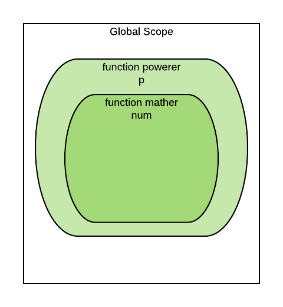

# Closures in JavaScript

This lesson assumes that you're comfortable with ES6 arrow function syntax, and that you have spent at least a little time using jQuery to manipulate the DOM and handle events.

## Learning Goals
By the end of this lesson you should be able to:

- Explain, "What's a _closure_ and why's it important?"
- Identify closures when they occur in code.

## Introduction

Often when building a single page application, you will need to have many UI elements that each do something similar. An example of this is a list of contacts, where clicking on the name of a contact pops up a modal showing details.

A simpler example is a set of buttons which can each change the color of a box on the screen, [as in this codepen](https://codepen.io/adadev/pen/ZmbMdq). Don't worry too much about the code itself yet, just the functionality of the buttons.

Because the UI elements have such similar behavior, we want to use the same function to handle each one. However, that function needs to know a little bit of extra information about which element it's attached to. This is where closures come in.

**A closure is a way to attach some extra information to a function.**

## Making a Closure

All that jQuery is a little complex, so let's start with something simpler: a function that knows how many times it has been called. Each time you call it, it will print the total number of calls to the console. We'll use it like this:

```javascript
const incrementer = // build this closure somehow

               // Each call prints out:
incrementer(); // This is call number 1
incrementer(); // This is call number 2
incrementer(); // This is call number 3
```

To create a closure in JavaScript, you need to do three things:

1. Nest a function inside a function
1. Reference a variable from the outer function in the inner function
1. Make the inner function available outside the outer function
    - Usually this means you return the inner function from the outer function
    - We'll see other ways to do this later

```javascript
// Here is the outer function
const buildIncrementer = () => {
  // callCount is defined in the outer function
  let callCount = 0;

  // Here is the inner function
  const callCountingFunction = () => {
    // callCount is used in the inner function
    callCount += 1;
    console.log(`This is call number ${callCount}`);
  }

  // Here we return the inner function, creating
  // a closure.
  return callCountingFunction;
};

const incrementer = buildIncrementer();

               // Each call prints out:
incrementer(); // This is call number 1
incrementer(); // This is call number 2
incrementer(); // This is call number 3
```

**Question:** On the line `return callCountingFunction`, what would happen if we added parentheses, like `return callCountingFunction()`?

### Multiple Closures

The usefulness of this closure becomes especially clear when you need multiple incrementers:

```javascript
const buildIncrementer = () => {
  // ...same as before...
};

const firstInc = buildIncrementer();
const secondInc = buildIncrementer();

firstInc();  // This is call number 1
firstInc();  // This is call number 2
firstInc();  // This is call number 3

secondInc(); // This is call number 1
secondInc(); // This is call number 2

firstInc();  // This is call number 4
```

The two functions track their counts separately. Not only can we use a closure to attach extra information, we can attach _different_ information to each function.

This is exciting because it means we can generate many functions that are similar but distinct. This is not something we could do so easily in Ruby.

### Closures from Parameters

As an example, let's expand our incrementer example to give each generated function a name.

```javascript
const buildIncrementer = (name) => {
  let callCount = 0;

  const callCountingFunction = () => {
    callCount += 1;
    console.log(`This is call number ${callCount} for function ${name}`);
  }

  return callCountingFunction;
};

const firstInc = buildIncrementer("first");
const secondInc = buildIncrementer("second");

firstInc();  // This is call number 1 for function first
firstInc();  // This is call number 2 for function first
firstInc();  // This is call number 3 for function first

secondInc(); // This is call number 1 for function second
secondInc(); // This is call number 2 for function second

firstInc();  // This is call number 4 for function first
```

Note that we reference a parameter of the outer function. Parameters are a special type of local variables, so they work for closures as well.



## Closure SeatSquad Exercises

Take a look at the following codepens, make sure to open your Dev Tools to see the console.

- [Example 1](https://codepen.io/adadev/pen/gXXadg?editors=0010)
- [Example 2](https://codepen.io/adadev/pen/gXXaQm?editors=0010)
- [Example 3](https://codepen.io/anon/pen/wjQyEy?editors=1010)

With your SeatSquad, walk through the code and be able to identify in each example:
1. Where is the closure?
2. What does the code do?
3. How does the closure take advantage of the outer function's variables?

### Building a Closure Creating `makeAccumulator`

Define a function named `makeAccumulator` that takes no arguments. It should create and return a function that takes __one__ argument and __returns a running total of all the arguments it has seen__. _E.g_ if `f` is the function returned by `makeAccumulator`, the first time you call `f(3)` it should return _3_, then if you call `f(2)`, it should return _5_. If you called `f(1000)` after that, it should return _1005_. Like this:

```javascript
let makeAccumulator = function() {
  //you write this code
  //it will return a function
};

let f = makeAccumulator();
console.log(f(0)); // 0
console.log(f(5)); // 5
console.log(f(5)); // 10
console.log(f(300)); // 310
```

### What Did We Learn?
Any of the various ways that functions can be passed around as __values__, and invoked in other locations, are all examples of observing/exercising closure.

### Additional Resources

- [I never understood JavaScript closures...](https://medium.com/dailyjs/i-never-understood-javascript-closures-9663703368e8)
- [Video: Understanding Closures](https://www.youtube.com/watch?v=rBBwrBRoOOY)
- [Closures](http://javascriptissexy.com/understand-javascript-closures-with-ease/)
- [MDN on Closures](https://developer.mozilla.org/en-US/docs/Web/JavaScript/Closures)
- [Diagram Link](https://www.lucidchart.com/invitations/accept/21e6a308-154a-47ef-980b-99a1917ce6af)
