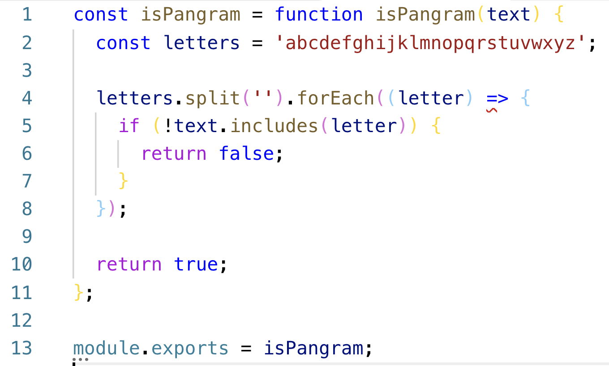
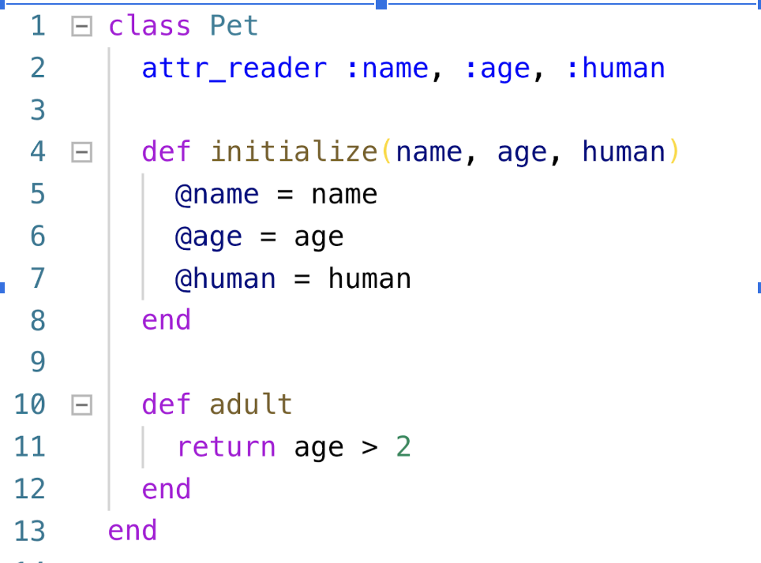

# JavaScript Review Questions

1. Take a look at  [translate_me.rb](code-samples/translate_me.rb) and convert the Ruby sample code into JavaScript. 
1. Take a look at [functions_first_class.js](code-samples/functions_first_class.js)
   - Predict the output of the code sample.
   - In `getResume()`  what does `this` refer to?
   - With your neighbor try to convert the for loop into a forEach loop.

1. What is wrong with the code above?
1. Name 2 advantages of an arrow function over a traditional functional expression.
1. When should you avoid using an arrow function?
1. Reduce this function to a minimal arrow function
   ```javascript
   const divisibleByThree = function divisibleByThree(num) {
     return num % 3 === 0;
   };
   ```
1. Take a look at your JS-Testing exercise with your neighbor.
   - Identify edge-case tests
   - Identify nominal tests
   - Is there anything else that should be tested, but isn't?
   
1. Convert the above into a JavaScript class
1. What is a **Constructor**?
1. How would you create an instance of **Pet** in JavaScript.
1. How do you make instance variables private in JS?
1. How do you create a **class method** in JS?

