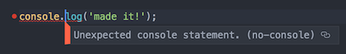

# Set Up Atom for Linting According to the AirBNB JS Standards

This walkthrough will help you set up Atom's `eslint` linter to follow the AirBNB standard globally and help keep you in line with the coding standard.

__Why do this?__  Without a good style guide that all parties adhere to, inevitably ugly, inconsistent code creeps in.  Agreeing on a coding standard helps keep the codebase readable, and encourage best practices.  You can read more on it [here](https://medium.freecodecamp.org/adding-some-air-to-the-airbnb-style-guide-3df40e31c57a).  Using a Linter is one way of enforcing a coding standard, the text editor reminds you when you veer off the road.  

[AirBNB](https://github.com/airbnb/javascript) has a well documented coding standard that is very popular.  There are others including [Google](https://google.github.io/styleguide/jsguide.html).

We are going to use the AirBNB JavaScript style guide at Ada to enforce a good consistent style.  

## Install Node Modules

First we will install some node modules eslint, our linter will use to enforce our coding standard.  

```bash
$ npm install -g eslint eslint-plugin-jasmine jasmine babel-eslint eslint-config-airbnb eslint-plugin-import eslint-plugin-jsx-a11y eslint-plugin-react
```

## A Global Linter Configuration File

Our linter `eslint` will naturally look for a `.eslintrc` file in our projects to know what coding standards to enforce.  We will create one in our home folders which will be the default, if the file does not exist in our local project.  You can always override this file by providing one of your own in your project's root directory.

Add this file `~/.eslintrc`

```json
{
  "extends": ["airbnb",  "eslint:recommended", "plugin:jasmine/recommended"],
  "parser": "babel-eslint",
  "env": {
    "browser": true,
    "node": true,
    "es6": true,
    "mocha": true,
    "jasmine": true
  },
  "rules": {
    "valid-jsdoc": ["error", {
      "requireReturn": false,
      "requireReturnType": false,
      "requireParamDescription": false,
      "requireReturnDescription": false,
    }],
    "require-jsdoc": ["error", {
        "require": {
            "FunctionDeclaration": false,
            "MethodDefinition": false,
            "ClassDeclaration": false
        }
    }]
  },
  "plugins": ["jasmine"]
}
```

## Install `eslint`

Back to Atom!  Now we can install Atom's linter and get it set up.  

In atom go to preferences-->install and install `eslint`.

Preferences:

Install


### Atom ESLint Settings

Then go to the settings and add these settings.

Settings:


1. .eslintrc path to: `~/.eslintrc`


2. Check `Use Global ESLint Installation`


## Trust But Verify!

Now open a new .js file and type:

```javascript
console.log("Am I linting yet?");
```

You should get a warning (Unexpected console statement) about not including `console.log` in production code (for the most part it's just used for debugging).



Notice the link on the right-side of the message.  That will take you to an eslint page about the rule.

## Summary

In this exercise we set up Atom to use the AirBNB coding standards by default in any JavaScript file we create (ending with .js).  To do so we had to install some node modules (like Ruby Gems) and install the `eslint` package in Atom.  

## Resources
- [AirBNB JavaScript Style Guide](https://github.com/airbnb/javascript)
- [Google JavaScript Style Guide](https://google.github.io/styleguide/jsguide.html)
- [A more generic style guide](https://github.com/standard/standard)
- [Why I Use a JavaScript Style Guide and Why You Should Too](https://www.sitepoint.com/why-use-javascript-style-guide/)
