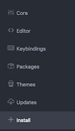
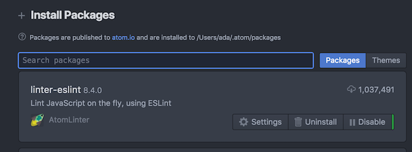
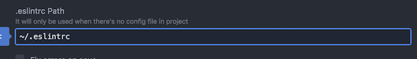
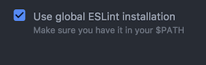
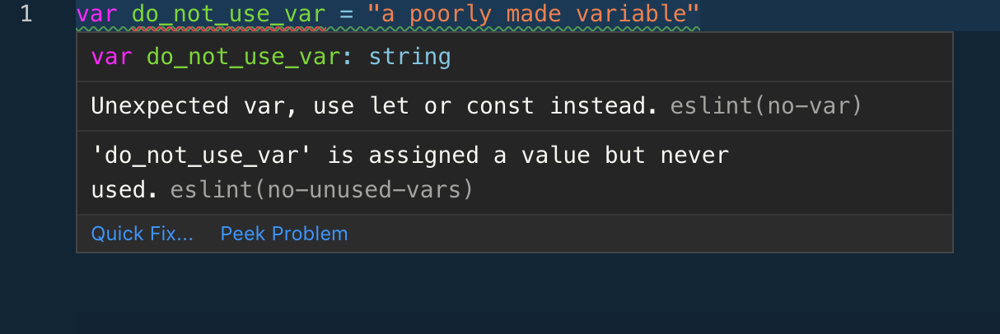

# Set Up Atom for Linting

This walkthrough will help you set up Atom's `eslint` linter to use the ESLint recommended settings globally and help you write cleaner JavaScript.  Many developers use specific linter configurations to enforce coding style guides.

## Learning Goals:

After this walkthrough you should be able to:
- Explain what a code style guide is
- Write JavaScript in Atom with a JavaScript linter highlighting errors and warnings


[Source](https://xkcd.com/927/)

## A Note On Style Guides

Many software teams adhere to a set of rules which serve as guidelines for how to write and organize code.  Linters can be an integral part of a team's style conventions.

__Why use a style guide?__  Without a good style guide that all parties adhere to, inevitably ugly, inconsistent code creeps in.  Agreeing on a coding standard helps keep the codebase readable, and encourage best practices.  You can read more on it [here](https://medium.freecodecamp.org/adding-some-air-to-the-airbnb-style-guide-3df40e31c57a).  Using a Linter is one way of enforcing a coding standard, the text editor reminds you when you veer off the road.


- [AirBNB](https://github.com/airbnb/javascript) has a well documented coding standard that is very popular.
- [Google](https://google.github.io/styleguide/jsguide.html) also has a popular coding style guide.

We will use the linting setting [ESLint Recommended](https://eslint.org/docs/rules/) and [ESLint-react](https://github.com/yannickcr/eslint-plugin-react) which have a rather minimal set of linting rules to highlight common JavaScript problems.


## Install Node Modules

First we will install eslint, which is the linter will use to enforce our coding standard.  There are several node modules here, which are all context-specific linters for the eslint style.

```bash
$ npm install -g eslint eslint-plugin-react jest jest-cli babel-eslint eslint-plugin-jasmine jasmine eslint-plugin-import eslint-plugin-jsx-a11y eslint-plugin-jest
```

## A Global Linter Configuration File

Our linter `eslint` will naturally look for a `.eslintrc` file in our projects to know what coding standards to enforce.  We will create one in our home folders which will be the default, if the file does not exist in our local project to define a project-specific standard.  You can always override this file by providing one of your own in your project's root directory.

Add this file `~/.eslintrc`

```json
{
  "parser": "babel-eslint",
  "plugins": ["jest", "react"],
  "rules": {
    "max-len": [1, 120, 2, {ignoreComments: true}],
    "no-console": 0,
    "no-var": 1,
    "jsx-a11y/href-no-hash": [0]
  },
  "extends": ["eslint:recommended", "plugin:react/recommended"],
  "env": {
    "node": true,
    "browser": true,
    "commonjs": true,
    "es6": true,
    "jquery": true,
    "jest/globals": true
  }
}
```

## Install `Linter-Eslint`

Back to Atom!  Now we can install Atom's linter and get it set up.

In Atom go to preferences-->install and install `linter-eslint`.

Preferences:


Install



### Atom Linter-ESLint Settings

Then go to the settings and add these settings.

Settings:



1. .eslintrc path to: `~/.eslintrc`



2. Check `Use Global ESLint Installation`



3. Also make sure that `Disable when no ESLint config is found (in package.json or .eslintrc)` is **unchecked**.

## Trust But Verify!

Now open a new .js file and type:

```javascript
var dont_user_var = "A poorly made variable";
```

You should get a warning (Unexpected var) about declaring a variable with var, that's ok as we want the warning to verify that linting is working.  



Notice the link on the right-side of the message.  That will take you to an eslint page about the rule.  If you get this message, it worked!

## Summary

In this exercise we set up Atom to use the ESLint recommended coding standards by default in any JavaScript file we create (ending with .js).  To do so we had to install some node modules (like Ruby Gems) and install the `linter-eslint` package in Atom.

## Resources
- [AirBNB JavaScript Style Guide](https://github.com/airbnb/javascript)
- [Google JavaScript Style Guide](https://google.github.io/styleguide/jsguide.html)
- [A more generic style guide](https://github.com/standard/standard)
- [Why I Use a JavaScript Style Guide and Why You Should Too](https://www.sitepoint.com/why-use-javascript-style-guide/)
