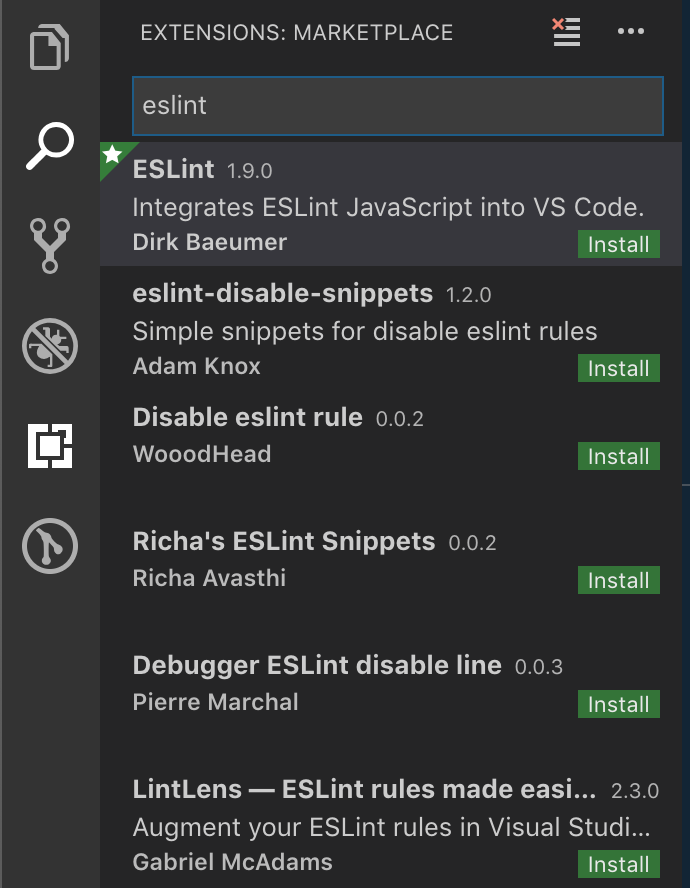

# Linting Setup for Javascript

This walkthrough will help you set up the `eslint` linter to use the ESLint recommended settings globally and help you write cleaner JavaScript.  Many developers use specific linter configurations to enforce coding style guides.

## Learning Goals:

After this walkthrough you should be able to:
- Explain what a code style guide is
- Write JavaScript with a linter highlighting errors and warnings


[Source](https://xkcd.com/927/)

## A Note On Style Guides

Many software teams adhere to a set of rules which serve as guidelines for how to write and organize code.  Linters can be an integral part of a team's style conventions.

__Why use a style guide?__  Style guides are a common way for a group of people to create consistently formatted documents. Like MLA or the Chicago Manual of Style, a code style guide helps us find the information we are looking for as quickly as possible.

In a large team, with programmers from a lot of different language backgrounds, it's easy to fall into whatever habits your first programming language encouraged. A Python whiz might default to using indentation alone to show where a code block begins and ends, where a C programmer at heart might feel more comfortable surrounding code blocks in curly braces. With small differences like these, one slight difference between two programmers may go unnoticed, but as teams get bigger and more and more styles mix, code becomes increasingly ugly and unreadable. 

Simply put, style guides help us keep code formatted consistently between developers, making for fewer context switches, and hopefully fewer dumb mistakes.

- [AirBNB](https://github.com/airbnb/javascript) has a well documented coding standard that is very popular.
- [Google](https://google.github.io/styleguide/jsguide.html) also has a popular coding style guide.

We will use the linting setting [ESLint Recommended](https://eslint.org/docs/rules/) and [ESLint-react](https://github.com/yannickcr/eslint-plugin-react) which have a rather minimal set of linting rules to highlight common JavaScript problems.


## Install Node Modules

First we will install eslint, which is the linter will use to enforce our coding standard.  There are several node modules here, which are all context-specific linters for the eslint style.

```bash
$ npm install -g eslint eslint-plugin-react jest jest-cli babel-eslint eslint-plugin-jasmine jasmine eslint-plugin-import eslint-plugin-jsx-a11y eslint-plugin-jest
```

## A Global Linter Configuration File

Our linter `eslint` will naturally look for a `.eslintrc` file in our projects to know what coding standards to enforce.  We will create one in our home folders which will be the default, if the file does not exist in our local project to define a project-specific standard.  You can always override this file by providing one of your own in your project's root directory.

Add this file `~/.eslintrc`

```json
{
  "parser": "babel-eslint",
  "parserOptions": {
        "ecmaVersion": 8
  },
  "plugins": ["jest", "react"],
  "rules": {
    "max-len": [1, 120, 2, { "ignoreComments": true }],
    "no-console": 0,
    "no-var": 1,
    "camelcase": ["error", {"properties": "always"}],
    "jsx-a11y/href-no-hash": [0]
  },
  "extends": ["eslint:recommended", "plugin:react/recommended"],
  "env": {
    "node": true,
    "browser": true,
    "commonjs": true,
    "jquery": true,
    "jest/globals": true,
    "es6": true
  }
}
```

## Install `Linter-Eslint`

Head to VS Code!  Now we can install the extension for eslint and get it set up.

In VS Code open the Extensions tab and search for `ESLint`.

Extensions Tab:



## Trust But Verify!

Now open a new .js file and type:

```javascript
var dont_user_var = "A poorly made variable";
```

You should get a warning (Unexpected var) about declaring a variable with var, that's ok as we want the warning to verify that linting is working.  


Notice the `Quick Fix` link on the right-side of the message.  That will open a sub-menu that can take you to an eslint page about the rule.  If you get this message, it worked!

## Summary

In this exercise we set up VS Code to use the ESLint recommended coding standards by default in any JavaScript file we create (ending with .js).  To do so we had to install some node modules (like Ruby Gems) and install `ESLint` extension in VS Code.

## Resources
- [AirBNB JavaScript Style Guide](https://github.com/airbnb/javascript)
- [Google JavaScript Style Guide](https://google.github.io/styleguide/jsguide.html)
- [A more generic style guide](https://github.com/standard/standard)
- [Why I Use a JavaScript Style Guide and Why You Should Too](https://www.sitepoint.com/why-use-javascript-style-guide/)
