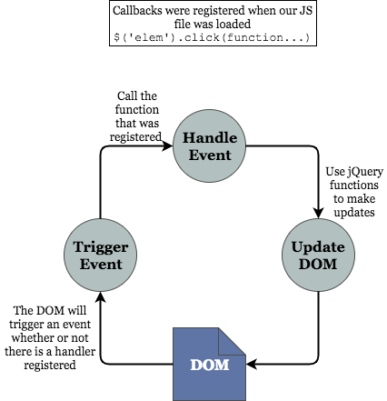

# jQuery Event Handling

## Motivation
- Users do things all the time: clicking on buttons, highlighting text, pressing keys
- Being able to respond to these events is the core of making a web page dynamic

## Learning Goals
- Become familiar with jQuery _event-handling_ syntax
- Use jQuery events to manipulate the DOM
- Use _event delegation_ to streamline complex event logic

## jQuery Event Handling
### First, an Example
Here is [an updated version](http://codepen.io/kariabancroft/pen/gLaBve) of the CodePen example we used with intro to jQuery.

There are two new pieces, both of which look something like this:

```javascript
$('.dynamic-list').click(function() {
  $(this).addClass('list-thinking');
})
```

We use jQuery to select an element with the class `dynamic-list`, and then call the `click()` function on it. `click()` has one argument: a function to be called when the user clicks on the element. The function that the event is associated with is referred to as a _callback_.

In this case, the _callback function_ is _anonymous_, that is, defined inside the list of arguments instead of being assigned to an external variable. This isn't strictly necessary - we could just as easily have defined a named function and used it instead - but using anonymous functions for callbacks is a pretty common pattern in JavaScript.

The jQuery `click()` function waits for a user event--in this case the user clicking the element with their mouse--and then calls the function that you provide (the callback) when that event happens.

### This Looks Familiar...
We've seen something very similar to this jQuery event handling syntax in the past:

```javascript
$(document).ready(() => {
  // Do some stuff, manipulate the DOM
});
```

We use this to make sure the HTML document has finished loading before we start messing with it. Turns out `ready()` is just another event. The only difference is it's triggered by the browser automatically rather than by something the user does.


### Overview
Now that we've seen an example with some of the syntax, let's take a step back and look at the big picture of how jQuery events apply to our web pages.

<!-- Diagram located: https://drive.google.com/a/adadevelopersacademy.org/file/d/0B6Pq6XZ1hzv1eXVScm5uTlE5U1U/view?usp=sharing -->



### More Events
There are a number of important jQuery events that we want to be aware of. `click` is one of the most common. Another set of events that we'll want to use are those related to keyboard events:
- `keydown`
- `keypress`
- `keyup`

Note that each of these have a slightly different and nuanced behavior. Also, the __key codes__ used for each are slightly different. For our purposes we will only examine [`keydown`](https://api.jquery.com/keydown/).

The way we invoke this method is similar to the click event, but we act on a keyboard action rather than a mouse action. The other relevant difference is that we care which key has been pressed, as opposed to the click event which is more relevant to the item we clicked on.

Let's see this [updated example](http://codepen.io/kariabancroft/pen/woKYRR):

```javascript
$("body").keydown(function(event) {
  if (event.key == 'a') {
    alert('You got an A!');
  }
});
```

Notice the `event` argument to our callback. This will get filled in with a bunch of info about what happened to trigger the event - for example, which key was pressed, exactly when the event occurred, and where the mouse was on the screen when it happened. The `event` argument has actually been available for all our events so far, we've just been ignoring it.

#### Exercise: Color Switching
[Using this CodePen](http://codepen.io/droberts-ada/pen/pNRbJd), build a script that changes the background color of the color-box div each time the spacebar or enter key is pressed.

Hints:
- Calling `nextColor()` will get the name of the next color to switch to.
- If you have a jQuery element named `target`, and you call `target.removeClass()` with no arguments, it will remove all classes from that element.
- Detecting keys like space and enter is a little different than letter keys. Look it up!
- `console.log()` is your friend.

## Extending to Multiple Elements
In the above examples, we only used ID selectors for jQuery, which means our event was only attached to one object. However, a CSS selector can select multiple elements. [Take this CodePen](http://codepen.io/droberts-ada/pen/jVygpR?editors=1010) for example. When you click on any of the list items, the click handler activates.

Instead of alerting with a generic message, let's tell the user which list item they clicked on. In order to do so, we'll need to figure out which element was clicked. Fortunately, jQuery lets us know which element we're in via `this`.

It's important to be aware that `this` is the raw JavaScript DOM object for the clicked element. If we want access to our nice `jQuery` functionality, just pass it into the `$` function:

```javascript
$(this)
```

Armed with `this` knowledge, let's get back to our task: telling the user what element they clicked on. Change the JavaScript in the CodePen to the following:

```javascript
$(document).ready(function() {
  $('li').click(function(event) {
    alert('Got a click on an <li> containing "' + $(this).html() + '"');
  });
});
```

## Event Delegation
Event handling starts to get tricky when you're working with dynamic content - things on your page generated by JavaScript, rather than baked into the HTML. As an example, add the following line of JavaScript to the CodePen, after the click handler:

```javascript
$('#mylist').append($('<li>Herbie Hancock</li>'));
```

You can click on `Herbie Hancock` all you want, but the event doesn't trigger. What gives?

Turns out you can only bind an event to an element that currently exists on the page. This means that when you add a new element, you'll have to rebind all the events it should be listening for. Sounds like a recipe for a bunch of overly-complex spaghetti code.

Enter _event delegation_. The big idea here is that when an event happens doesn't just happen to one element, but also to all containing elements. So in our case, the click happens on the `<li>`, then gets propagated to the `<ul>`, and then to `<ul>`'s parent, eventually winding up in `<body>`. Let's see this in action, by changing the selector on our click handler from `li` to `#mylist`:

```javascript
$(document).ready(function() {
  $('#mylist').click(function(event) {
    alert('Got a click on an <li> containing "' + $(this).html() + '"');
  });

  $('#mylist').append($('<li>Herbie Hancock</li>'));
});
```

Oops - we can click on `Herbie Hancock`, but now we get alerted about all the list items. Why?

In order to get the behavior we want, we'll have to make two changes:

1. We'll change `click(callback)` to `on('click', callback)`. `on` is another way that jQuery gives us to bind events; it's a little more complex, but gives us finer-grained control. If you make just this change, you should see the same results as before.

1. We'll pass an extra argument to `on`: the type of child element to listen on (`li`). This will cause jQuery to do exactly what we want: only detect the event if it happens to a `<li>` child of our list, and provide that child as the context in `this`.

The final, fully functional version of our JavaScript should look like this:

```javascript
$(document).ready(function() {
  $('#mylist').on('click', 'li', function(event) {
    alert('Got a click on an <li> containing "' + $(this).html() + '"');
  });

  $('#mylist').append($('<li>Herbie Hancock</li>'));
});
```

## What Have We Accomplished?
- Learn how to listen for user events
- Explore some different types of events, including clicks and key presses
- Use `$(this)` to retrieve the current element inside an event handler
- Discover how event delegation causes events to bubble up the document tree, and how to use this to handle events on dynamic objects

## Additional Resources
- [MDN on events](https://learn.jquery.com/events/introduction-to-events/)
- [jQuery documentation on event.which](https://api.jquery.com/event.which/)
- [jQuery documentation on event delegation](https://learn.jquery.com/events/event-delegation/)
