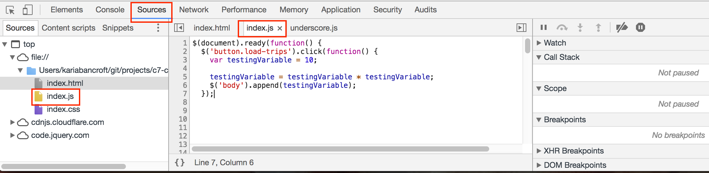
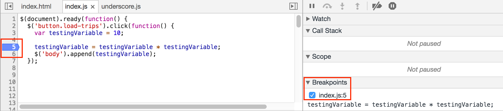
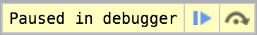

# JavaScript Debugging

## Learning Goals
- Explore the debugging tools provided by the Chrome developer console
- Define a breakpoint
- Use breakpoints in debugging activities

## Dev Tools
Many browsers provide nice debugging tools for web development. We utilize Chrome so we can access some of these tools consistently.

## What is a breakpoint?
A **breakpoint** is an intentional stopping or pausing place in a program, put in place for debugging purposes.

We have used basic breakpoint functionality in our Rails applications by adding `raise`. The great thing about breakpoints in a browser is that they give us even more power than the `raise` did in Rails. We can pause execution of our code, continue execution and check the values of variables all along the way!

## Setting and using breakpoints
### Find the code
First, we need to find the code that is running where we want to set a breakpoint. You can find the JS files in the "Sources" tab in the Chrome dev tools. Along the left you'll find the files that you loaded as part of your JS project. When you select a JS file, you'll see that the code is loaded.

### Set the breakpoint
Next, we need to **set** a breakpoint on a chosen line of code in the JS file we selected in the previous step. Generally we want to set a breakpoint where we are setting a variable's value, or within a function that isn't providing our expected result.

In this example code, the `testingVariable` that is printing out has an unexpected value when it is added to the HTML. We will set the breakpoint when the `testingVariable` is modified _before_ it is appended to the HTML. We do that by **clicking on the line number** that corresponds to the line of code where we want to pause execution.

Your breakpoint is set when you see the blue badge on the line of code, as well as that breakpoint listed on the right hand side menu that lists all breakpoints.

### Run the code
Now that we have a breakpoint set, we should run our code to see it in action and use it to debug.

This example code is located inside a click function which will execute only once the button referenced is clicked. Therefore, we have to click the button in the browser in order for our breakpoint to be _hit_.

Once we click the button, we should see our screen go gray and the following **step tool** pop up at the top of our browser screen.

Now we have the ability to interact with our code. Try hovering over the variables in the code box to see what their values are.

#### Stepping
Once you see the step tool pop up, you now have the ability to **step over** a function call or **continue** execution.

If you choose **step over** you will remain in the debugger and the debugger will pause on the next line of code.

If you choose to **continue** then the debugger will continue executing all of the remaining code.

## Key Takeaways
- Browser dev tools are powerful debugging resources
- Breakpoints are a good way to see a snapshot of variable values throughout the execution of your code
- Breakpoints will only be hit if the code is executed
- **You should be using these tools in the development of your JS applications!**

## Additional Resources
- [Chrome DevTools](https://developers.google.com/web/tools/chrome-devtools/javascript/)
