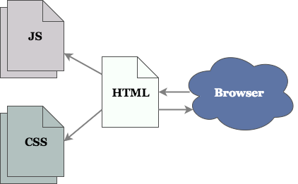

# JavaScript in the Browser

## Learning Goals
By the end of this lesson, students will be able to...

- Practice evaluating JavaScript in the Chrome Dev Tools -> Console
- Connect a JavaScript script to a website
- Define the DOM
- Do basic manipulation of the DOM

## Running JavaScript in the Developer Console

Our first step is to prove that our browser Google Chrome can read and execute JavaScript.

In your browser, open a new empty tab, and pull up your developer tools. Click on the Console tab. This is where calls to `console.log()` will end up. It's also where you'll see any errors that occur.

Notice also that there is something that looks like a command prompt. Let's see what it does.

```javascript
console.log('live, from the browser!');
```

Nice, there it is. OK, let's do something a little more interesting - a popup box.

```javascript
alert('four score and seven years ago...');
```

Pops right up! Can't do that in the terminal!

[Where did the `alert` method come from? Who defined it?](https://developer.mozilla.org/en-US/docs/Web/API/Window/alert) `Window` is something that the browser makes available to us. When we write JavaScript that runs in the browser, we can predict that the `alert` method will be available to us.

What happens if we make a mistake? Let's reference an undefined variable.

```javascript
console.log(doesNotExist);
```

OK, so that's what an error looks like. If you double click on the message or click on the `(...)`, it'll show you more details.

The Chrome console is kind of like the rails console. It gives you access to all the variables you've defined in your scripts, allowing you to write JavaScript live and see the effects immediately. Use it well.

## Running JavaScript on Websites

Obviously we don't expect users to type out all their own JavaScript by hand. How do we get a website to connect to a JavaScript file? We'll add a link to our JavaScript file in our HTML, similar to the way we included CSS before.

When our user goes to a website using their browser, the browser will make a request for an HTML page. This HTML page contains references to our CSS and JavaScript files. Then, these files will be loaded into the browser.
<!-- Diagram located here: https://drive.google.com/a/adadevelopersacademy.org/file/d/0B6Pq6XZ1hzv1WHcyUnZZREtadDg/view?usp=sharing -->



### Try It

1. Create a new directory called `browser-js`, with two files: `index.html` and `index.js`:

    ```bash
    $ mkdir browser-js
    $ cd browser-js
    $ touch index.html
    $ touch index.js
    ```
1. Add this basic HTML to `index.html`:

    ```html
    <!-- index.html -->
    <!DOCTYPE html>
    <html>
      <head>
        <meta charset="utf-8">
        <title>JavaScript Test Page</title>
      </head>
      <body>
        <h1>Test page for JavaScript in the Browser</h1>

        <div id="js-lecture-target"></div>
      </body>
    </html>
    ```

1. And finally, add this JavaScript to `index.js`:

    ```javascript
    // index.js
    console.log('This is a test');
    ```

1. Modify your HTML page `index.html` by adding this `<script>` tag at the end of `<body>`, RIGHT before the closing `</body>` tag:

    ```html
    <!-- index.html -->
    ...
    <body>
      ...

      <script src="index.js" type="text/javascript"></script>
    </body>
    ```

1. Ensure all files are saved
1. Open up the Chrome Dev Tools and switch to the Console tab
1. Reload the page (refresh the page)
1. Observe that the test text `This is a test` from the JavaScript prints out!

#### Extend This Example

1. Check that you and your neighbor are on the right track
1. Modify your `index.js` file so it prints to the console some other text
1. Reload your HTML page and make sure you see that new text!
1. Modify your `index.js` file so it prints out this text five times

### Side Note: About `<script>`

Just like CSS links, you can include multiple `<script>`s in your page, and they'll be loaded in order.

#### Where Should `<script>` Go?

Believe it or not, people have a lot of opinions on this topic.

<details>

  <summary>
    In this class we'll always load our scripts at the end of the body. If you'd like to learn more, click here to expand and see our thoughts.
  </summary>

The reason why JS loading is so contentious is, when the browser encounters a `<script>` tag, it stops loading the HTML document. It goes and downloads your _entire_ script, which might be quite large and hosted halfway across the internet. Only once the script has finished downloading does it continue rendering the page. That means if you put your `<script>` tags before your content, the user gets to look at an empty white screen for a while while your scripts load. Not a great user experience.

The easiest way to deal with this is to always place your scripts at the bottom of your `<body>` section. That way, the browser renders the whole page first, then goes and gets your scripts.

Out in the wild you'll see other techniques, like downloading the scripts asynchronously and not running them until the page has finished loading. This is cool, and you should definitely know that it's a thing, but it takes some work to set up.

</details>

## Manipulating the DOM
Logging to the console is alright, but the true power of JavaScript is that it can dynamically change the contents of the webpage. The interface the browser provides for dynamically changing the page's content, behavior, and appearance is called the _DOM_.

When we say that it _dynamically_ changes the page, we mean that the changes are made to the "living" copy of the page that the browser has in its memory. Until now our web applications have rendered _static_ HTML which defines a webpage. They have then sent it to the browser which in turn builds the DOM from that HTML.

When we use JavaScript to manipulate the DOM, we do not change the original HTML that was sent to the browser, instead we change the browser's internal representation of that same webpage. An important consequence of this distinction is that all of our changes disappear as soon as the browser forgets about that webpage (e.g. if we close the tab or the whole browser).

### What Is the DOM?
_DOM_ stands for Document Object Model. The document in question is our web page! The "Object Model" part is for distinguishing the DOM approach from other ways of accessing a document (which are not available in the browser). You can see the DOM for any webpage your browser has loaded by opening the developer tools and selecting the Elements tab (in Chrome).

The DOM is effectively a tree, like the ones we've learned about in CS fundamentals. In general each node in the tree matches up to an individual HTML tag such as `div` or `img`.

Nodes in the DOM have properties that match the attributes set on them in the HTML (e.g. an `img` node might have `src` and `id` properties). DOM nodes also have children, which are all of the other nodes nested within them (e.g. a `div` node might have a `table` child node).

### JavaScript and the DOM
In JavaScript, the DOM is exposed through a set of objects and methods that provide access to the HTML structure of the webpage. These act sort of like the Ruby gems we've seen in the past, an extension rather than a core part of the language. The only difference is, when running JS in the browser, you get access to these DOM functions automatically - no `require`s necessary.

The methods for DOM manipulation in JavaScript allow you to add and remove nodes from the DOM tree, change the attributes of a node, and enable interactions from the user such as clicking on a button (or any other type of HTML tag).

Before we go on, it's worth noting that the raw interface JavaScript provides for the DOM isn't great. It's clunky, and lots of pieces are slightly different in different browsers. In the next lecture, we'll talk about what to do about that.

### Changing the DOM From Our Script
The DOM is accessed through an object called `document`. Let's update our `index.js` to use it:

```javascript
// index.js
console.log('This is a test');

let target = document.getElementById('js-lecture-target');  // Find the HTML element where the ID is js-lecture-target
target.innerHTML = '<p>I give you... content!</p>'; // Put this HTML inside the div we retrieved above
```

Now we have modified the DOM using JavaScript Code. That is the only instance of direct DOM manipulation we'll ever do in this class. Now that you know that it _can_ be done, we'll skip right to a neat library called `jQuery` that smooths out many of the issues outlined above. But that is a subject for another lecture.

## What did we Accomplish?
* Run some JavaScript in the browser
* Use the DOM to change the content of our web page
* Understand that we'll never use the DOM directly again

## Additional Resources
* [MDN on the DOM](https://developer.mozilla.org/en-US/docs/Web/API/Document_Object_Model/Introduction)
* [StackOverflow on where to put your `<script>` tags](http://stackoverflow.com/questions/436411/where-is-the-best-place-to-put-script-tags-in-html-markup)
*  [Slides on JS In the browser](https://docs.google.com/presentation/d/1GPTn6W0QeEyquCxBJFj-E9W-i-MgXsBytA4xtCCW6Q4/edit#slide=id.g195ed98213_0_86)
