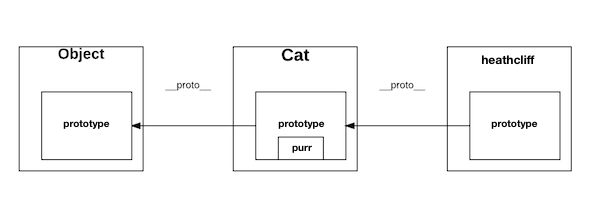

# JavaScript Objects

## Learning Goals
After reading this you should be able to:
* Create a JavaScript Objects using functions
* Explain how new instances inherit functionality in JavaScript using Prototypes

## JavaScript Objects

### Recap Objects and Hashes in Ruby

In Ruby, objects and hashes are two different things. A hash is a data structure that maps keys to values. The keys are strings or symbols, and the values can be any data type.

```ruby
ruby_hash = {
  key: "value"
}
```

Objects, on the other hand, are formally specified through a class definition. Their structure is much more rigid, and they can contain methods that act on the data they store.

```ruby
class RubyClass
  attr_reader :value
  def initialize(value)
    @value = value
  end
end
```

### Objects in JavaScript

In JavaScript, hashes and objects are the same thing! All objects are hashes, and all hashes are objects. In the interest of only having one name for things, we just call them "objects".

The syntax for creating a JavaScript object is very similar to the syntax for a Ruby hash. One important difference is that a JavaScript object can contain functions.

```javascript
let cat = {
  name: "Amper",
  age: 13,
  speak: function() {
    console.log(`${this.name} says meow`);
  }
}

cat.speak();
> Amper says meow
```

#### What is `this`?

You may have noticed the keyword `this`.  In JavaScript `this` refers to the current object like `self` in Ruby classes.   Inside an object's instance method you can access an instance variable with `this.<variable name>`.

### Object Templates with Prototype

Manual definition is great for 1-off objects, but what if we want to design a template to build numerous objects from, like we do with classes in Ruby?  JavaScript creates object templates differently than Ruby and other Object Oriented Languages.

#### Ruby-Style:  Classical OOP

In Ruby we create a template for objects by building a class.  We give the class methods and instance variables and then generate instances of the class.

```ruby
# cat.rb
class Cat
  attr_reader :name, :breed
  def initialize(name, age)
    @name = name
    @age = age
  end

  def info      # Each cat instance is unique
    "Meet #{@name} who is a #{@age} years old"
  end

  def self.speak  # Let's assume all cats speak the same way
    "meow!"
  end
end

puts Cat.speak
amper = Cat.new "Amper", 9
puts amper.info
```
This pattern of defining a class and then instantiating it is very common in object oriented languages, and languages that use it are sometimes said to have _classical_ objects. JavaScript uses a slightly different technique called _prototypical_ objects.

#### Object Templates in JavaScript

In the above Ruby example we have actions we perform on __instances__ (info) and actions we performed at the __class__ level (speak).  To create a template in JavaScript and generate instances involves 3 important steps.

1. Define a __constructor__ method which sets up the instance, usually initializing instance variables.
1. Extend the object's __prototype__ to add pieces common to all instances of this type of object, usually instance methods.
1. Call the constructor using the `new` keyword to create new instances.

Below is an example of a constructor method.

```javascript
let Cat = function(name, age) {
  this.name = name;
  this.age = age;
};

let amper = new Cat("Amper", 7);
```

By using `new` JavaScript runs the constructor function `Cat` and returns an object with `name`, `age` attributes.

All objects in JavaScript have an object named `prototype` as an attribute.  The prototype has a collection of instance variables and methods inherited from either Object or the object's constructor.

We can attach methods by extending the object's prototype.  You can do so by assigning the prototype to an object with the methods defined within, or add methods to the prototype object one-by-one.

```javascript
Cat.prototype = {
  info: function() {
    return `Meet ${this.name} who is a ${this.age} years old`
  }
}

Cat.prototype.purr = function() {
  console.log("Prrrrr");
}

let octo = new Cat("Octo", 13);
console.log(octo.info()); // Meet Octo who is a 13 years old
octo.purr();  // Prrrrr
```

So how does this prototype thing work?  When the `new` operator is used, JavaScript looks at the constructor's prototype and links the new instance to the constructor's prototype.  The constructor Cat constructor's prototype also links back to it's "parent", which in this case is Object.  So `amper` has access to methods in both the `Cat` prototype and `Object`.



By creating a constructor and extending the prototype you then have a template to generate as many objects with the needed fields and methods.

### Class Methods in JavaScript

If you want to create methods which operate like Ruby class methods in JavaScript you add the method to the Object and not it's prototype.

```javascript
Cat.speak = function() {
  console.log("meow");
}

Cat.speak();
> meow
```

Since this method is directly attached to `Cat`, you can't call it directly on instance of `Cat`.  Calling `octo.speak()` for example would fail.

### Prototypical Inheritance
Inheritance in traditional JavaScript is **complicated!** It also doesn't come up all that often, and because the syntax is so weird the ES2015 version of JavaScript has created a more traditional syntaxical sugar based on classes to make it easier. As such we won't cover it in detail in this course. Just know that JavaScript classes use prototypes under the hood.  If you're interested in learning more about how inheritance works in raw JavaScript, check out [the MDN guide](https://developer.mozilla.org/en-US/docs/Learn/JavaScript/Objects/Inheritance).

## Summary

We've seen how to:
* Create an object with a constructor method
* Extend an object's prototype to add attributes and methods to all instances.
* Add methods to an object to act like class methods

## Resources
- [Prototypal Inheritance in JavaScript](http://javascript.crockford.com/prototypal.html)
- [JavaScript methods within The Constructor vs Prototype](https://www.thecodeship.com/web-development/methods-within-constructor-vs-prototype-in-javascript/)
- [MDN Docs on JS Prototypes](https://developer.mozilla.org/en-US/docs/Web/JavaScript/Inheritance_and_the_prototype_chain)
