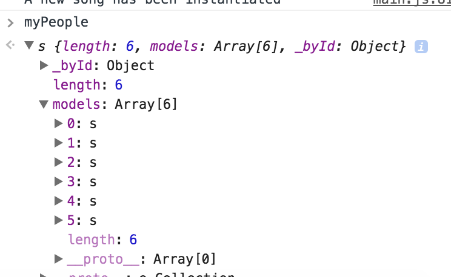

# Backbone Collections

## Learning Goals

At the end of this you should:
- Be able to explain what a Backbone Collection is
- Be able to place Models into a collection
- Be able to manipulate models in a collection
- Be able to filter models within a collection

## Collection Introduction

In Backbone a Collection is really a type of Model, one that has other model instances inside it.  You can think of it as similar to an Array, an ordered collection of Models.  

Collections are useful for storing and manipulating a group of models.

## Creating a Collection

To Create a Backbone Collection you will need to extend the Backbone.Collection class.  As shown below you can also 

```javascript
var People = Backbone.Collection.extend({

});

// Instantiating a People collection and starting it with some models.
var myPeople = new People([
					new Person({name: "Kari", title: "Ada Lead Instructor"}),
					new Person({name: "Dan", title: "Ada Instructor"}),
					new Person({name: "Jamie", title: "Ada Instructor"}),
					new Person({name: "Chris", title: "Ada Instructor"}),
					new Person({name: "Crystal", title: "Program Director"}),
					new Person({name: "Cynthia", title: "Executive Director"})
]);

// Adding a Person via the add method.
myPeople.add( new Person( {name: "Korica", title: "Program Coordinator"} ) );
```

Looking at the model in the console we can see the Models are stored in the collection under the models attribute, an array, and each instance has an index number.  They also have an attribute called a `cid` which is an id that Backbone assigns to each Model instance.  Models synched with a server also have a persistent ID assigned by the server.




## Getting Our Models!

You can retrieve a model from a Backbone collection via the get method which will take either the index number of the model and the Collection's `at` attribute, or via it's cid.

```javascript
// will print Dan's model
console.log(myPeople.at(1) );

// Will retrieve the model with cid equal to "c3" from the collection, if it exists.
console.log(myPeople.get("c1"));
```


## Removing Models

You can remove models in Backbone via it's `remove` method.

```javascript
var personToRemove = myPeople.at(3);
myPeople.remove(personToRemove);
```


## Looping through a collection

You can loop through a collection, known as iterating, using the `each` method.  This method takes an anonymous function and applies it to each model in turn.  The models are passed into the function one at a time as a parameter. 


```javascript
myPeople.each(function(person) {
  person.sayhi();
});
```
