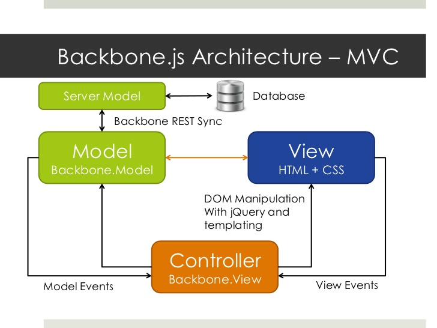

# Using Backbone With an API

## Learning Goals
By the end of this lesson you should be able to...

- Use Backbone to retrieve and render data from an API
- Send Backbone data to an API
- Write custom parsers and formatters to match API data and Backbone Models

## TaskList and the Task API
### Introduction
For this live-code, we'll be using the same Backbone task list we've used so far for live code. If you've been following along you should be able to use your version, but just in case the `api-baseline` branch of the [live code repository](https://github.com/Ada-C6/backbone-live-code/tree/api-baseline) is a good starting point.

Our task list has a lot of features so far, but it's also got one major problem: tasks are not persistent. Every time we reload the page, we get the same old static data, without any of our changes.

In order to add persistence, we'll need to make our app talk to an external API. The [Ada TaskList API](https://github.com/ada-c6/ada-tasklist-api) ought to do nicely. Follow the instructions in the README to run the server locally, and take a few minutes to familiarize yourself with the API.

Note that these instructions will work just as well for a deployed API - just change the URL.

**Question:** How might you make your app talk to an API? Which Backbone components ought to be responsible for this behavior?

**Question:** How is this similar to what we've done in Rails?



### Reading Data From an API

#### Configuring Backbone for Our API
Backbone doesn't just magically know where our API is or how it works - we have to tell it. Open up `.../collections/task_list.js`.

First we need to tell Backbone the URL of our API. Note that this `url` property is specifically for the data retrieval.

```javascript
var TaskList = Backbone.Collection.extend({
  model: Task,
  url: 'http://ada-tasklist-api.herokuapp.com/tasks'
});
```

Second we need to tell Backbone how to interpret the data it gets back. We can do so by implementing the `parse()` function, which Backbone calls on the data it gets back from the API. `parse()` should return an array of JavaScript objects representing tasks, in the same data format our static data was in.

**Question:** What does the data we get back from the API look like? How can we turn it into what we want?

```javascript
var TaskList = Backbone.Collection.extend({
  model: Task,
  url: 'http://ada-tasklist-api.herokuapp.com/tasks',
  parse: function(data) {
    return data.tasks;
  }
});
```

Note that you only need a `parse()` function if the data sent by your API doesn't match what Backbone expects (an array of objects). If that is the format, you can omit `parse()`.

#### Removing Static Data
Now that we are configured to read our data from an API, that means we don't need to keep any static data in our JavaScript files. Go into `src/app.js` and delete `taskData`.

Since we're not getting data locally, we need to tell Backbone to read it from the remote server which we have configured. To do so, add a call to `taskList.fetch()` once you've initialized the Collection.

When you're done, `app.js` should contain this modified instantiation of the `TaskList` collection:

```javascript
...
  var taskList = new TaskList();
  taskList.fetch();
...
});
```

Backbone knows that when `fetch()` is called, it should look for the appropriate configuration in the collection to load the data. Since the use of an API for data retrieval is so common, this can feel a bit like "magic".


### Writing Data To an API
Our original goal was to make our data persistent: if we make changes, the next time we load the page we should see them. We're not quite there yet - if you make some changes to your tasks and then reload the page the changes will be gone. The reason is we haven't told Backbone to **write** those changes to the API, we are currently only **reading**.

#### Delete
The one exception to this is "Delete", which _does_ seem to persist. What's going on?

Turns out that most APIs follow a predictable pattern, and Backbone is tuned into this. When you `add` a Model to a Collection that is configured with the `url`, Backbone (correctly) guesses that the delete `url` will be `<collection-url>/<id>`. In our case, that correctly matches the way we've defined the delete route in our API.

Moreover, [according to the Backbone documentation](http://backbonejs.org/#Model-destroy), `Model.destroy()` (which we used for the "Delete" operation in our `TaskView`) automatically sends a HTTP `DELETE` request against that URI. So that's why removed tasks are gone forever.


#### Mark Complete
The fact that "Delete" already works is good news - it means we've got our Models and Collections set up in more-or-less the right way. It should just be a few small changes to get the whole app up and running. We'll start with marking a task complete.

**Question:** How do we currently mark a task as complete? What does the Backbone documentation have to say about that?

Let's take a look at the model logic we have now for toggling a Task complete. Right now we are using `this.set()` to modify the task. The Backbone docs for `Model.set()` doesn't say anything about making API calls, so we'll need to tell Backbone to do so ourselves. A call to `this.save()` should do the trick:

```javascript
// .../models/task.js
  ...
  toggleComplete: function() {
    var newStatus = !(this.get('complete'));
    this.set('complete', newStatus);
    this.save();
  }
  ...
```

If this looks remarkably similar to saving ActiveRecord Models in Rails, it's no coincidence. The two tasks are very closely related, so it makes sense that Rails and Backbone would provide similar interfaces. Using `this.save()` tells the Backbone Model that we want to persist the data that has been changed. For more info on `save()`, check out [the docs](http://backbonejs.org/#Model-save).

#### Adding a Task
Work with a partner to make adding a new task persistent! You should follow a similar process to what we did for "Mark Complete":
1. find the code where we currently add a task
2. read the documentation
3. apply some changes to the code
4. test it out
5. rinse & repeat

<!-- We're going to pass over "Edit" in this lecture, because the way we implemented it doesn't match up with an API well. It's worth spending some time looking at our current implementation to figure out why it will be difficult, and thinking about how we could have implemented it better. -->

### Matching Backbone to Non-standard APIs
Not all APIs follow the standard RESTful convention. Fortunately, Backbone's API integration is flexible enough to fit most any oddly-shaped web service.

We saw an example of this above, when we implemented `parse()` in our Collection. Other ways to customize include overriding the `toJSON()` methods in the Model and Collection, and the `url()` function in the Model. Read the docs for more info!

## What Did We Accomplish?
- Remove all that gross static data from our javascript file
- Load data into Backbone dynamically from an API
- Write Backbone data back to an API

## Additional Resources
- [Backbone docs on API integration](http://backbonejs.org/#API-integration)
- [MDN on Cross-Origin Resource Sharing (CORS)](https://developer.mozilla.org/en-US/docs/Web/HTTP/Access_control_CORS)
