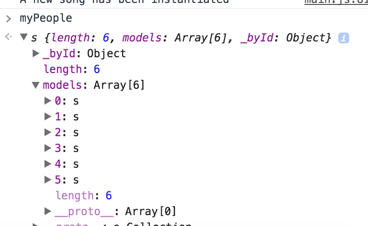

# TODO INSTRUCTORS:
This content is all good and should be covered at some point (possibly Wednesday morning), but I don't know that we'll have time tomorrow.

I (DPR) certainly don't have time to go through it right now.

## More on Collections

To create a Backbone Collection you have learned so far that you need to extend `Backbone.Collection`.  As shown below you can also add model instances directly into the collection when you instantiate it.  

```javascript
var People = Backbone.Collection.extend({

});

// Instantiating a People collection and starting it with some models.
var myPeople = new People([
					new Person({name: "Jamie", title: "Ada Instructor"}),
					new Person({name: "Dan", title: "Ada Instructor"}),					
					new Person({name: "Chris", title: "Ada Instructor"}),
					new Person({name: "Cynthia", title: "Executive Director"})
]);

// Adding a Person via the add method
myPeople.add( new Person( {name: "Korica", title: "Program Coordinator"} ) );
```

Looking at the model in the console we can see the Models are stored in the collection under the models attribute, an array, and each instance has an index number.  They also have an attribute called a `cid` which is an id that Backbone assigns to each Model instance.  Models synched with a server also have a persistent ID assigned by the server.




## Getting At Our Models!

You can retrieve a model from a Backbone collection via the `get` method which will take the *cid* as a parameter. You can also use the `at` method which will take the *index number* of the model in the collection.

```javascript
// will print Kari's model
var jamie = myPeople.at(0);
console.log(jamie);

// Will retrieve the model with cid equal to "c1" from the collection, if it exists.
var dan = myPeople.get("c1");
console.log(dan);
```

<!--
## Removing Models

You can remove models in Backbone via a Collection's `remove` method.

```javascript
var personToRemove = myPeople.at(3);
myPeople.remove(personToRemove);
```


## Looping Through a Collection

You can loop through a collection, known as iterating, using the `each` method.  This method takes an anonymous function and applies it to each model in turn.  The models are passed into the function one at a time as a parameter.


```javascript

// Causes
myPeople.each(function(person) {
  person.sayHi();
});
``` -->
<!--
## Filtering Models

You can also get a collection of filtered results with the `where` method.  The `where` method finds array of Models matching the given attributes.

```javascript
// Results in Dan, Jamie, Chris
var adaInstructors = myPeople.where( { title: "Ada Instructor" });

for (var i = 0; i < adaInstructors.length; i++) {
  console.log(adaInstructors[i].get("name"));
}
```

If you only want to find the first occurrence of the matching condition then you can use the the `findWhere` method.  The `findWhere` method returns the first matching model in the collection.  

```javascript
// Returns the model with { name: "Cynthia", title: "Executive Director" }
var matchingInstructor = myPeople.findWhere( { name: "Cynthia" } );
``` -->

## Pushing & Popping

Backbone Collections also have the `push` and `pop` methods which add an element to the rear and take an element off the rear of the collection.  

```javascript
// Returns Korica object and takes it off the collection
var popped = myPeople.pop();

var anotherPerson = new Person({name: "Charles", title: "Instructional Assistant" });
// Put this person into the list at the rear
myPeople.push(anotherPerson);
```


## Rendering Backbone Collections

So Backbone Collections can store groups of Models, but how does that apply to my webpage?  Often you want to render collections of Models not Models 1-by-1.  So you can build a View for a collection.

We will use the following collection to match our Todo-list application.

```javascript
// app/js/collections/todolist.js

TodoManager.Collections.TodoList = Backbone.Collection.extend({
  initialize: function() {
    // Event listeners go here

  },
  model: TodoManager.Models.Todo
});
```

First we need to build a template to render the collection into.

```html
<script type="text/template" id="tpl-todolist">
      <h2 class="page-header text-center">Things To Do</h2>
      <p class="text-center">
        <a href="#todo/new" class="btn btn-lg btn-outline">Add Item</a>
      </p>
      <article class="media-list media-list row small-up-1 medium-up-2 large-up-4 todolist-container "></article>
</script>
```

And then the view to render the collection using the template.  Notice we use `that.$('.media-list)`.  Backbone provides a jQuery object you can use to select elements within the view's HTML.  We use that to select an article within the HTML to append each items' views to.  


```javascript
TodoManager.Views.TodoList = Backbone.View.extend( {
  tagName: 'section',
  className: 'media no-bullet column',
  template: _.template($('#tpl-todolist').html()),
  initialize:  function() {
    // put event listeners here!
  },
  render:  function() {
    var that = this;
      // Clear the HTML with the fresh template when rendering
    this.$el.html(this.template());
    _.each( that.collection.models, function(item) {

      var myTodoView = new TodoManager.Views.Todo ({
          model: item
        });
        // Select the Media-List class article inside the template
        // then append the item's view.
      that.$('.media-list').append(myTodoView.render().el);
    });

    return this;
  }
});
```

And then in `app/js/app.js` we can create the collection and view and render it.


```javascript
  // Build TodoList Collection
var myTodoList = new TodoManager.Collections.TodoList( [
                    new TodoManager.Models.Todo({description: "JavaScript Rules", title: "Learn JavaScript", id: 1}),
                    new TodoManager.Models.Todo({description: "Backbone Structures JavaScript", title: "Study Backbone", id: 2}),
                    new TodoManager.Models.Todo({description: "Jamie taught us", title: "Master AJAX", id: 3}),
                    new TodoManager.Models.Todo({description: "Rails 5", title: "Master Rails", id: 4})
                  ]);
  // Build TodoList View
var todoListView = new TodoManager.Views.TodoList({
     collection:  myTodoList
});
   //  Render the view
$('#todocontainer').append(todoListView.render().$el);
```
And the collection should then be rendered in the browser.  
