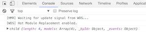

# Backbone Collections

## Learning Goals

At the end of this you should be able to:
- Explain what a Backbone collection is
- Place models into a collection
- Manipulate models in a collection
- Respond to events emitted by collections

## Introduction

In Backbone a Collection is a type of Model that can contain Model instances inside it.  You can think of it as similar to an Array: an ordered collection of Models.  

Using a Collection instead of an Array will bring us similar benefits to using a Model instead of a raw JavaScript Object. Collections can abstract away complex bits of logic (like only selecting Models that match a condition), they're also really good at talking to APIs, and they emit events when they change.

In this lecture we will begin to scratch the surface of the Power of collections.  We will stop using arrays of Model objects and use a Collection instead.  Then in the next lecture we will look at the Event model Backbone inherits from Underscore and how it applies to Collections & Models. 


## Adding a Collection
### Defining the Collection
The first thing we need to do is create the collection itself.  Our collection will get its own file: `app/collections/task_list.js`. As with models and views, we will call `extend()` on `Backbone.Collection`.

```javascript
// app/collections/task_list.js
import Backbone from 'backbone';
import Task from 'app/models/task';

var TaskList = Backbone.Collection.extend({
  model: Task
});

export default TaskList;
```

### Assembling the Collection
In `app.js`, we'll create a new instance of our Collection from our raw task data, and pass it to our View. First, import our new `TaskList` constructor:

```javascript
// app.js
import TaskList from 'app/collections/task_list';
```

Second, in `$(document).ready()`, instead of using an array of JavaScript objects, we'll use them to create a `TaskList` and use that instead.

```javascript
// src/app.js
import $ from 'jquery';
import _ from 'underscore';

import Task from 'app/models/task';
import TaskList from 'app/collections/task_list';

var taskData = [ {
  title: "Study JavaScript",
  completed: true
},
{
  title: "Learn Backbone Collections",
  completed: false
},
{
  title: "Take out the trash",
  completed: false
}];

var taskList = new TaskList(taskData);

$(document).ready(function() {
  $('main').empty();
  // Select the template using jQuery
  var template_text = $('#taskItemTemplate').html();
  // Get an underscore template object
  var template = _.template(template_text);

  taskList.each(function(task) {
    $('main').append(template(task.toJSON()));
   });
});

```

Notice that just like you can create a Model from a raw JavaScript object, you can create a Collection from an array of raw JavaScript objects.  This works as long as the `model` property of the Collection is set.

Remember that a Collection is just a special type of Model. This means we can pass the Collection in under the `model` property, and Backbone will mostly know what to do. Using a Backbone Collection should reduce the code we need to write.

### Iterating Through A Collection

Another thing to notice is that we used the Collection's `.each` method to iterate through a collection with the Collection's `.each` method and replicate the output we obtained with an Array of Tasks.  

```JavaScript
  taskList.each(function(task) {
    $('main').append(template(task.toJSON()));
   });
```

#### Check-in 

With your Seatsquad check and verify that you can both display the todo list using the Collection

## Events

Underscore provides an Event module that we can take advantage of.  With it we can configure functions to be called when a specific action occurs.  To start with we can set up a Event Handler to create new Tasks.  

Add the following HTML below the `<main>` element.  

```html
  <section class="new-task">
    <form>
      <div>
        <label for="title">Title:</label>
        <input name="title" id="title">
      </div>
      <div>
        <label for="completed">Completed:</label>
        <input type="checkbox" id="completed" name="completed">
      </div>
      <div>
        <button type="button" id="new-task">
          New Task
        </button>
      </div>
    </form>
  </section>
```

Then we can add the following, jQuery code to respond to the button's click event.

```JavaScript
  $('#new-task').on("click", function() {
    if ( $('#title').val() !== "" ) {
      var task = new Task({title: $('#title').val(), completed: $('#completed').val() === "on"  });

      taskList.add(task);
            
      // Clear the form
      $('#title').val("");
      $('#completed').prop('checked', false);
      
      console.log(taskList);
    }
  });
```

This will add a new `Task` to `taskList`, and then clear the form, but it doesn't change what's drawn on the screen (just the output to the console)...  We can however by looking at the console output see that the Collection has indeed been changed:



We can add an event handler to the Collection now to redraw the list every time the collection is updated.  

```JavaScript
  taskList.on("update", function() {
    $('main').empty();
    taskList.each(function(task) {
      $('main').append(template(task.toJSON()));
    });
  });
``` 
Backbone Collections provide a number of built-in events we can add handlers for, these include `update`, `change`, `add`, `remove` and [more](http://backbonejs.org/#Events-catalog).

If you notice this function looks a lot like the original loop that drew, aka *rendered*, our `taskList` on the screen originally.

We can dry up our code slightly by manually *triggering* the event after we add the original list of items.

```JavaScript
// src/app.js
...
var taskList = new TaskList(taskData);

$(document).ready(function() {
  $('#new-task').on("click", function() {
    if ( $('#title').val() !== "" ) {
      var task = new Task({title: $('#title').val(), completed: $('#completed').val() === "on"  });

      taskList.add(task);
      $('#title').val("");
      $('#completed').val("off");
      console.log(taskList);
    }
  });

  // Select the template using jQuery
  var template_text = $('#taskItemTemplate').html();
  // Get an underscore template object
  var template = _.template(template_text);

  taskList.on("update", function() {
    $('main').empty();
    taskList.each(function(task) {
      $('main').append(template(task.toJSON()));
    });
  });
  taskList.trigger("update");
});
```

### Check-in

Check and verify with your SeatSquad member that you can now add task items to your list.  


## Deleting Models From a Collection

Lets add a way to delete things from our list of tasks.  First we will need to add a button to delete the task.

```html
  <script id="taskItemTemplate" type="text/template">
    <section class="task-item">
      <h1><strong>Title:</strong> <%= title %></h1>
      <h3><strong>Completed:</strong> <%= completed %></h3>
      <button class="delete">Delete</button>
    </section>
  </script>
```

So we have a button for the user to press, however when the user presses a one of the buttons we need some way to distinguish which task to delete.  

Luckily Backbone Collections assign a unique ID, called a `cid` for each instance of the model.  

```JavaScript
  taskList.on("update", function() {
    $('main').empty();
    taskList.each(function(task) {
      $('main').append(template(task.toJSON()));
      $('main section.task-item:last').find('button').click ({taskCid: task.cid}, function(params) {
          taskList.remove(params.data.taskCid);
      });
    });
  });
  taskList.trigger("update");
```

### Toggling Tasks Complete/Incomplete

Now with your SeatSquad, add an event handler to toggle a Task between complete and incomplete.  You will, unfortunately need to trigger the `update` event manually.  

#### Verify 

You can find a solution [here](https://gist.github.com/anonymous/209589fa3db6f3725801361f6eaa5555)

## Looking Back

If this seems... messy, it is.  That's why we will next go into Views, to provide a bit of structure to our code.  Views will provide a bit of structure to coordinate between our models and the HTML templates.  


## What Have We Accomplished?

- Replace the array of Models in our `TaskListView` with a proper Backbone Collection
- Listen to events on the Collection to know when to update our display


## Additional Resources
- [Backbone docs on Collections](http://backbonejs.org/#Collection)
- [cdnjs on Collections](https://cdnjs.com/libraries/backbone.js/tutorials/what-is-a-collection)
- [Backbone Built-in Events Catalog](http://backbonejs.org/#Events-catalog)
