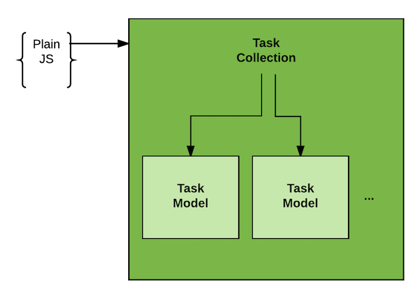
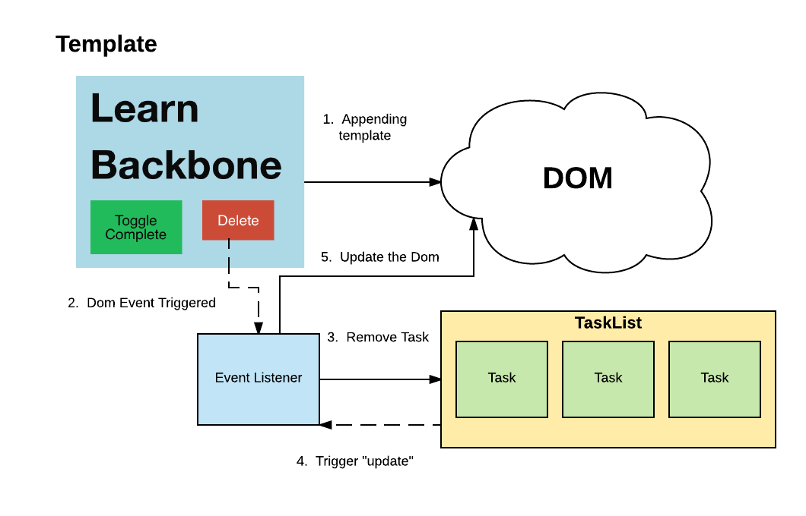

# Backbone Collections

## Learning Goals

At the end of this you should be able to:
- Explain what a Backbone collection is
- Place models into a collection
- Manipulate models in a collection
- Respond to events emitted by collections

## Introduction

In Backbone a Collection is a type of Model that can contain Model instances inside it.  You can think of it as similar to an Array: an ordered collection of Models.  

Using a Collection instead of an Array brings us similar benefits to using a Model instead of a raw JavaScript Object. Collections can abstract away complex bits of logic (like only selecting Models that match a condition), they're also really good at talking to APIs, and they emit events when they change.

In this lecture we will begin to scratch the surface of the power of collections.  We will use a Collection to track and contain our tasks.  Then we will look at the Event model Backbone inherits from Underscore and how it applies to Collections & Models. Our `TaskList` model will contain individual `Task` models.  

 

## 

## Creating a Collection
### Defining the Collection
The first thing we need to do is create the collection itself.  Our collection will get its own file: `app/collections/task_list.js`. As with models, we will call `extend()` on `Backbone.Collection`.

```javascript
// ./collections/task_list.js
import Backbone from 'backbone';
import Task from '../models/task';

var TaskList = Backbone.Collection.extend({
  model: Task
});

export default TaskList;
```

### Assembling the Collection
In `app.js`, we'll create a new instance of our Collection from our raw task data, and then loop through to render it. 

First, import our new `TaskList` constructor:

```javascript
// app.js
import TaskList from './app/collections/task_list';
```

Second, in `$(document).ready()`, we can create a TaskList to track our list of tasks.  A Collection can take generic JavaScript objects and use them to instantiate Models, in this case Task objects.

```javascript
// src/app.js
// imports etc...

var taskData = [{
  title: "Create a model",
  completed: true
},
{
  title: "Create a collection",
  completed: false
}];
  
var  taskList = new TaskList(taskData);

// ...

$(document).ready(function() {

  taskList.each(function(task) {
    render(task);
  });
});
```

### Iterating Through A Collection

Another thing to notice is that we used the Collection's `.each` method to iterate through a collection with the Collection's `.each` method and replicate the output we obtained with an Array of Tasks.  

```JavaScript
taskList.each(function(task) {
  render(task);
});
```

Just like we created a `render` method to draw an individual task we can create and use another method to render the collection.  By moving it into a function, we will later be able to move it into a separate component.  

```javascript
var renderList = function(taskList) {
  // Clear the unordered list
  $('.todo-items').empty();
  
  // Iterate through the list rendering each Task
  taskList.each(function(task) {
    render(task);
  });
};
```

And we can replace the `.each` loop in `$(document).ready` with `renderList(taskList)`.

#### Check-in 

With your Seatsquad check and verify that you can both display the todo list using the Collection and can add Tasks to the list. 

You can see a working solution [here](https://gist.github.com/CheezItMan/bbb9465a88d16412243dd1abadee8a21).


### Dom Events

We've seen with jQuery and in our previous examples DOM events, DOM events are built-in events within JavaScript that occur when something happens to the document.  When a user clicks a button, a key is pressed, etc.

We created an event handler for DOM click events, but now we need to modify it to add the newly created task to the collection and redraw the collection.

```javascript
$('#add-task').click( function() {

    // Create a new Task
    var task = new Task( readNewTaskForm() );

    // Add the Task to the list
    taskList.add(task);

    // re-render the list
    renderList(taskList);
  });
```

### Check-in

Check and verify with your SeatSquad member that you can now add task items to your list.  

You can see a working version [here:](https://gist.github.com/CheezItMan/f6ca39005274ec23d79060384dbf944b)

### Backbone Events

Underscore provides Backbone an Event module that we can take advantage of.  Backbone events allow us to respond when something happens to a Model or Collection.  We can use them to update or re-render a collection in response.  Backbone events include `update`, `change`, `add`, `remove` and [more](http://backbonejs.org/#Events-catalog).

Let's use the example of adding a new task to understand how our DOM events are different from our Backbone Collection events. 

When the "add task" button is clicked:
-  we trigger a DOM event. 
	- In this click event handler, we read the form data, create an instance of our Backbone Model and then add this model to our Collection. 
-  When the Model object is added to our Collection, Backbone is **aware** of the new Model object and will **automatically** trigger the Collection "update" event. 
-  If we are listening for the Collection update event, we can use this listener to update the DOM to render our updated Collection.

We can create an event handler to respond when the collection is updated.  

```javascript
$(document).ready(function() {
  // ... code
  
  taskList.on("update", function() {
    renderList(taskList);
  });
}
```

This event handler will cause the list to be re-rendered whenever the TaskList is updated.  We can now remove `renderList(taskList);` from our on click event handler because this event handler will be called when the collection is updated.  

Another way we can update the collection is to delete a task!


## Deleting Models From a Collection

We are going to set up the following process to allow us to delete tasks.  



1.  We will append the template to the DOM.
1.  We add an event listener to the **delete** button.
1.  When the listener is triggered it will call `remove` on our Collection.
1.  The `remove` method will trigger an "update" event which will trigger another listener we already wrote.
1.  That event listener will update the DOM.


The template has a button we can use to delete a model.  However we need some way to identify which model a button corresponds to.  

So we can pass the task to delete into the event handler.

We can add an event handler to the `render` method.  

```JavaScript
// src/app.js
// ...

var render = function(task) {
  // Select the template using jQuery
  var template_text = $('#taskItemTemplate').html();

  // Get a compiled underscore template object
  var templateObject = _.template(template_text);

  // Use the underscore template function to use the 
  //  data from the model to generate raw html.
  var compiledHTML = $(templateObject(task.toJSON()));

  // append the html to the unordered list.
  $('.todo-items').append(compiledHTML);

  compiledHTML.find("button.alert").click({task: task}, function(params) {
    taskList.remove(params.data.task);
  });
};
```

To review, the code above:

1.  Appends the template to the DOM.
1.  Adds an event handler to listen for the last button to be clicked, and passes the task to the event handler.
	-  The jQuery `click` function lets you pass an argument to the event handler.  In this case we pass a JavaScript object to the handler with one attribute (the task in question).  
	-  Then that object appears as an attribute tot he parameter of the event handler (params.data.  
1.  When the event handler is triggered it removes the task from the collection.
1.  This removal triggers an `update` event and causes the list to re-render.


#### Check-In

Verify with your SeatSquad member that you both have it working.  You can see a working solution [here:](https://gist.github.com/CheezItMan/b77634f6d017227cf440481e232c74e1) 


## What Have We Accomplished?

- We now have a Collection which can track our Tasks and trigger events when the collection changes.
- We are listening to events on the Collection to know when to update our display

## Take-aways
-  A Backbone Collection is an ordered collection of Model objects, like an array
-  Models can be added and removed from a collection.
-  You can iterate through a model with the `.each` function.
-  Backbone objects have their own event model and can emit events like "change" which you can set listeners for.


## Additional Resources
- [Backbone docs on Collections](http://backbonejs.org/#Collection)
- [cdnjs on Collections](https://cdnjs.com/libraries/backbone.js/tutorials/what-is-a-collection)
- [Backbone Built-in Events Catalog](http://backbonejs.org/#Events-catalog)
