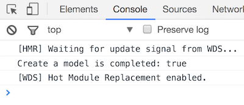

# Intro to Backbone Models

## Learning Goals

By the end of this lesson you should be able to:

- Explain what a Backbone Model is
- Create your own Backbone Model
- Instantiate your Backbone Model and assign attributes

## What is a Backbone Model
Backbone Models are much like Rails Models.  They keep track of your data and help in saving and loading information to and from your back end.

Things you can do with a model in Backbone include:
- Setting default values for new data
- Validating changes to the data
- Reading data from and writing it to an API
- Abstracting away complex bits of business logic
- Keeping track of a collection of data
- Triggering events when the data changes

Organizing all this functionality ourselves would be a giant pain in the butt, so let's create a model for our Todo items!

## What are we going to Do here

In this lesson we're going to start by creating models to hold the data for our Task List and then write a function to render, or draw, them on the screen using jQuery & Underscore.  We'll also add a jQuery event handler to let us create new Tasks.

You can see the finished version [here:](https://tasklist-js-models.herokuapp.com/)


## First Steps Setting up `app.js`

In our `src/app.js` file we will first set it up with lines we'll need from now on.

```javascript
// /src/app.js
// Load Foundation Files
import _settings  from './css/_settings.scss';
import foundation  from './css/foundation.css';
import css from './css/styles.css';

// Import jQuery & Underscore
import $ from 'jquery';
import _ from 'underscore';

// ready to go
$(document).ready(function() {

  $('section.main-content').append('<p>Hello World!</p>');

});
```

What does this do for us?  We first import some CSS files into our application so Webpack can load the styles dynamically.  

The  `import` statement lets us bring in code from libraries we are using and defined in our `package.json` file, and other JavaScript files we create.  Since our `app.js` file will regularly use underscore and jQuery throughout, we import them immediately.  These top lines should remain at the top of `src/app.js`.


## Adding Models
In this first section, we will create a model to represent a single task. We will add this model to our application without adding any new functionality. Later we'll take advantage of the model to add some new features that would be much more difficult without it.

### Defining the Task Model
The first thing we need to do is create the model itself. We start by calling `extend()`, on `Backbone.Model`. Our model will get its own file: `src/app/models/task.js`.

```javascript
// src/models/task.js
import Backbone from 'backbone';

var Task = Backbone.Model.extend({ });

export default Task;
```

In the code segment above we created a new type of model, `Task` which extends or inherits from `Backbone.Model` and we exported the type for any file which imports `src/app/models/task.js`.  

So now in our `src/app.js` file we can add.

```javascript
// src/app.js
//... imports etc
import Task from './models/task';

// ready to go
$(document).ready(function() {

  var my_task = new Task({
    title: "Create a model",
    completed: true
  });

  console.log(my_task.get("title") +  " is completed: " + my_task.get("completed"));

});

// ...
```

Notice we took out appending `hello world` to the DOM.

What did this get us?  We now have a new `Task` type of object which can store information, in this case `title` and `completed`.  Then just to test it we created one instance of `Task` and logged it to the console.  

We can check to see if it works by launching the site with `$  npm run dev` and viewing [http://localhost:8080](http://localhost:8080)




#### Check-in Point

Check with your SeatSquad and verify that you have the working output.  

**Question**:  What's that `.get` method?

Great question o'hypothetical student!

### Get & Set Methods

We created our task with two fields, `title` and `completed`.  We can access these fields with the `get` method.  You may have noticed how `.get` was used above in our initial logging of things to the console.

For example in `app.js` we used `get` already:

```javascript
// src/app.js

...
 
   // prints "Title:  Create a model"
console.log("Title: " + my_task.get("title") );
  // prints "Complete:  true"
console.log("Complete: " + my_task.get("completed") );
```

The `set` method allows you to change the attributes of a Model by either passing it a key and value or by passing `set` a JSON object.

```javascript
// sample code illustrating `set`

...

  // key & value example
my_task.set("title", "Test the `set` method.");
  // prints "Title:  Test the `set` method."
console.log("Title: " + my_task.get("title") );

  // using an object
my_task.set({title: "Run a hash of object"});
  // prints "Title:  Create a model"
console.log("Title: " + my_task.get("title") );
  // prints "Complete:  true"
console.log("Complete: " + my_task.get("completed") );
```

That's... great, but lets get something output to the webpage.

### Creating An Underscore Template

Lets use our fabulous underscore library to create a template to render, or draw our task item.  We have the following template in our HTML file to use.  Notice the `<%= %>` handles just like ERB.  We can use our underscore templates much like views in Rails to describe how we want to render our tasks.  

```html
<!-- index.html -->
...
  <script id="taskItemTemplate" type="text/template">
    <li class="task-item column column-block">
      <h2 <%= completed ? 'class="completed"' : 'class="incomplete"' %> >
        <strong> <%= title %></strong>
      </h2>
      <div class="row">
        <div class="small-6 columns">
          <button class="button success">
            Toggle <%= completed ? "Incomplete" : "Complete" %>
          </button>
        </div>
        <div class="small-6 columns">
          <button class="button alert">
            Delete
          </button>
        </div>
      </div>
    </li>
  </script>
```

Note that we can use the ternary operator `?` to change the output depending on values passed into the template.  In this case we are changing the class of the title's `<h2>` element and changing the text displayed on a button based on the `completed` property. 

Next we'll use the template to add content to the DOM.  
 

```javascript
// src/app.js

...

$(document).ready(function() {

  var my_task = new Task({
    title: "Create a model",
    completed: true
  });

  // Replacing the console log statements.
  
    // Select the template using jQuery
  var template_text = $('#taskItemTemplate').html();
  
    // Get an underscore template object
  var template = _.template(template_text);
  
    // Use the underscore template function to compile the
    // template and data into raw html.
  var compiledHTML = template(my_task.toJSON());
  
    // append the html onto the list using jQuery.
  $('.todo-items').append(compiledHTML);
  
  // End of new code
});
```

What's happening?  We first use jQuery to find our template with `$('#taskItemTemplate')`.  Then we use the `.html()` function to get the HTML code inside that selection.  

Then we call the underscore `template` function which compiles the given html into a template function with `_.template(template_text);`

Lastly we appended to `main` the resulting template with data provided by JSON from our model with `$('main').append(template(my_task.toJSON()));`

**Questions:** 
  -  What does `console.log(template_text);` print to the console?  
  -  What about `console.log(compiledHTML);` 

#### Check-In Point 

You should have the task displayed on the browser now.  With your SeatSquad member, first check and verify that you both have it working.  Then add a few more tasks to the display.  You can see one example [here:](https://gist.github.com/CheezItMan/33b342b9d47e345482ff2682b62938d0)

## Refactoring

Currently we've done all the code around drawing the Task within `$(document).ready`'s event handler.  Lets break that down into a separate function that we can call `render`.  This way we can create multiple Tasks and use `render` to add each of them to the DOM.  

```javascript
var render = function(task) {
  // Select the template using jQuery
  var template_text = $('#taskItemTemplate').html();

  //console.log(template_text);
  // Get an underscore template object
  var template = _.template(template_text);

  // Use the underscore template function to compile the
  // template and data into raw html.
  var compiledHTML = template(task.toJSON());

  // append the html to the unordered list.
  $('.todo-items').append(compiledHTML);
};

// ready to go
$(document).ready(function() {

  var my_task = new Task({
    title: "Create a model",
    completed: true
  });
  render(my_task);

});
```

Now we can create as many tasks as we need and add them to our list.  Later on we'll move `render` into a better structure, but for now we have a handy method to add tasks to our list.

##  Creating New Tasks

If you'll notice the HTML has a handy form available to create new tasks, but it doesn't do anything!  Lets change that and create an event handler for the `Add a Task` button.  For now we will create two functions to read from the input form, create a new task and add it to the DOM.

```javascript

var readNewTaskForm() {
  // Get the values from the fields
  var title = $('#title').val();
  $('#title').val('');
  var description = $('#description').val();
  $('#description').val('');
  var completed = $('#completed-checkbox').is(":checked");
  $('#completed-checkbox').prop('checked', false);
	
  return {
    title: title,
    description: description,
    completed: completed	
  }  
}

$('#add-task').click( function() {

    // Create a new Task
    var task = new Task( readNewTaskForm() );

    // Add it to the DOM
    render(task);
  });
```

So when we click the `Add a Task` button we get the values from the form fields, and clear them.  Then we create a new task.  Lastly we add it to the DOM with `render`.  

## What We Can't Do

At this point we can't remove a task from the DOM, and we cannot interact with one once we've added it to our list.  There's nothing keeping track of our growing **collection** of Task objects...  

So we need:
-  A way to store/track our Tasks
-  A way to delete a task when the user clicks the delete button.


This leads us to the next step in our journey... Collections!


## What Have We Accomplished
- Create a basic Backbone model to represent a task
- Created a template to display this task in the browser

## Resources
- [Backbone Model & View Documentation](http://backbonejs.org/#Model-View-separation)
- [An Intro to Backbone Models & Collections](http://liquidmedia.org/blog/2011/01/backbone-js-part-1/)
- [Backbone Fundamentals, Models Chapter](https://addyosmani.com/backbone-fundamentals/#models-1)
