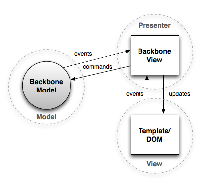
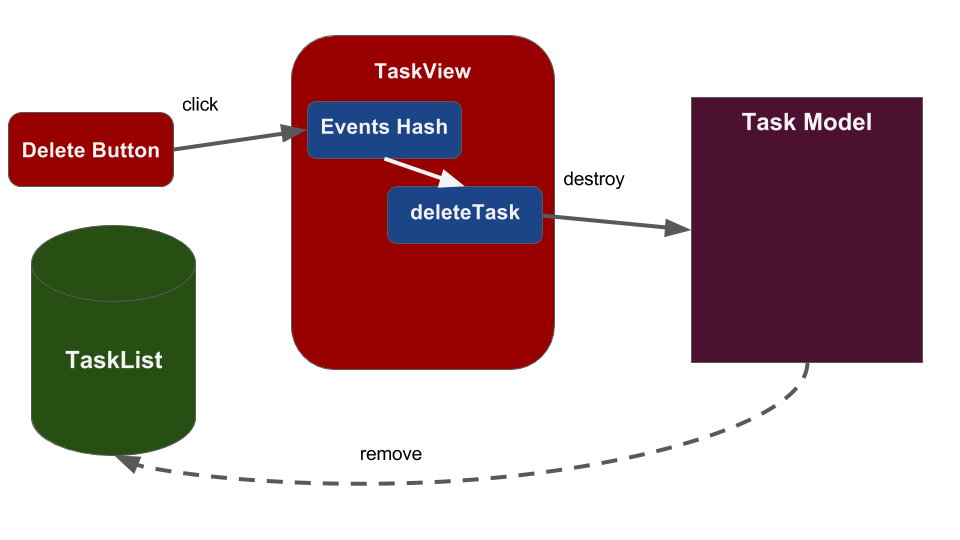

# Intro to Backbone Views

## Learning Goals
By the end of this lesson you should be able to:

- Explain what Backbone views are and why they're useful
- Create a view around a Backbone Model
- Render HTML using a view & an Underscore Template
- Create a view for a Backbone Collection
- Render a collection with a view

## What is a View?
Backbone views are kind of middle-managers in the Backbone world, filling a similar role to controllers in Rails. A view's job is to coordinate between the data and the DOM. When a DOM event happens, it's the view's job to handle it and update the data as needed, and when the data changes it's the view's job to modify the DOM to match.

You may have noticed in the previous lectures, we have a jumble (technical term) of functions handling events, and drawing the tasklist to the browser etc.  This could quickly become a mess.  It's time for some structure!

We will first create two views, one for a single task item and a second for the collection of Tasks.  Each view will handle drawing and event handling for it's specific domain, and the view for the collection will utilize the smaller TaskView.  



You can see a deployed version of this app [here:](http://cheezitman.github.io/tasklist-js)

## Creating A TaskView


A TaskView will handle drawing an individual task item and responding to events that concern just that task.  To start we create a file in `app/views/task_view.js`  Each TaskView will only be concerned with rendering a specific task and dealing with events on that task.  We've indicated it in red in the image above.  


```JavaScript
import Backbone from 'backbone';
import _ from 'underscore';
import $ from 'jquery';
import Task from '../models/task.js';

var TaskView = Backbone.View.extend({
  initialize: function(params) {
    this.template = params.template;
  },
  render: function() {
    var compiledTemplate = this.template(this.model.toJSON());
    this.$el.html(compiledTemplate);
    return this;
  }
});

export default TaskView;
```

### Important Parts of a View

Just like Models and Collections a view extends `Backbone.View`.  This view has 4 important properties, `initialize`, `render` `el`, & `model`.

|   Property	|   Description	|
|---	|---	|
|   `initialize`	|   A function, like in a Ruby class, called immediately when a new Backbone object is created, View, Model or Collection. 	|
|   `el`	|   An HTML DOM element that, by default, is an empty `div`.  We use `el` to insert our view into the page when it is rendered.  	|
|   `$el`	|   A jQuery selection of `el`, and you can use jQuery functions on it.  With `$el` you can run jQuery selections for HTML elements inside, and only inside the view.  For example, `$el.find('button.delete')` is jQuery selection of button with the class `delete` inside of `el` (the view). 	In other words `myView.$el` and `$(myView.el)` are equivalent.  |
|   `model`	|   The Backbone model which provides the data for the view.  The view's `model` can be a Backbone Model or Collection.  Each View should, in general, have **one** `model`.    	|
|   `render`	|   A function called to draw (or redraw) the view.  By convention the render function always returns `this` so that it can be chained with other methods.  |


## Adding our view to `app.js`

We can update our renderList method to use the new view to draw each element.  Instead of calling the render method we created in `app.js` we create a new TaskView with the given model & template.

Then we render the template and append the resulting `$el` to the DOM.  

```javascript
// app.js
// imports etc...
import TaskView from './views/task_view.js';

var renderList = function(taskList) {
  // Clear the unordered list
  $('.todo-items').empty();
  
  // Iterate through the list rendering each Task
  taskList.each(function(task) {
  
    // Create a new TaskView with the model & template
    var taskView = new TaskView({
      model: task,
      template: _.template($('#taskItemTemplate').html()),
      tagName: 'li'
    });
    
    // Then render the TaskView
    // And append the resulting HTML to the DOM.
    $('.todo-items').append(taskView.render().$el);
  });
};
```

Notice that in the code above we used `taskView.render().$el`.  We can do this because the view's `render()` method returns a reference to the view with the line `return this;`.  It is convention in Backbone to always have the `render()` method return `this` exactly so that we can do this kind of chaining.  We also set the 
that we are using for `el` to be `li` or a list item.

We are performing many of the same operations we performed in our `app.js` file's `render` function as we create the `TaskView` and render it.

## DOM Events & Views

Switching to using views has rendered the delete button inoperative.  Backbone however provides a way to configure a View to respond to DOM events using a JavaScript object called `events`.  

The `events` object is structured like a Ruby hash with DOM events as the keys and event handler functions as the values.  When a DOM event occurs, like when the user clicks on a button, Backbone looks at `events` and tries to match the event with a key in the event handler hash.  Below we create an events hash with our click event and an event handling method.  



```javascript
//...
}, // render
  events: {
    'click button.alert': "deleteTask"
  },
  deleteTask: function(e) {
    this.model.destroy();
    this.remove();
  }
}};
```

So when the user clicks a delete button inside the view:
-  Backbone will check the events hash and match the event with an event handler function.  
-  Then that function will call the model's `destroy()` function.  
-  The model will then remove itself from all collections.  
-  Once the model is removed from the collection the Collection will trigger an, "update" event 
-  Our event handler cause our `app.js` file's `renderList` function to execute.  

The line `this.remove();` removes the View from the DOM and also calls `stopListening()` which causes the view to stop listening to other objects, such as the model.

## Exercise

Now try to add another event yourself toggling the task between complete or incomplete using the model method you made earlier.  You will also need to finish the event handler by calling `render()` to draw the updated Task.

You can see a working version [here](https://gist.github.com/CheezItMan/ebd6a77aab299aa247ea3e9b1164dd1a).

## Backbone Events

Our view's `toggleComplete` function works, but not quite the Backbone way.  In Backbone events follow this pattern.

1.  A user performs an action
1.  A DOM event listener in the View responds to the action calling methods to change data in the Model.
1.  The Model emits a "change" event which the view is listening to.
1.  The view responds to the "change" event by redrawing the event.  


Right now we have the Backbone View responding to DOM events and issuing commands to the Model.  It's manually updating the DOM.  However it's not listening for changes in the model.  

We can set up the View to listen for changes in the model by adjusting the `initialize` method.  

```javaScript
var TaskView = Backbone.View.extend({
  initialize: function(params) {
    this.template = params.template;
    
    // Listen to changes in the model and call render when they occur.
    this.listenTo(this.model, "change", this.render);
  },
```

The [`listenTo`](http://backbonejs.org/#Events-listenTo) method causes the Backbone object to listen for custom events emitted by a different Backbone object.  In this case our View is listening for change events from the model.  We can now take out `this.render();` from the `toggleComplete` function.  

Backbone Models emit custom events like, "change," to allow other components to respond when data in the model changes.  

You can see a working version [here.](https://gist.github.com/CheezItMan/5d5ad38e664e587b040cb9e3368b88e8)

## Summary

So now we have a solution which displays a task, lets us toggle it complete or incomplete.  This view acts as a coordinator handling events and coordinating the response with the template & the model.  


## Last Note on Coding Style

Also notice that we only used `$el` to select items inside a view.  Views should never use jQuery directly `$()`, but rather use `$el` to ensure that we only select items within the view.  Some developers make an exception for selecting templates.  

## What Did We Accomplish?
- Create a basic Backbone view to display a task. It had the following functions:
  - `initialize()` is run once to set everything up
  - `render()` generates HTML, and may be run many times
- Use the underscore templating engine to separate concerns and clean up our rendering code.
- Added a DOM event handler methods to respond to click events.


## Additional Resources
- [Backbone View Documentation](http://backbonejs.org/#View)
- [Backbone Applications Intro to Views](https://addyosmani.com/backbone-fundamentals/#views-1)
- [Underscore documentation](http://underscorejs.org/)
- [SitePoint Underscore tutorial](https://www.sitepoint.com/getting-started-with-underscore-js/)
