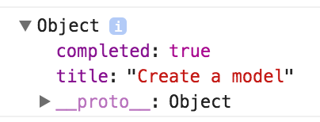

# Enhancing the Model

There are a lot of other things we can add to our Backbone models.  They can be constructed running a special `initialize` method.  They can be set up with default attribute values.  They can also, like our Rails models, be set up with methods to hold business logic.

## Learning Goals
-  Setup default values for model attributes
-  Write Custom methods in a model

## Default Values

We can edit the Task model by adding a hash of attributes to initialize.  For example below we can set default values for attributes:

```javascript
// src/app/models/task.js
import Backbone from 'backbone';

var Task = Backbone.Model.extend({
  defaults: {
    title: '',
    completed: false
  }
});

export default Task;
```

Then any tasks created like `var my_other_task = new Task({title: "Study JavaScript" });` will automatically have a field named `completed` set to false.  


## Custom Methods

This is also how you can add custom methods (including business logic) to your model. For example we've done a lot of printing the title & completion status of our Task to the console, a `logStatus` method might be handy. 

```javascript
// src/app/models/task.js
import Backbone from 'backbone';

var Task = Backbone.Model.extend({
  defaults: {
    title: '',
    completed: false
  },
  logStatus: function() {
    console.log("Title: " + this.get("title"));
    console.log("Completed: " + this.get("completed"));
  }
});

export default Task;
```

Then in our `app.js` we can simply print out the status of our task with:  `myTask.logStatus();`

### Initialize

Just like with a Rails Model you can create an `initialize` method and it will be called each time a new model is instantiated with `new`.

```javascript
// src/app/models/task.js
//...

var Task = Backbone.Model.extend({
  defaults: {
    title: '',
    completed: false
  },
  initialize: function(params) {
    console.log("Task initialized: " + this.get("title"));
    // just to see what params looks like
    console.log(params);
  }
});
```

Take a look at the code in the example and examine what `params` in initialize looks like.



The parameter to initialize is a JavaScript object containing the argument given when the Model is constructed with `new`.  

Later on we will use this method in our views.

#### Exercise

Add a `toggleComplete` method to the `Task` model which will toggle the `completed` attribute.  We'll try to use it later.

If you're stuck you can see a working solution [here:](https://gist.github.com/CheezItMan/38fac3dfd1f26cdd19a32b50b2a5c359)

## Resources
-  [What is a model?](https://cdnjs.com/libraries/backbone.js/tutorials/what-is-a-model)
-  [Defining Models in Backbonejs](http://codebeerstartups.com/2012/12/3-defining-models-in-backbone-js-learning-backbone-js/)