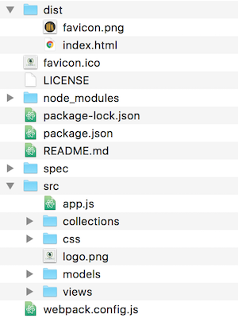

# Intro to Backbone.js

## Learning Goals

By the end of this lesson you should be able to:

- Explain what Backbone provides for you as a developer
- Explain the MV\* structure of Backbone

## What Is Backbone?

Pure JavaScript & jQuery can quickly become unstructured and messy.  It's very easy to build a single-page-application using JavaScript & jQuery as a collection of function calls, nested jQuery callbacks all tied to DOM elements in your HTML.  

Backbone provides structure to your application by breaking things into our now familiar MVC framework, separating concerns and allowing your app to communicate with the server with a RESTful set of API calls.  

So in short Backbone:
-  Provides structure to make your code more maintainable and readable
-  Encourages good practices in how your JavaScript interacts with external resources

### Aside: Libraries and Frameworks
The benefits of Backbone should look somewhat familiar - they're some of the same reasons we learned Rails rather than writing a custom web server in pure Ruby. However, there's a major philosophical difference between Backbone and Rails, down to the very core of their designs: Backbone is a **library**, while Rails is a **framework**.

#### Libraries
A library, like jQuery or the Ruby CSV gem, is a toolbox, from which you select the function or class that you need. The library accomplishes specific tasks, but ultimately your code is what's in charge. Examples of JavaScript libraries include:
- jQuery
- Backbone
- Underscore

#### Frameworks
A framework, like Rails, is just the opposite. You write some code (like a controller action) which is called by the framework. The framework is in charge; it's running the show. The vocab word for this is _inversion of control_. Frameworks tend to be much more structured than libraries, and they impose that structure on your program (this is not necessarily a bad thing!). Example of JavaScript frameworks include:
- React
- Angular
- Ember

#### So Why Backbone?
There are a lot of opinions about which is better, and oftentimes even opinions about whether there's really a meaningful difference between the two. That then raises the question: in this class, why learn a library like Backbone instead of a framework like Angular or Ember, which solves the same problems in a different way? Here are a few reasons:
- Backbone is a lot smaller and simpler than a massive framework like React, which means we're more likely to be able to get a good handle on it in just a few weeks.
- Backbone does a lot less for you, forcing a better understanding of the way the whole program flows.
- We've already learned a framework (Rails), so let's see what working with a library is like.

## Single Page Applications

Backbone is typically used to create *Single Page Applications*.  In a Single Page Application the entire page is only loaded once.  From that point on any data needed is loaded dynamically using Ajax without needing to reload the entire page.  

A good example of a Single Page Application is Gmail.  In Gmail new e-mails are loaded dynamically and when you send e-mail the page sends the information to the server without reloading the page.  This is an example of an asynchronous application.

## Backbone MV\*

Backbone implements the familiar MVC architecture that we learned in Rails in a slightly different way. In Backbone the views perform much the same roles as a Rails controller and Underscore templates work like Rails Views, thus Backbone is called an MV\* architecture.

### Backbone has 5 Components
1. **Models**: Similar to Rails models, these include the application data and business logic. Models can:
	- Organize data and business logic
	- Load and save data from and to the server
	- Emit events when data changes
1. **Collections**: These are ordered sets of models
1. **Views**: These render models and collections, and listen for DOM/Model events. Backbone views are really closer to Rails controllers, which has been confusing everyone for years.
1. **Events**: Events are a module, taken from underscore, which can be mixed in to any object, giving the object the ability to bind and trigger custom named events.
1. **Routers**: Routers let you add paths to the URL so that you can maintain history and allow users to jump to a specific state in your single-page-application.


## Live Code: Task List
As we learn about Backbone, we'll be using a running example: a task list, similar to the one we built at the beginning of Rails. The difference is, this task list will be a Single Page Application. You can find the initial setup linked in the calendar. The initial setup lives on the branch `master`, and the final result that we're working toward lives on the branch `live-code-sequence`.  

As we build this application we will implement it using one Backbone component and do the rest using jQuery and regular JS.  We will continue gradually adding Backbone components, replacing the jQuery and JS code until we have a full Backbone app.

You can see the finished version here: [https://cheezitman.github.io/tasklist-js/](https://cheezitman.github.io/tasklist-js//) 

The live code setup is a little more complex than what we've done in the past with JavaScript. Instead of directing your browser straight to a file, we'll run a simple webserver, kind of like what we did with Rails. To get started, run the following in the command line:

```bash
$ git clone https://github.com/Ada-C7/backbone-live-code.git
$ cd backbone-live-code
$ npm install
$ npm start
```

`npm start` runs the webserver - that's what all those scrolling statements are. If you navigate to http://localhost:8081, you should see the words `Hello World!` in the familiar Foundation font on a white background.

### Modules
The webserver is called **webpack**, and it is what's known as a "bundler". Much like the Rails server, its job is to keep track of all the JavaScript files we write and libraries we use, and pull them all together into one application. It can even do clever tricks like detecting when the code has changed and automatically refreshing your browser window.

In addition to webpack, we've included a module called **babel**. Babel is called a transpiler, and it helps deal with the fact that most browsers haven't implemented the newest version of JavaScript (ES6). Babel takes our ES6 code and turns it into older versions of JavaScript. Because we've tied it into webpack, this happens automatically - you should be able to write ES6 code and have it work in any browser.

In addition to those two several other libraries have been pre-installed, including jQuery, Backbone itself, and Underscore (a Backbone dependency). These are specified in `package.json`, which will act sort of like your Gemfile in a Rails app (with `npm install` taking the place of `bundle`).

For those with an unquenchable thirst for understanding, [Ada's Backbone scaffold repository](https://github.com/AdaGold/backbone-baseline) has additional details.

#### Relation to Backbone
Neither babel nor webpack have anything to do whatsoever with Backbone!

You can use Backbone without them, and use them without Backbone - in fact, right now Backbone is installed, but we're not using it at all. So why are we jumping through all these hoops? Because we've been learning JavaScript for 2 whole weeks, and it's time to switch to a big kids development environment!

### Directory Structure
Let's take a look at the directory structure. We are interested in the root folder and the  `dist` and `src` folders. Both these folder names are completely arbitrary - you can see them specified in `webpack.config.js`.

Inside `dist` are `bundle.js` and `bundle.js.map`.  These are compiled JavaScript files with all the JavaScript code we are using. In the root folder `index.html` is the page that will be served to the browser.  The `src` folder contains all our application's JavaScript, & CSS.

The `src` folder is where we'll put our JavaScript. There are a few empty folders in here which we will use eventually, but to start everything will go in `app.js`.

Our Project structure will look like this, including hidden files:



Note the folders for our models, collections & views.

### HTML Document

Throughout the LiveCode we will also be using the same HTML document in our exercise.  You will notice an underscore template at the bottom and an unordered list (`<ul>`) where we will be placing our tasks.  

```html
<!DOCTYPE html>
<html lang="en">
  <head>
    <meta charset="utf-8">
    <link rel="stylesheet" type="text/css" href="css/_settings.css">
    <link rel="stylesheet" type="text/css" href="css/foundation.css">
    <link rel="stylesheet" type="text/css" href="css/styles.css">
    <title>TaskList JS</title>
  </head>
  <body>
    <header class="row">
      <aside class="icon medium-4 small-12 columns">
        <a href="https://tasklist-js.herokuapp.com">
          
        </a>
      </aside>
      <section class="title medium-8 small-12 columns">
        <h1>Ada TaskList</h1>
      </section>
    </header>
    <main class="row">

      <aside class="small-11 large-3 medium-3 columns create-tasklist">
        <h2>Create a New Task</h2>
          <section class="row" id="title-section">
            <label class="columns medium-12">Title
              <input type="text" name="title" id="title" placeholder="Enter the title here" />
            </label>
          </section>
          <section class="row" id="description-section">
            <label class="columns medium-12">Description
              <textarea id="description" placeholder="None"></textarea>
            </label>
          </section>
          <section class="row" id="buttons-section">
            <div class="medium-8 columns">
              <input id="completed-checkbox" type="checkbox">
              <label for="completed-checkbox">Completed?</label>
            </div>

            <button id="add-task" class="medium-3 columns button success">Add a Task</button>
          </section>
      </aside>
      <section class="main-content small-12 large-9 medium-9 columns">
        <h2>Todo Items</h2>
        <ul class="todo-items row small-up-2 medium-up-3 large-up-4">

        </ul>
      </section>
    </main>
    <footer>
    </footer>
    <script id="taskItemTemplate" type="text/template">
      <li class="task-item column column-block">
        <h2 <%= completed ? 'class="completed"' : 'class="incomplete"' %> >
          <strong> <%= title %></strong>
        </h2>
        <div class="row">
          <div class="small-6 columns">
            <button class="button success">
              Toggle <%= completed ? "Incomplete" : "Complete" %>
            </button>
          </div>
          <div class="small-6 columns">
            <button class="button alert">
              Delete
            </button>
          </div>
        </div>
      </li>
    </script>
    <script src="/app.bundle.js"></script>

  </body>
  </html>
```


## Resources
- [Underscore Documentation](http://underscorejs.org/)
- [Backbone Documentation](http://backbonejs.org/)
- [jQuery Documentation](http://api.jquery.com/)
- [Top JavaScript Frameworks, Libraries and Tools and When to Use Them](https://www.sitepoint.com/top-javascript-frameworks-libraries-tools-use/)
- [StackOverflow on the difference between a Framework and a Library](http://stackoverflow.com/questions/3057526/framework-vs-toolkit-vs-library)
- [Jamie's Backbone.js Overview slides](https://docs.google.com/presentation/d/12wG-8q4AH9UU-Z1DjANf7m--CiVTKqj9OO0rX7oMlDc/edit?usp=sharing)
- [A Video on getting started with Webpack](https://www.youtube.com/watch?v=eWmkBNBTbMM)

