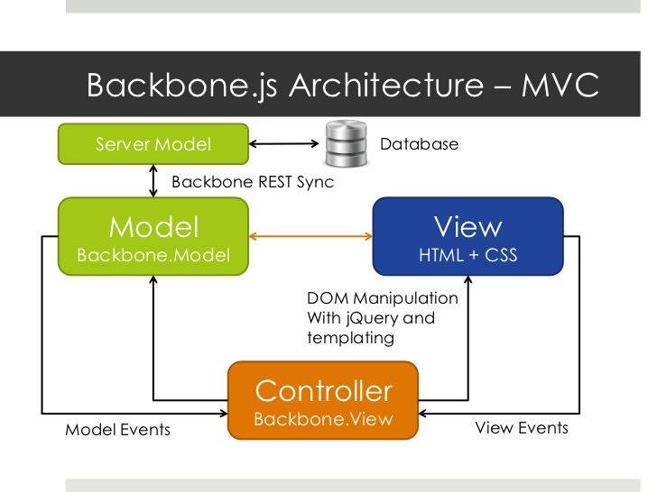

# Intro to Backbone.js

## Learning Goals

By the end of this lesson you should be able to:

- Explain what Backbone provides for you as a developer
- Explain the MV\* structure of Backbone

## What Is Backbone?

Pure JavaScript & jQuery can quickly become unstructured and messy.  It's very easy to build a single-page-application using JavaScript & jQuery as a collection of function calls, nested jQuery callbacks all tied to DOM elements in your HTML.

Backbone provides structure to your application by breaking things into our now familiar MVC framework, separating concerns and allowing your app to communicate with the server with a RESTful set of API calls.

So in short Backbone:
-  Provides structure to make your code more maintainable and readable
-  Encourages good practices in how your JavaScript interacts with external resources

### Aside: Libraries and Frameworks
The benefits of Backbone should look somewhat familiar - they're some of the same reasons we learned Rails rather than writing a custom web server in pure Ruby. However, there's a major philosophical difference between Backbone and Rails, down to the very core of their designs: Backbone is a **library**, while Rails is a **framework**.

#### Libraries
A library, like jQuery or the Ruby CSV gem, is a toolbox, from which you select the function or class that you need. The library accomplishes specific tasks, but ultimately your code is what's in charge. Examples of JavaScript libraries include:
- jQuery
- Backbone
- Underscore

#### Frameworks
A framework, like Rails, is just the opposite. You write some code (like a controller action) which is called by the framework. The framework is in charge; it's running the show. The vocab word for this is _inversion of control_. Frameworks tend to be much more structured than libraries, and they impose that structure on your program (this is not necessarily a bad thing!). Example of JavaScript frameworks include:
- React
- Angular
- Ember

#### So Why Backbone?
There are a lot of opinions about which is better, and oftentimes even opinions about whether there's really a meaningful difference between the two. That then raises the question: in this class, why learn a library like Backbone instead of a framework like Angular or Ember, which solves the same problems in a different way? Here are a few reasons:
- Backbone is a lot smaller and simpler than a massive framework like React, which means we're more likely to be able to get a good handle on it in just a few weeks.
- Backbone does a lot less for you, forcing a better understanding of the way the whole program flows.
- We've already learned a framework (Rails), so let's see what working with a library is like.

## Single Page Applications

Backbone is typically used to create *Single Page Applications*.  In a Single Page Application the entire page is only loaded once.  From that point on any data needed is loaded dynamically using Ajax without needing to reload the entire page.

A good example of a Single Page Application is Gmail.  In Gmail new e-mails are loaded dynamically and when you send e-mail the page sends the information to the server without reloading the page.  This is an example of an asynchronous application.

## Backbone MV\*

Backbone implements the familiar MVC architecture that we learned in Rails in a slightly different way. In Backbone the views perform much the same roles as a Rails controller and Underscore templates work like Rails Views, thus Backbone is called an MV\* architecture.

### Backbone has 5 Components
1. **Models**: Similar to Rails models, these include the application data and business logic. Models can:
	- Organize data and business logic
	- Load and save data from and to the server
	- Emit events when data changes
1. **Collections**: These are ordered sets of models
1. **Views**: These render models and collections, and listen for DOM/Model events. Backbone views are really closer to Rails controllers, which has been confusing everyone for years.
1. **Events**: Events are a module, taken from underscore, which can be mixed in to any object, giving the object the ability to bind and trigger custom named events.
1. **Routers**: Routers let you add paths to the URL so that you can maintain history and allow users to jump to a specific state in your single-page-application.

To keep things manageable, in the first week of curriculum we will only cover Models and Collections, with the goal of better organizing our app's data. Interacting with the DOM will still be handled by jQuery, similar to what we did in previous assignments.

In the following week we will explore Views, and how they help translate between the DOM and the Models.

## Resources
- [Underscore Documentation](http://underscorejs.org/)
- [Backbone Documentation](http://backbonejs.org/)
- [jQuery Documentation](http://api.jquery.com/)
- [Top JavaScript Frameworks, Libraries and Tools and When to Use Them](https://www.sitepoint.com/top-javascript-frameworks-libraries-tools-use/)
- [StackOverflow on the difference between a Framework and a Library](http://stackoverflow.com/questions/3057526/framework-vs-toolkit-vs-library)
- [Jamie's Backbone.js Overview slides](https://docs.google.com/presentation/d/12wG-8q4AH9UU-Z1DjANf7m--CiVTKqj9OO0rX7oMlDc/edit?usp=sharing)
- [A Video on getting started with Webpack](https://www.youtube.com/watch?v=eWmkBNBTbMM)
