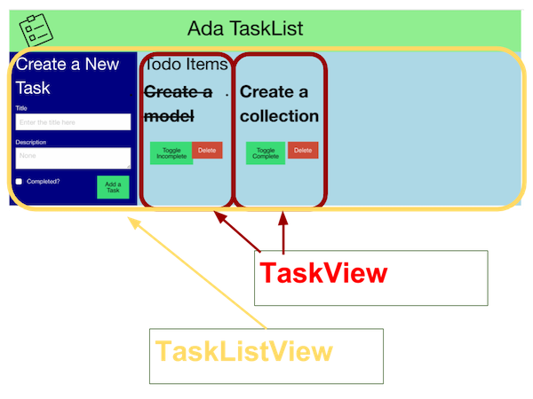
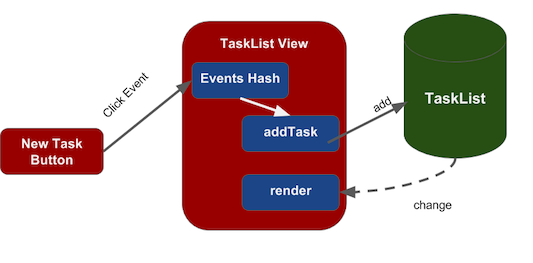
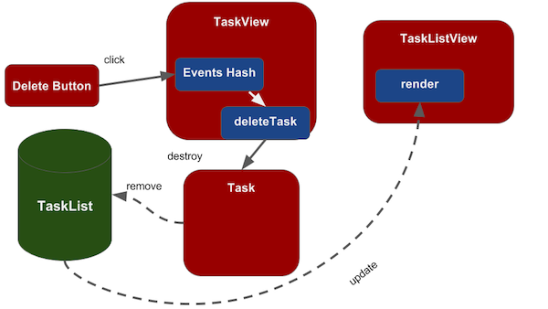

# Views of Collections

We have created a view for an individual task.  However views can also be built to manage a collection.  Therefore our next step is to create a TaskListView.  This view will manage everything we have on the site to including the form to add a new task to the list.  If you examine the image below the TaskListView's area of concern is indicated in yellow.  



## Learning Goals
-  Create a view to manage the entire TaskList collection
-  Create event listeners to add new models to the collection
-  Create event listeners for custom Backbone Events
-  Create a `render` method which creates and renders a group of smaller views.  

## Getting Started

This view starts like `TaskView` with a file named `/src/views/task_list_view.js`.  We can move our renderList code into the view's render method and make a few adjustments.

```javascript
import Backbone from 'backbone';
import _ from 'underscore';
import $ from 'jquery';
import TaskView from '../views/task_view.js';


var TaskListView = Backbone.View.extend({
  initialize: function(params) {
    this.template = params.template;
  },
  render: function() {
    // Clear the unordered list
    this.$('.todo-items').empty();
    // Iterate through the list rendering each Task
    var that = this;
    this.model.each(function(task) {
      // Create a new TaskView with the model & template
      var taskView = new TaskView({
        model: task,
        template: that.template,
        tagName: 'li'
      });
      // Then render the TaskView
      // And append the resulting HTML to the DOM.
      that.$('.todo-items').append(taskView.render().$el);
    });
    return this;
  }
});

export default TaskListView;
```
Just like the `TaskView` in `initialize` we store the template in an attribute of the view.  The view's render method looks like the render method we wrote earlier with a few differences particularly with regard to `this` and `that`.

### A Note about `this` and `that`.  

If you'll notice we save our current context `this` into a variable named `that` in the render method.  We do this because the `.each` method's callback method is called within the context of the collection.  

We finish the `render` method by appending each TaskView to the list inside the DOM and when the loop is finished we `return this;` by convention.  It's a fairly common pattern developers use in JavaScript to deal with confusing `this` issues. 


### About `this.$`

In the `render` method we clear the list using `this.$`.  The method `this.$` performs a jQuery selection for HTML inside `el`.  Using `this.$` we can ensure that our view does not interact with any code outside of it.  You should never use jQuery directly within a view.  Instead you should use `this.$` just as you would jQuery to avoid impacting the DOM outside your view.  


### Updating `app.js`

We will adjust our `$(document).ready` handler to use the `TaskView`.


```JavaScript
// app.js
// imports etc...

import TaskListView from './views/task_list_view';

// ...


$(document).ready(function() {
  // Why does this belong in $(document).ready ?
  var taskListView = new TaskListView({
    model: taskList,
    template: _.template($('#taskItemTemplate').html()),
    el: 'main'
  });
  
  taskListView.render();
});
```

We create the TaskListView and set it's model to be our taskList collection and set the template attribute.  In this case we start off our View attached to an element in the DOM, in this case our `main` tag.

Lastly we call render on the taskListView.

**Wait The Add & Delete Buttons Just got broken!!**  Don't worry we'll handle that shortly.  

### Handling Creating New Tasks

Just like we added event handlers in the `TaskView` to handle button clicks we can add an event handler to create a new task and a method to read from the new task form, and add them to the collection.




```javascript
// views/task_list_view.js
}, // end of render

events: {
    'click #add-task': "addTask"
  },
  readNewTaskForm: function() {
    // Get the values from the fields
    var formTitle = this.$('#title').val();
    this.$('#title').val('');
    var formDescription = this.$('#description').val();
    this.$('#description').val('');
    var formCompleted = this.$('#completed-checkbox').is(":checked");
    this.$('#completed-checkbox').prop('checked', false);

    return {
      title: formTitle,
      description: formDescription,
      completed: formCompleted
    };
  },
  addTask: function(e) {
    var taskData = this.readNewTaskForm();
    var task = new Task(taskData);
    this.model.add(task);
  }
```

Again this looks very much like what we originally wrote in `app.js`  We did change the code to use `this.$` instead of direct jQuery and called `readNewTaskForm()` as an instance method with `this.`.  

**Note you will need to delete the original event handlers in `app.js`.**

## Adding a Backbone Event Listener

**Question:** We've broken our delete handler (again). Why isn't it working?

With a little bit of digging, we can find that the delete and add buttons are doing what they're supposed to: tasks are getting added and removed from the collection. The problem is we're not re-rending the updated list.

If we add an event listener to the collection we can call render when the collection is updated.  



Similar to `on` we can use a method called `listenTo` to add an event listener for our collection.  We will do so in the `initialize` method.

```javascript
  initialize: function(params) {
    this.template = params.template;

    this.listenTo(this.model, "update", this.render);
  },
```

## Last bit, adjusting styles

You may have noticed that the styling is a bit broken.  That's because the `li` tag we set in the `TaskView`  doesn't have any classes added to it for styling.  

**NOTE** this is for `task_view.js` not `task_list_view.js`.  


```javascript
// src/views/task_view.js

  initialize: function(params) {
    this.template = params.template;
    
    this.listenTo(this.model, "update", this.render);
    
	 // Add classes for styling
    this.$el.addClass("task-item");
    this.$el.addClass("column");
    this.$el.addClass("column-block");
  },
```

We also need to make one adjustment by removing the `li` tag from the HTML template.

## Summary

So now we have a solution which displays our list of tasks, lets us toggle them complete or incomplete, delete and create tasks.  The view acts as a coordinator handling events and coordinating the response with the template & the model.  


## Last Note on Coding Style

Also notice that we only used `$el` to select items inside a view.  Views should never use jQuery directly `$()`, but rather use `$el` to ensure that we only select items within the view.  Some developers make an exception for selecting templates.  

## What Did We Accomplish?
- Create a basic Backbone view to display a task. It had one function:
  - `initialize()` is run once to set everything up
  - `render()` generates HTML, and may be run many times
- Use the underscore templating engine to separate concerns and clean up our rendering code.
- Added event handler methods to respond to click events.
- Create a more complex Backbone view to manage our whole collection

## Additional Resources
- [Backbone View Documentation](http://backbonejs.org/#View)
- [Backbone Applications Intro to Views](https://addyosmani.com/backbone-fundamentals/#views-1)
- [Underscore documentation](http://underscorejs.org/)
- [SitePoint Underscore tutorial](https://www.sitepoint.com/getting-started-with-underscore-js/)
