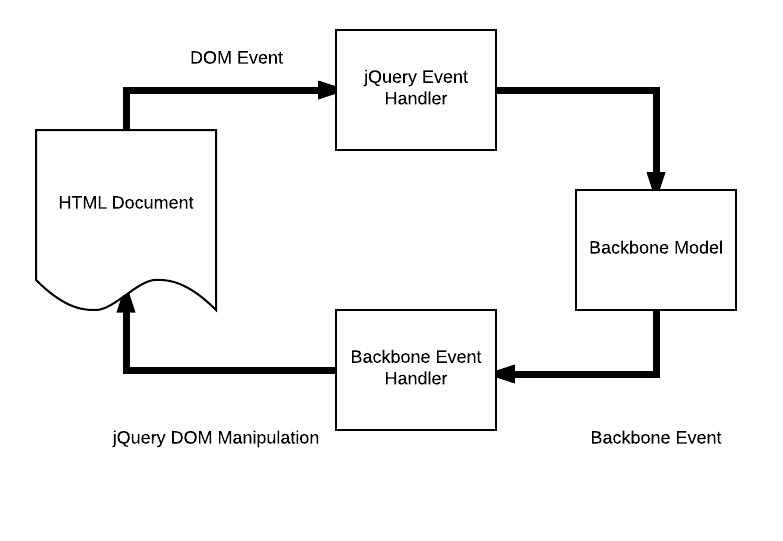
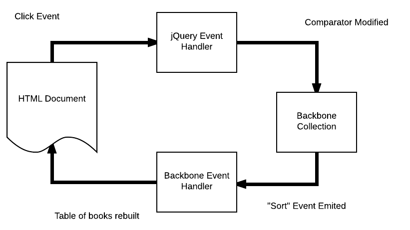

# Working with Backbone Events

In this lesson we'll look at Backbone's event handling behavior, one of the big advantages Backbone provides over raw JavaScript objects. We will use this to build two new types of functionality for our BackBooks app: adding and sorting.

## Learning Goals

By the end of this lesson, you should be able to:

- Describe what a Backbone event is
- Register a callback function for an event
- List some of the events emitted by collections, including `update` and `sort`

## Backbone Events

Backbone models and collections can emit events. This works almost exactly like the DOM events we've already seen. The big difference is that while DOM events are triggered in response to user actions, Backbone events are triggered when our data changes.

TODO DPR: Maybe move this code down to the vocab section, to give a clear running example?

We listen for Backbone events in the same way we listen for DOM events: using the `.on()` function. For example, to listen for a `update` event on our `bookList`, we would use the following code.

```javascript
let updateHandler = (list) => {
  // do some work, handle the update
};
bookList.on('update', updateHandler);
```

Once this code has been run, whenever our `bookList` emits a `update` event the `updateHandler()` function will be called. Neat!

Why is this important? **It means we can separate code that updates the model from code that updates the DOM.** In practice, this allows us to simplify and DRY our code that handles DOM events.



### Event Vocabulary

Before we go any further, let's review our vocabulary around event handling. This vocab is general - it applies not just to DOM events and Backbone events in JavaScript, but to event handling in any language.

**Trigger:** When an event happens, we say that the event has been _triggered_.
- A user _triggers_ a `click` event by clicking a button
- Our code automatically _triggers_ a `update` event on the `bookList` whenever it adds a book to the list

**Emit:** We might also say that an object _emits_ a `click` event. This usually indicates we're focused more on how our program responds the event than on what caused it.
- The button _emits_ a `click` event
- The `bookList` _emits_ a `update` event

**Event Handler:** Code that responds to an event is called an _event handler_ (sometimes _handler_ for short). In JavaScript, this will usually take the form of a callback function.
- In the above code, `updateHandler()` is an _event handler_

**Listen / Register:** When we associate a handler with an event, we say we are now _listening_ for the event. We also say that we have _registered_ an event handler.
- In the above code, we are _listening_ for a `update` event
- We have _registered_ the `updateHandler()` function as an event handler

## Adding Models to a Collection

As a demonstration of this technique, we will add functionality for adding a book to our library. This is what the high-level architecture will look like:


1. A user fills out and submits the "Add a book" form, triggering a `submit` DOM event
1. Our `submit` event handler will read the form data and use it to add a book to the collection
1. When the book is added, the collection will emit a `update` event
1. Our `update` event handler will re-build the table of books in the DOM

We will build these components in reverse order, starting with the handler for the `update` event, and then adding code to read the form and add a model to the collection.

### Building the `update` Event Handler

Let's look a little closer at that `update` event we mentioned earlier. This is a real event that Backbone collections emit automatically whenever a model is added to or removed from the collection.

When Backbone invokes a callback for the `update` event it passes the collection that was updated as an argument. That means that our event handler needs to have the following structure:

```javascript
const updateHandler = (bookList) => {
  // Handle the update
};
```

What should our handler do? Usually an event handler is responsible for updating the DOM to reflect the current state of the model or collection. In this case, that means we need to rebuild the table of books.

Fortunately we've already got a function that does exactly that: `render()`. The following code will register `render()` as an event handler for the `update` event.

```javascript
bookList.on('update', render);
```

**Question:** Where should this registration code be placed? Does it need to be inside `$(document).ready`? Why or why not?

**Question:** How would we test this code manually, to ensure we've connected all the pieces correctly?

#### Finding Events

How do we know that the `update` event will be triggered on `.add()`? By reading [Backbone's documentation for the `.add()` function](http://backbonejs.org/#Collection-add). Backbone also has a list of [all the events that are emitted automatically](http://backbonejs.org/#Events-catalog), which includes the arguments passed to the event handler. Very useful information!

### Triggering the `update` Event

Now that we've got our event handler in place, we need to build some code that triggers an `update` event by adding a model to our collection. This code itself will be an event handler, waiting for the `submit` event on the form.

Working with the person next to you, build this logic. Things to think about include:

- Where will you define this function?
- How will you read the values from the form?
- How will you turn these values into a new model instance in the collection?
- Where will you listen for the `submit` event?
- Do you need to prevent the `submit` event's default behavior?
- Do you need to clear the form?
- What sort of logging might you add to aid you in debugging?

The completed handlers should match the [code on the `add-book` branch](https://github.com/AdaGold/backbooks-client/blob/add-book/src/app.js).

## Sorting the Collection

Our customers are delighted with our book-adding functionality, but now they've got so many books in their table that it's becoming difficult to manage. To help address this, they want to be able to sort the table by each of its columns: `title`, `author` or `publication_year`.

Spend some time brainstorming this feature with your table group. Consider the following questions:
- Backbone collections have a [comparator property and a sort method](http://backbonejs.org/#Collection-comparator). Can we use this somehow?
- How will this code be architected? Draw a diagram.
- What should the DOM event handler do?
- What should the Backbone event handler do?
- What will the UI look like?

### Architecture

Here is a high-level diagram of how the sorting feature will work.



1. User clicks a column header, triggering a `click` event
1. Our `click` handler will modify the collection's comparator, and then call the `.sort()` function
1. After the collection is done sorting, it will emit a `sort` event
1. Our `sort` handler will update the DOM to match

Note the similarities to the "add" workflow above. This pattern of "user event changes the data, causing the DOM to update" is extremely common when building UI code.

This flow of control is at the foundation of much of Backbone's design, and many other front-end frameworks such as React/Redux are built on the same high-level pattern. There's also a close parallel to the request/response cycle we saw in Rails, though the details here are very different.

As before, we'll set up the backbone handler first, then write code to update the collection based on user actions.

### Handling the `sort` Event

What does our app need to do when the collection is sorted? Clear out the DOM table, and rebuild its contents in the correct order. Fortunately we've already got a function that can do this: `render()`. Setting this up will follow the same pattern we saw before.

```javascript
bookList.on('sort', render);
```

As before, one of the big questions is "How can we verify things are set up correctly?" We want to build our app in as small of increments as possible, so that when things don't work (as they often don't the first time) we have less to dig through.

### Triggering the `sort` Event

Work with the person next to you to write code to detect a click event on the `<th>` elements and sort the collection by the appropriate attribute.

The handler will need to set `bookList.comparator` to the name of the field, and then call `bookList.sort()`.

There are three columns we need to be able to sort by, so this code will be a little complex. Start by building a click handler for only the `title` field. Once you've got that working, generalize your code to handle all three fields. Do your best to keep things DRY.

We'll come back as a class to review this code. Once you're done, you should have something that resembles the [code on the `sort` branch](https://github.com/AdaGold/backbooks-client/blob/sort/src/app.js).

### Details

#### Interaction with Add

When a Backbone collection has a comparator defined, new models will be inserted in the proper spot. This means that if our table is sorted and we add a new book that should go between two existing entries, order will be maintained.

To test this out, sort by `title` and then add `Bad Feminist` by `Roxane Gay` (published 2014).

#### Providing Visual Feedback

An important principle of UI design is that when a user takes an action, they should immediately get feedback that something has happened. This helps make applications feel snappy and responsive rather than sluggish.

What should we do when the user sorts the table? One common technique is to highlight the table header for that column. This makes it clear that we're doing what they asked, even if nothing else has changed (for example sorting by `title` yields the same order as sorting by `author`).

To do so we'll use the CSS ruleset for the class `.current-sort-field` (this has already been built). We will apply that class to the header of the currently selected column.

**Question:** Should this code go in the `click` handler or in our `render()` function? Why?

```javascript
// Clear the old sort field
$('th.sort').removeClass('current-sort-field');

// Add the class to the appropriate header
$(`th.sort.${ bookList.comparator }`).addClass('current-sort-field');
```

The final result should match the [code on the `sort-feedback` branch](https://github.com/AdaGold/backbooks-client/blob/sort-feedback/src/app.js).

## Summary

- Backbone's event library provides a powerful tool for organizing code
    - This allows you to separate code that updates the model from code that updates the DOM
- Many events are emitted automatically by models and collections
    - These events are often triggered as a result of user actions
- To register an event handler, use `collection.on('event', callback)`
- A `render()` function will often serve as a callback for Backbone events
- Backbone collections emit `update` when a model is added or removed, and `sort` when the collection is sorted

## Additional Resources

- [Backbone Event documentation](http://backbonejs.org/#Events)
- [SitePoint on Backbone Event](https://www.sitepoint.com/backbone-basics-events/) (assumes knowledge of views)
