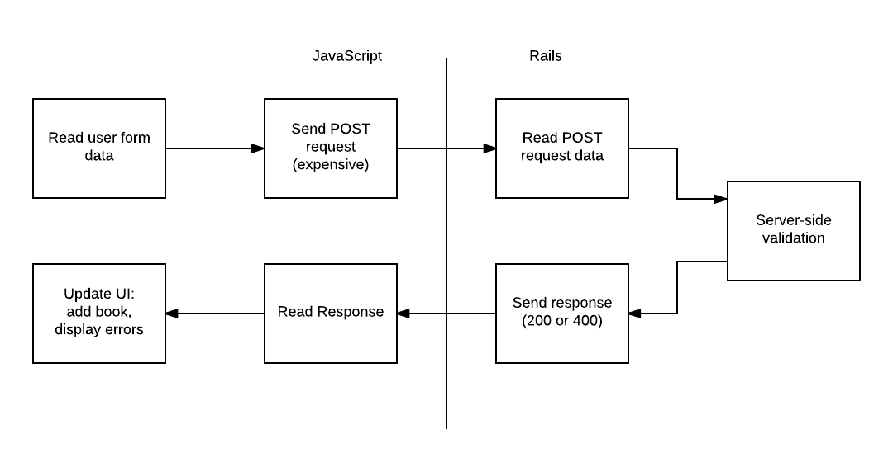
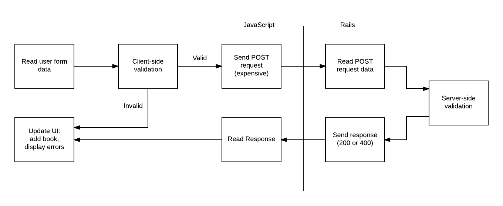

# Client-Side Validations in Backbone

One of the most useful things provided by ActiveRecord Models was the ability to automatically validate data. In this lesson, we'll explore similar functionality in Backbone.

## Learning Goals

- Differentiate between client-side and server-side validation
- Use Backbone to validate model data
- Handle validation failures gracefully

## Introduction

You've done validation before in Rails. These validations are done on the **server-side**. This works, but it means we need a full request-response cycle in order to see whether what the user typed was valid. This has a couple of downsides:

- The user has to wait for the server's response to get feedback
- We might waste a bunch of network bandwidth sending bad data


<!-- TODO DPR: give edit rights to other instructors https://www.lucidchart.com/documents/edit/423ebc54-2ba0-424a-8534-1c0cfd8fbd33# -->

A more user-friendly approach is **client-side validation**. The core idea is we should validate as much of the user's data as possible in the browser before it is sent. With client-side validation, the users gets immediate feedback because they do not have to wait for an entire request-cycle to complete. This makes the application feel more responsive and improves the user experience.



## Validating Data

To add validations to your model, create a `validate` function in your model. This is another template method - as long as the name matches, Backbone will be able to find it. The method should return `false` if the model is valid and a truthy value if the model is invalid.

For our `Book` model, we will organize our validation errors the same way Rails does. This requires a little extra work on our part, but has two benefits:
- Multiple errors can be reported at once
- We can use the same error handling code for client-side and server-side validation failures

```javascript
// src/models/book.js
const Book = Backbone.Model.extend({
  defaults: {
    author: 'Unknown',
  },
  validate: function(attributes) {
    const errors = {};
    if (!attributes.title) {
      errors['title'] = ['Cannot be blank'];
    }

    if (!attributes.author) {
      errors['author'] = ['Cannot be blank'];
    }

    if (!attributes.publication_year) {
      errors['publication_year'] = ['Cannot be blank'];
    } else if (isNaN(attributes.publication_year)) {
      errors['publication_year'] = ['Must be a number'];
    } else if (attributes.publication_year <= 1000 || attributes.publication_year > (new Date()).getFullYear()) {
      errors['publication_year'] = ['Must be between 1000 and this year'];
    }

    // Return false if it's valid,
    // or something truthy (i.e. the errors) if it's not valid
    if (Object.keys(errors).length > 0) {
      return errors;
    } else {
      return false;
    }
  }
});
```

Much like in Rails, in Backbone validations are only run when `.save()` is called on the model. In other words:
- Calling `bookList.add(book)` will **not** run validations
- Calling `book.save()` will run validations

To run validations manually, use the built-in `isValid()` method. The `validationError` property contains the return value of the most recent call to `validate`.

## Handling Errors

With this in mind, we can modify our existing `submit` handler to perform client-side validation before doing the POST request. Because of the work we did above to format errors in `validate`, we can reuse the `renderValidationFailure` function we wrote earlier.

```javascript
$('#add-book-form').on('submit', (event) => {
    event.preventDefault();
    let book = new Book(readForm());
    if (book.isValid()) {
      // Client-side validations passed, so send
      // the book to the server
      bookList.add(book);
      book.save({}, {
        error: (model, response) => {
          // Server-side validation failure
          renderValidationFailure(response.responseJSON['errors']);

          // Don't keep invalid books in the list
          bookList.remove(model);
        },

        // Don't clear the input form until we know the book is OK
        success: clearForm
      });

    } else {
      // Client-side validation failure
      renderValidationFailure(book.validationError);
    }
  });
```

## Client-Side and Server-Side

With all this fancy client-side validation, do we still need to write server-side validations?

The answer is a resounding "yes"! Even with client-side validations, **we still need to write validations on the server**. There are two main reasons for this:

- Some validations require data the client doesn't have (e.g. uniqueness constraints)
- Because we can't trust the client, we have no guarantee the client-side validations were actually run

That last one is really important. Anyone can use a tool like Postman or HTTParty to hand-roll an HTTP request, and our server needs to be able to handle these bad actors.

Even with these constraints client-side validation is an extremely useful technique. It's one of those little things has a huge impact on your user experience, and you should leverage it where possible.

## Summary

- Client-side validations happen in JavaScript in the browser
- Server-side validations happen on the server
  - These are what we've seen before in Rails
- Backbone models provide a `validate` template method
- Validations are run on `book.save()`, but not on `bookList.add(book)`
- To run validations manually, use `book.isValid()`, and then check `book.validationErrors`
- Handling client-side validation errors requires a little extra work, but provides a big boost in usability
- Server-side validations are still required
  - You can't trust your users
  - Some validations _can't_ be performed in the client

## Additional Resources

- [Excellent Stack Overflow answer](https://stackoverflow.com/a/162579/1513338) on why you should use both client-side and server-side validations
- [Backbone documentation on `.validate()`](http://backbonejs.org/#Model-validate)
