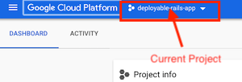
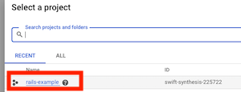
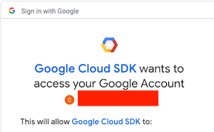

# Deploying a Rails Application to Google App Engine

## Learning Goals

By the end of this tutorial you should be able to:

1. explain what the Google Cloud Platform is
1. explain what a _project_, _instance_, and ______ are.
1. create database instances and a 

## Overview

Google's App Engine is a Platform as a Service offering.  It allows developers to deploy applications to the Google Cloud platform and allow Google to provision and manage virtual machines, database administration load balancing etc.  So you as a developer focus on your application and Google provides a platform to run it on.  You pay Google for the resources you use, both for bandwidth and virtual machines used.  In many ways it is similar to Heroku or AWS' Elastic Beanstalk service.  App Engine provides a standard environment which runs in a restricted sandbox and a flexible environment which runs in a Docker container on a virtual machine.  

There is a free-tier for App Engine for the standard environment which supports the following languages:

- Go
- Java
- PHP
- Node.js
- Python

Google also provides free credits for a year, which can be used on most services including App Engine deployments.  This makes Google an attractive platform for new developers.  

In this tutorial we will be building a basic Rails application and deploying it using App Engine.  

### A Few Terms

In this tutorial we will use the following terms.

- `GCP Console` - The Google Cloud Platform website which allows you to manage your google services through the browser.
- `GCP CLI` - Google Command-line tools which you can install and run from the terminal.

## Creating a GCP Account & GCP Command Line Tools

Before you can access GCP, you need to create an account at:  [https://console.cloud.google.com/](https://console.cloud.google.com/).

### Creating a project

In GCP a project is the basic unit for organizing users, APIs, billing authentication and compute resources.  For a larger group or company a project can but does not have to be part of an organization.  You should either have "Select a project," if this is your first time in GCP or an existing project listed next to the "Google Cloud Platform" title at the top of the page.



**Click on the project name, and create a new project named: `rails-example`.**

It will take approximately 1-2 minutes to create the project.  

**After the project is created, switch to it by clicking on your current project at the top**.




### Set up a Billing Account For the Project

Next in the console select `Billing` and link your account to the project for billing.  

You will receive the free credits, but will be required to add either a bank account or credit card.  

## Turning on APIs

To build a Rails project we will need to turn on the following APIs.  These APIs are turned off initially for security, but will allow the pieces of our Rails application to work together and allow you to manage your deployment from the command line.

- Compute APIs - To run and access google virtual machines
- Cloud SQL Admin API - To allow us to access and set up a database server
- Google App Engine Flexible Environment
- App Engine Admin API

Go to the web console and select APIs & Services --> Library.

Search for and enable to above APIs.

Once you have a Google Cloud account and project set up you can install Google's command line tools to manage the Google Cloud:

```bash
$ brew cask install google-cloud-sdk
```

You can verify that the sdk is installed with `$ gcloud`.

You should get the following output:

```bash
ERROR: (gcloud) Command name argument expected.
Usage: gcloud [optional flags] <group | command>
  group may be           app | auth | beta | bigtable | builds | components |
                         composer | compute | config | container | dataflow |
                         dataproc | datastore | debug | deployment-manager |
                         dns | domains | endpoints | firebase | functions |
                         iam | iot | kms | logging | ml | ml-engine |
                         organizations | projects | pubsub | redis | services |
                         source | spanner | sql | topic
  command may be         docker | feedback | help | info | init | version

For detailed information on this command and its flags, run:
  gcloud --help
```

### Logging in

To access your Google cloud account you can login with:

```bash
gcloud auth login <YOUR_ACCOUNT_NAME>
```

It will open a browser window and ask you to choose an account and authorize the SDK to access your account.  



## Creating a Cloud SQL Instance

Next we will create a server running Postgres for our deployed application to store data on.  

1. In the Google web console go to Storage-->SQL and click `create instance`
1. Then select a `PostgreSQL` database engine and click `next`.
1. Give your instance the name `rails-database-instance`, the password `password` and the region `us-central1` and zone `us-central1-c`

Then wait, it could take up to five minutes to complete.  We have configured a **database server**, but the server doesn't have a database ready for our app to use.  We will create one next.

1. When the instance is created, click on the instance ID to look at the details.  
1. You will see a number of tabs, `Overview`, `Connections`, `Users`, `Databases` etc.  Click on the `Users` tab.
1. Create a user account with the name: `pets` and the password `password`.  
1. Next click on the `Databases` tab and create a database named `pets`. 
1. Lastly go back to the `Overview` tab and find the area labeled, `Connect to this instance` and copy the `Instance connection name` to a text file for later.  

# TODO CLI STUFF

## Using the Google CLI to create and deploy a rails app

Now we will begin to create and deploy a rails application from the command line.  

Then in the GCP CLI switch to the project and select the location `us-central1-c`.

```bash
$  gcloud config set project rails-example
$  gcloud config set compute/region us-central1-c
```
You can verify the settings by running `gcloud config list`

```bash
$ gcloud config list
[compute]
region = us-central1-c
zone = us-central1-c
[core]
account = <YOUR EMAIL ADDRESS>
disable_usage_reporting = False
project = <YOUR PROJECT ID>
```

## Configuring the Rails Application

### Cloning the application

Clone the repository from https://github.com/adagold/appengine-example-rails

Then run `bundle install`, `rails db:reset`.

Then run the application and verify that it works with `rails server`.

### Add the appengine gem

App Engine has a gem to help it work with rails, add the following line to your `Gemfile`.

```ruby
gem "appengine"
```

Then run `bundle install`.  

This [gem](https://github.com/GoogleCloudPlatform/appengine-ruby) provides integration with Google cloud for logging, provides the ability to run rake tasks on the production environment and access to the project id and VM properties.  

### Update the `config/database.yml` file

Open the application's `config/database.yml` file.

```yml
default: &default
  adapter: postgresql
  encoding: unicode
  # For details on connection pooling, see Rails configuration guide
  # http://guides.rubyonrails.org/configuring.html#database-pooling
  pool: <%= ENV.fetch("RAILS_MAX_THREADS") { 5 } %>

development:
  <<: *default
  database: pets_development

test:
  <<: *default
  database: pets_test


production:
  <<: *default
  database: pets_production
  username: pets
  password: <%= ENV['PETS_DATABASE_PASSWORD'] %>
```

Now update the `production` section of the `database.yml` file. Remember we set the username and database to the name `pets` and the password to `password`.  

```yml
production:
  adapter: postgresql
  encoding: unicode
  pool: 5
  timeout: 5000
  username: "pets"
  password: "password"
  database: "pets"
  host:   "/cloudsql/[YOUR_INSTANCE_CONNECTION_NAME]"
```

### Update the `.ruby-version` file

App Engine tries to get the version of ruby to use from the `.ruby-version` file, but requires simply the ruby version number, change `ruby-2.5.3` to `2.5.3`

### Create an `app.yaml` file

App Engine flexible environments use a file called `app.yaml` to describe the app's configuration.  Create the file below:  

```yaml
entrypoint: bundle exec rackup --port $PORT
env: flex
runtime: ruby
```

### Configure Rails secret key in app.yaml

When a Rails app is deployed to a production environment, the environment variable SECRET_KEY_BASE expects a secret key to protect user session data. This environment variable is read from the config/secrets.yml file in your Rails app.

First, generate a new secret key:

```bash
$  bundle exec bin/rails secret
```

Copy the generated secret key to your clipboard. You use the secret key in the next step.

Next, open the file app.yaml that you created earlier, and add an env_variables section. The env_variables defines environment variables in the App Engine environment. The app.yaml should look similar to the example below with [SECRET_KEY] replaced with the secret key in your clipboard.

```yaml
entrypoint: bundle exec rackup --port $PORT
env: flex
runtime: ruby

env_variables:
  SECRET_KEY_BASE: [SECRET_KEY]
```

### Configure app.yaml to use the Cloud SQL instance

Next, configure the App Engine flexible environment to use a specified Cloud SQL instance by providing the Cloud SQL Instance Connection Name in the app.yaml configuration file.

Open the file app.yaml, and add a new section named beta_settings and define a nested parameter cloud_sql_instances with the instance connection name as the value.

The app.yaml should now look similar to the following with [INSTANCE_CONNECTION_NAME] replaced with the value of the Cloud SQL instance connection name.

```yaml
entrypoint: bundle exec rackup --port $PORT
env: flex
runtime: ruby

env_variables:
  SECRET_KEY_BASE: [SECRET_KEY]

beta_settings:
  cloud_sql_instances: [YOUR_INSTANCE_CONNECTION_NAME]
```

## Grant the appengine gem permission

Next grant the cloudbuild service account to run commands on the database server.

First retrieve your project  number with:

```bash
$ gcloud projects list
```

Copy the [PROJECT NUMBER] and use it here.  

```bash
gcloud projects add-iam-policy-binding [YOUR-PROJECT-ID] \
  --member=serviceAccount:[PROJECT_NUMBER]@cloudbuild.gserviceaccount.com \
  --role=roles/editor
```


## Create the App Engine Flexible Environment

Almost done!  You can create the App Engine app with the command:

```bash
$  gcloud app create
```

Choose your region `us-central` and continue. 

You can deploy your application with two commands, one to compile the assets for the application and the second to start the deployment process:

```bash
$  bundle exec bin/rails assets:precompile
$  gcloud app deploy
```

Press `y` to continue and Google will begin publishing the app.  

 Then get a cup of coffee and wait.  This should take up to 10 minutes.

 Once the app is deployed you can bring it up with

 `gcloud app browse`

 **OMG It's not working!**

 Relax, you haven't run your migrations on the server yet.  So execute the following two commands:

 ```bash
$  bundle exec rake appengine:exec -- bundle exec rake db:migrate

$ bundle exec rake appengine:exec -- bundle exec rake db:seed
 ```

## Summary

In this tutorial you have created a Rails application, set up a Postgres database using Google's CloudSQL and deployed the Rails application using Google's command-line tools.  

## Resources

- [App Engine Documentation](https://cloud.google.com/appengine/docs/)
- [App Engine Flexible vs Standard Environments](https://cloud.google.com/appengine/docs/the-appengine-environments)