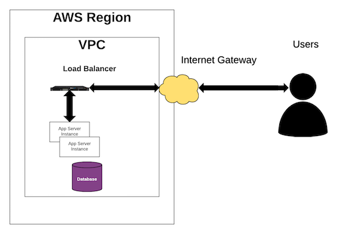

# Amazon Web Services & Elastic Beanstalk

In this lesson you will learn about Amazon Web Services in general and the Elastic Beanstalk Service in particular.

## Learning Goals

After following along with this lesson you should be able to answer the following questions:

1. What is _Infrastructure as a service?_
1. What is _Platform as a service?_
1. How does Elastic Beanstalk compare to Heroku?
1. Explain what components of AWS are used with Elastic Beanstalk

## Overview

Previously we've seen deployment with Heroku which is easy to get started with, but which also restricts your options for deployment architectures and technologies. We've also seen deployment with GitHub pages, but this only supports static front-end web applications.

One alternative for deploying back-end web applications is to use Amazon Web Services (which Heroku is built on).

As you read this document try to answer the following questions:

- What does Amazon provide with AWS?
- How is Elastic Beanstalk similar to Heroku and how is it different?
- What alternatives to Elastic Beanstalk exist?

### What is AWS?

Amazon Web Services is a _cloud_ computing system offered by Amazon. Amazon operates and maintains [several large datacenters](https://aws.amazon.com/about-aws/global-infrastructure/) of physical computer and networking equipment including servers, hard disks, routers, switches -- collectively known as infrastructure.

Much of this infrastructure is dedicated to running Amazon-specific applications (Amazon.com, Kindle, Alexa, their warehouse management system, etc.). In order to support peak loads, such as during black Friday / cyber Monday, Amazon owns a significant amount of infrastucture that goes unused the rest of the time.

This is where AWS comes in. Through the services provided by AWS and its management system Amazon is able to offer temporary, rental access to its infrastructure for other organizations. Companies can rent, for example, a server with a specific amount of CPU power, RAM, and hard disk space for timespans ranging from a single hour once, to 24/7 for months or years.

On top of the services that AWS offers which give access to rent (provision) its infrastructure (known in the cloud computing / devops world as **Infrastructure As A Service**), AWS now offers many services which provide "higher level" capabilities including databases, DNS management, email sending, and multiple deployment systems.

In this lesson we will be looking at one of those deployment options, Elastic Beanstalk, and the associated AWS services that it integrates with.

### What is Elastic Beanstalk?

[Elastic Beanstalk](https://aws.amazon.com/elasticbeanstalk/) is a deployment system built on top of AWS that allows for a deployment experience very [similar in capability and scope to Heroku](https://hackernoon.com/aws-vs-heroku-cloud-platform-comparison-for-2017-5f2194c0673e).

When deploying to Elastic Beanstalk (EB), developers configure an application for deployment using the [AWS Management Console](https://console.aws.amazon.com/), then use the [EB CLI](https://docs.aws.amazon.com/elasticbeanstalk/latest/dg/eb-cli3.html) program within the Git repository for their application to trigger a deployment.

EB then packages up the application source code, uploads it to AWS (using the [S3 file storage service](https://aws.amazon.com/s3/)), and creates and connects several resources necessary for running your application:

* Networking setup including firewalls
* One or more load balancers
* One or more web application servers
* A database (configured by you before deployment)

### Components of an Elastic Beanstalk stack

#### Networking

EB uses another AWS service known as [Virtual Private Cloud](https://aws.amazon.com/vpc/) (VPC) to manage the networking setup for your deployed application.

VPC supports a great many options for configuring internet and intranet access to the other resources that AWS offers. In the case of an Elastic Beanstalk deployment, the load balancers are made accessible directly via the Internet while the web servers and database are only accessible internally within AWS by the other components of your application.

#### Load balancers

Load balancers are simple web servers whose job it is to sit "in front" of your web app servers and distribute incoming requests so as to avoid any single web app server from becoming overloaded with requests.

You do not need to write any code for these web servers as they do not do any custom work unique to your application. Instead, you should only need to configure them to know about and talk to your web app servers.

Load balancers have a specific mechanism for determining which web app servers are most overloaded (and thus should be avoided). This mechanism is to send a specific request (known as a "health ping") to each web app server at a regular interval (once per second, perhaps) and measure the time it takes to receive a response.

If no response is received the web app server may be marked as inaccessible/dead and a new one may be started to take its place. For this reason it's important to implement the route used by AWS's load balancers and have it respond with 200 OK -- otherwise the Elastic Beanstalk console will falsely claim that your application is broken!

AWS provides a service for provisioning, configuring, and managing load balancers that is known as [Elastic Load Balancing](https://aws.amazon.com/elasticloadbalancing/) (ELB).

#### Web application servers

This is the part we're most used to thinking about when doing back-end web application development. Web application servers are the computers which hold and run our custom web application code such as the example Ruby on Rails project we'll deploy in this lecture.

The web application servers are provisioned, configured, and managed using an AWS service called [Elastic Compute Cloud](https://aws.amazon.com/ec2/) (EC2). In many ways this service is the "heart" of AWS, it gives direct access to computers which can run pretty much any server operating system and accompanying software.

However, directly provisioning and configuring computers is a lot of work and so EB automates that process. When we deploy a Ruby on Rails application using EB it automatically:

* Provisions one or more new computers from EC2
* Installs the appropriate operating system on them (using an [Amazon Machine Image](http://docs.aws.amazon.com/AWSEC2/latest/UserGuide/AMIs.html)
* Installs all necessary dependencies for Ruby on Rails (including Ruby, gem, bundler among many other programs)
* Downloads your Ruby on Rails application code from S3
* Creates the appropriate environment variables (including custom ones that you've defined)
* Starts the Ruby on Rails web server on a port that the load balancers are configured to communicate with

Elastic Beanstalk can do this automatically for any number of web app servers that you wish to run (based on the traffic needs of your site). It is also capable of automatically choosing when to shut down servers or start new ones based on observed load, so that if your application receives a big spike in traffic it a quickly adjusts to provide a fast response to all of the new users.

#### Database

Most back-end web applications require a database and so EB has options for easily connecting a database to use with your web application servers. While AWS offers multiple database services, currently the only one that integrates directly with EB is the [Relational Database Service](https://aws.amazon.com/rds/) (RDS).

RDS allows you to quickly provision a database of several different flavors including PostgreSQL and MySQL. You provide the size of database you want plus the username and password for logging in, and AWS sets it up and gives you a specific domain name for accessing it.

While this is relatively straight forward, Elastic Beanstalk again makes our lives easier by integrating this setup process into the application configuration web page. Furthermore, when we have an RDS database connected to our application then EB will automatically configure a set of environment variables with the information needed for our code to connect to that database.

#### Heroku

Now that we've taken a pretty significant tour through the different systems that Elastic Beanstalk uses to manage our deployments, lets take a look at how this differs with Heroku.

While it may seem like there's a lot more involved in an Elastic Beanstalk application, in truth both of these systems are very similar! Heroku's system involves every one of the above components and uses them in almost exactly the same ways.

The main difference between the two is that Heroku hides many of the underlying systems from developers which makes learning to use it and deploy your first application significantly faster. The other side to that coin however, is that you have less control over how each component of your deployment stack is configured and Heroku must explicitly support the kind of application you're attempting to deploy.

## Other Systems

While Amazon is by far the market leader in cloud computing a number of other companies provide Platform as a service offerings.  The Google Cloud Platform (GCP) provides [Appengine](https://cloud.google.com/appengine/) for deploying applications, and Microsoft Azure provides [Azure App Service](https://azure.microsoft.com/en-us/services/app-service/).  

## Summary

In this lesson we introduced Amazon Web Services and focused on the Elastic Beanstalk service (EB).  Elastic Beanstalk is a Platform As A Service(PAAS) offering.  It allows developers to deploy web applications in a variety of languages and EB configures and maintains networking, application servers and databases for the application transparently to the developer.  It has many similarities to Heroku, but provides more automatic scaling and fine-grained control.

## Resources

[AWS Services Overview](https://www.youtube.com/watch?v=TkT4iFRkaZk)
[AWS 101](https://www.sumologic.com/aws/)
[Introduction | AWS Elastic Beanstalk Survival Guide](https://colintoh.com/blog/aws-elastic-beanstalk-survival-guide-introduction)
