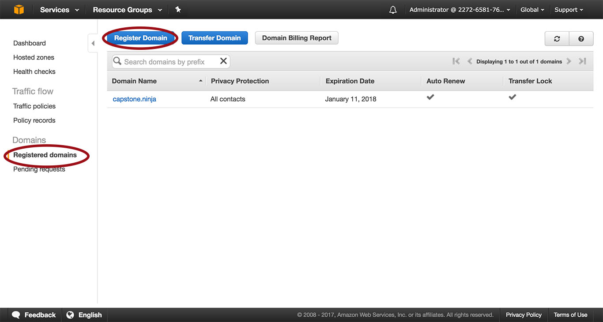
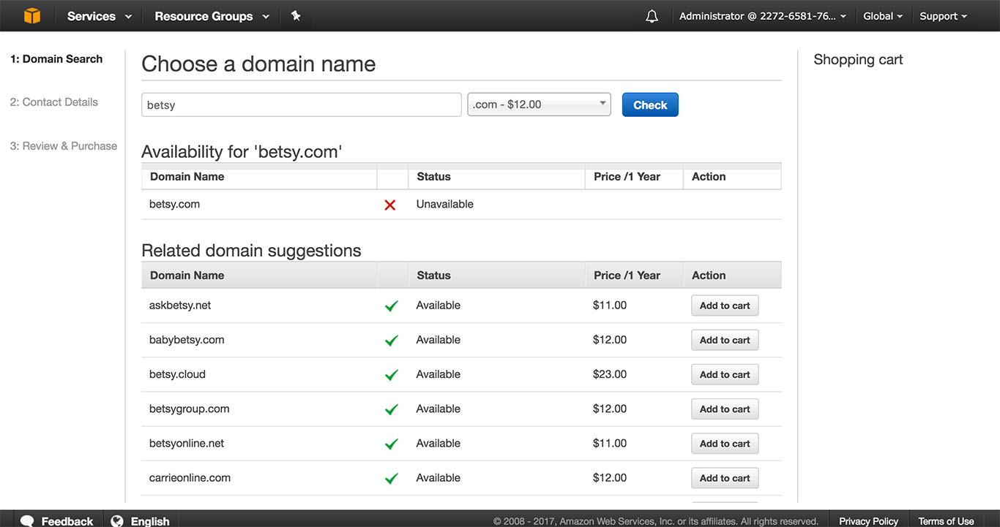
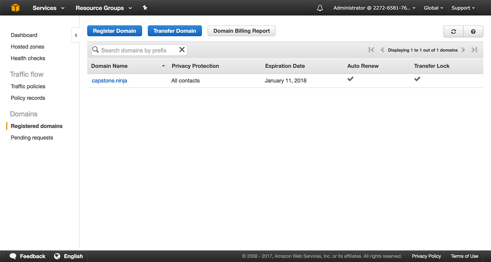
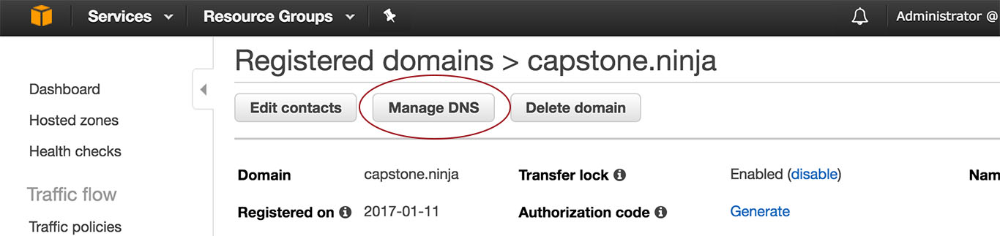
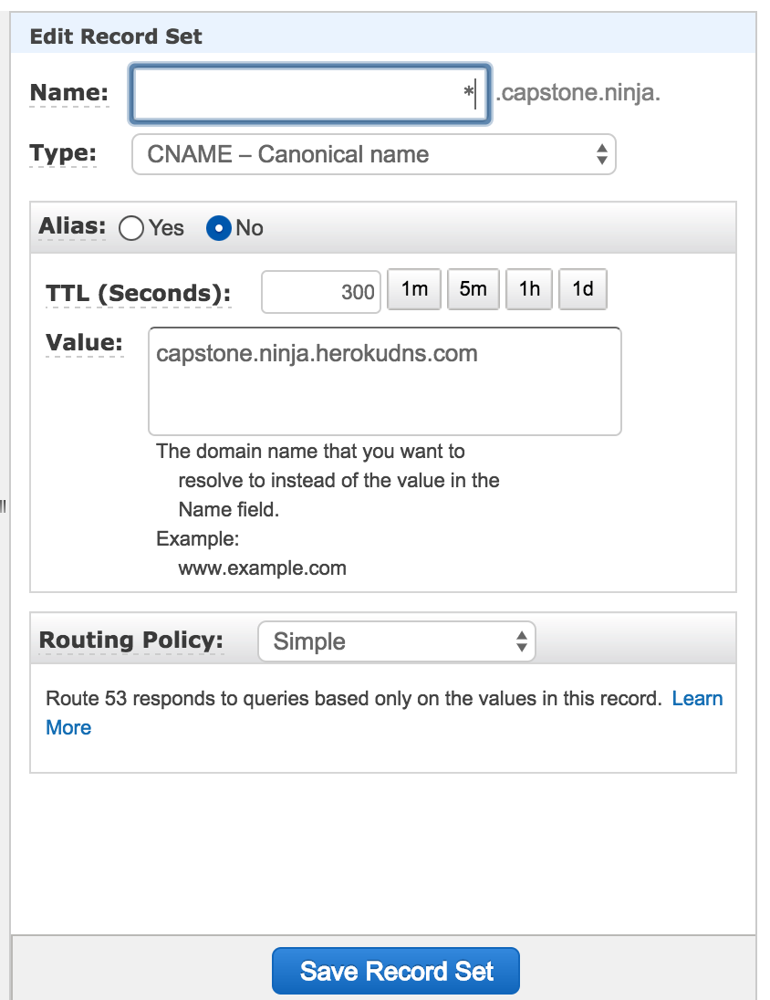
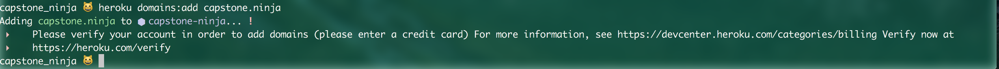
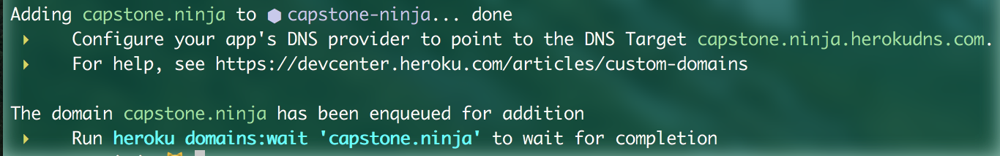

# DNS with Amazon Route 53

## Learning Goals

By the end of this lesson you should be able to:

- Describe the purpose and high-level functions of DNS
- Register a domain
- Connect domain to a hosted application

## Motivation

To give your application a snazzy, custom domain name. Much like [http://www.capstone.ninja](http://www.capstone.ninja)

## The Jargon

- ### IP Addresses
  Devices that are connected to the internet need a way to know how to direct communication between each other.  

  Much like we have phone numbers and street addresses, devices connected to the internet have IP Addresses.

  "IP" is short for Internet Protocol. The current version used is IPv4, but with so many websites needing a unique IP Address, IPv4 isn't going to cut it for too long. IPv6 is a longer version that is making it's way in, but IPv4 is still the convention.

  IPv4 addresses come in the classic "dotted quad" format: four numbers between 0 and 256, separated by periods. Examples include:
  - `192.168.0.1`
  - `70.99.235.236`
  - `127.0.0.1`

  IPv6 addresses are much longer, and consist of up to 8 groups of 1-4 hexidecimal digits separated by colons. Examples include:
  - `2001:0db8:85a3:0000:0000:8a2e:0370:7334`
  - `2001:db8:85a3::8a2e:370:7334`
  - `::1`

- ### Domain Name
  The name, such as `example.com`, that a user types in the address bar of a web browser to access a website or a web application.

## What Is DNS?

The Domanin Name System (DNS) is a hierarchical system of computers and databases, that maps IP addresses to domain names.

It enables Internet users to connect human-language locations on the Internet with numeric addresses used by IP

For example, www.amazon.com would translate to a machine readable IP address, like 192.0.2.44

[Click Here to Read More](https://aws.amazon.com/route53/what-is-dns/)


## What is Amazon Route 53?
Amazon Route 53 performs three main functions:

- **[Register domain names](http://docs.aws.amazon.com/Route53/latest/DeveloperGuide/welcome-domain-registration.html):**
- **[Route Internet traffic to the resources for your domain](http://docs.aws.amazon.com/Route53/latest/DeveloperGuide/welcome-dns-service.html):**
- **[Check the health of your resources](http://docs.aws.amazon.com/Route53/latest/DeveloperGuide/welcome-health-checks.html):**

[Click Here to Read More About Amazon Route 53](http://docs.aws.amazon.com/Route53/latest/DeveloperGuide/Welcome.html)


## Configuring Amazon Route 53 as Your DNS Service

You can registered a domain name directly from Amazon. If you do, it will automatically configure to Amazon Route 53 as your DNS Service.

If you have registered a domain from another service, you can still use AWS Route 53 as your DNS, but it will require more setup.

This tutorial is assuming you have not registered a domain.

First, go to: [https://console.aws.amazon.com/route53/home](https://console.aws.amazon.com/route53/home)



After you login/register, click on 'Registered Domains' in the left panel.

Then, click on the 'Register Domain' button.
Here you can purchase and register a domain, based on it's availability.



When you enter a domain, it will let you know if it is available and how much that domain costs. If it does not, have fun looking at all of it's suggestions. There's some real gems in there.  

Once you select your domain to register, add it to the cart, pay your money and complete the purchase, you're ready to configure your DNS!

... almost.

**You domain may be in pending status up to 3 days.** Mine was ready within the same day. But it's always better to play safe.



When your domain is not pending status, it can be found under ‘registered domains’.



Click on your domain name, then on the 'Manage DNS' button.

Click on your domain again to start creating record sets. We are going to keep our configuration fairly simple by using a CNAME record that will connect to a URL provided by Heroku (we'll get to that).

Another way, if you have access to your hosted site's IP Address, is to create an 'A'record. when adding a record it's the first one to appear in the 'type' dropdown under 'A - IPv4 Address'.

Since we're using Heroku for this tutorial, we're going to create a CNAME record.



Click the 'Create Record Set' button.

- In name, put an asterisk: '\*'
- Under Type, select 'CNAME'
- In Value, you'll need your DNS target from Heroku. We don't have that, so let's pause and get that from Heroku!

### Setup Heroku

As always, Heroku is on top of it's documentation game and has a page dedicated to setting up a Heroku app with AWS Route 53!  [https://devcenter.heroku.com/articles/route-53](https://devcenter.heroku.com/articles/route-53)

First thing is to navigate to your project in terminal, with Heroku already setup, and enter the following two lines (separately):
```
heroku domains:add example.com
heroku domains:add www.example.com
```



You will likely get the above error if you have never verified your account by giving your credit card details to Heroku.

Once you verify your account, you will see the following message that contains the DNS target. In this case, it's 'capstone.ninja.herokudns.com'



Now you should be able to go back to AWS and enter the value! Click 'Save Record Set' and you should be all set to use your domain!  (You may need to give a few minutes to *actually* work)

## Additional Resources
- [Amazon Route 53 Documentation](http://docs.aws.amazon.com/Route53/latest/DeveloperGuide/Welcome.html)
- [Getting Started Guide](http://docs.aws.amazon.com/Route53/latest/DeveloperGuide/getting-started.html)
