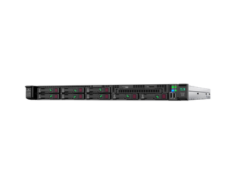
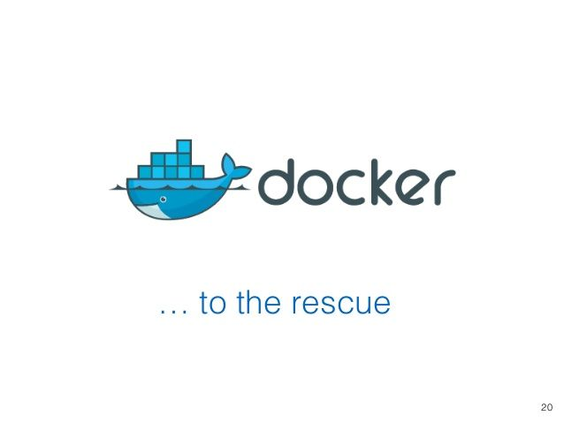
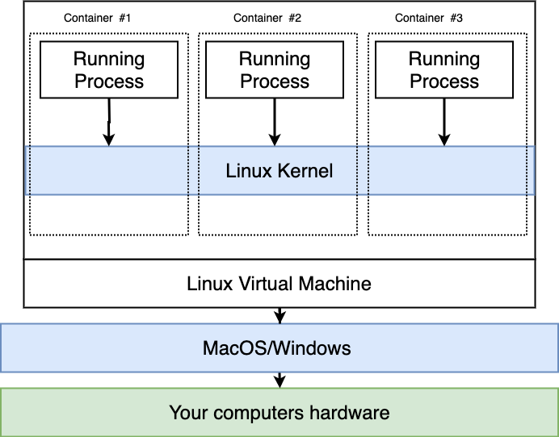

# Docker Introduction

## Learning Goals

By the end of this lesson you should be able to:

- Explain what Docker & Containerization are
- Read a basic Dockerfile
- Explain what docker-compose does
- Build a simple Rails app with Docker

## What is Docker & Containerization

Docker is a set of platform as a service (PaaS) products that use OS-level virtualization to deliver software in packages called containers.

**What?**

Lets do some vocabularly and history.  In the _old_ days when you wanted to launch a service on the web you bought a server (see image below) and then:

- Installed the Operating System
- Installed all your app's dependencies
- Installed your app
- Configured your app
- Debugged your mistakes
- Then connected your server to the internet and launched your service



This was too much work, and a service might only use a portion of the CPU and memory available to the server.  We could (and did) install multiple services on the same server, but then ran the risk of conflicts between the services.  What is one app required Ruby 2.3 and another required 2.4?  What if they both used conflicting version of python?

### Enter Virtualization!

Instead of installing everything on one "bare metal" machine we set up the physical server to emulate many servers.  Using software like Virtualbox, Hyper-V or VMWare one computer could run emulators pretending to be many servers, each with their own operating systems, disk space, software libraries etc.  Each **virtual machine** runs independently of the others consuming a portion of the physical server's resources.  

This was a great deal more efficient, but you still had to...

- Installed the Operating Systems
- Installed all your app's dependencies
- Installed your app
- Configured your app
- Debugged your mistakes
- Then connected your server to the internet and launched your service

Just on a virtual machine, instead of a physical one!  Still too much work!


### Docker To The Rescue



Now Docker enters the picture.  When you install Docker it installs **one** linux virtual machine.  Instead of configuring a new computer for each app, we take advantage of the Namespace feature of Linux.  

If you run an set of software in a namespace, it runs separately from all other applications and code.  Each namespace operates **independently** in terms of library code, CPU, Memory and hard disk space.  So you can have Python 2 running in one namespace and Python 3 running in another.  You can also have conflicting library code installed in sparate namespaces without conflict.



_[image from Docker & Kubernetes: The complete Guide](https://www.udemy.com/share/101WjMAkEacV9UQn4=/)_

### Docker Terminology

- **Docker Client** - A tool which provides a command-line interface (CLI) that lets you build run and stop application commands to the Docker daemon.  The **docker** command.
- **Docker Server** - a tool designed to make it easier to create, deploy, and run applications by using containers.  You installed it when you installed Docker on your computer.
- **Docker Machine** - a tool that lets you install Docker Engine on virtual hosts, and manage the hosts with docker-machine commands.  You can use it to create Docker hosts on a local computer or cloud hosted machines.
- **Docker Image** - a file, comprised of multiple layers, used to execute code in a Docker container.  It's used to build and run an app in a container.
- **Docker Hub** - a cloud-based repository in which Docker users and partners create, test, store and distribute container images.
- **Docker Compose** - a tool for defining and running multi-container Docker applications. With Compose, you use a YAML file to configure your application's services.

## Building A Rails App with Docker

We are going to create a Docker Image, and install Rails on it.  Then we will use Docker Compose to set up two images, one for the Rails web service and one for Postgres and then get them to talk to one another.  

We will do this all using our [Ada books app](https://github.com/Ada-C12/ada-books-leaves).

### Dockerfile

Move into the project and create a new file named `Dockerfile`.  Capitalization matters!

```bash
$ git clone git@github.com:Ada-C12/ada-books-leaves.git
$ cd ada-books-leaves
$ touch Dockerfile
```

The first thing we'll add is this line to the `Dockerfile`

```dockerfile
FROM ruby:2.5
```

This command starts our image from a base that someone else on Docker Hub created.  This image is of a basic linux machine with ruby 2.5 installed.  That sounds like a good place to start!  You can see the list of Ruby Docker images on [docker hub](https://hub.docker.com/_/ruby) and this specific parent image [Dockerfile on github](https://github.com/docker-library/ruby/blob/82eecb7596c3cb466dd87d4b0350d189a330b925/2.5/buster/Dockerfile).

Hmm... our Ada books was written for a different version...

We can update our `Gemfile` and `.ruby-version` file to 2.5.7 (which is installed in the base image).

```Gemfile
source 'https://rubygems.org'
git_source(:github) { |repo| "https://github.com/#{repo}.git" }

ruby '2.5.7'

# More stuff below
```

```.ruby-version
2.5.7
```

#### Installing Dependencies

Next in our Dockerfile we will add a Linux command `apt-get` to install nodejs and postgresql-client.  Then we'll create a folder, called `/myapp` for our Rails app to live in.

```Dockerfile
FROM ruby:2.5
RUN apt-get update -qq && apt-get install -y nodejs postgresql-client
RUN mkdir /myapp
```

#### Set Working Directory and Installing App

Next we will set `/myapp` as the working directory for our app, copy over the Gemfile and run bundle install to install all the gems.  Then we will copy over the rest of our application files.

```Dockerfile
# Set parent image and install dependencies
FROM ruby:2.5
RUN apt-get update -qq && apt-get install -y nodejs postgresql-client

# Create folder for Rails app and 
RUN mkdir /myapp
WORKDIR /myapp

# run bundle install
RUN gem install bundler
COPY ./Gemfile /myapp
COPY ./Gemfile.lock /myapp
RUN bundle install

# Copy app files to container
COPY . /myapp
```

We did this so because Docker by default, when it notices a change will re-run all subsequent lines in the Dockerfile.  So if we modified a controller, we don't want the container to re-run `bundle install`.  So we copy the application code later and the Gemfiles first.  This way only if the Gemfile changes, will we re-run bundle install.

#### EntryPoint For Our Application

Next we'll create a script file which we run by default every time we start the container.  We will call this file `entrypoint.sh` and it just runs a series of bash commands for us.

_entrypoint.sh_

```bash
#!/bin/bash
set -e

# If the app didn't close cleanly last time
# Remove a potentially pre-existing server.pid for Rails.
rm -f /myapp/tmp/pids/server.pid

# Then exec the container's main process (what's set as CMD in the Dockerfile).
exec "$@"
```

_Dockerfile_
```dockerfile
# Set parent image and install dependencies
FROM ruby:2.5
RUN apt-get update -qq && apt-get install -y nodejs postgresql-client

# Create folder for Rails app and 
RUN mkdir /myapp
WORKDIR /myapp

# run bundle install
RUN gem install bundler
COPY ./Gemfile /myapp
COPY ./Gemfile.lock /myapp
RUN bundle install

# Copy app files to container
COPY . /myapp


# Add a script to be executed every time the container starts.
COPY entrypoint.sh /usr/bin/
RUN chmod +x /usr/bin/entrypoint.sh
ENTRYPOINT ["entrypoint.sh"]
EXPOSE 3000

# Start the main process.
# It runs rails server -b on localhost (for the container)
CMD ["rails", "server", "-b", "0.0.0.0"]
```

### Docker Compose

We could run this conatiner with:

```bash
$ docker build -t ada/adabooks .
```

The `docker build` command creates an instance of our container and saves it.  

You could then run the container with:

```bash
$ docker run ada/adabooks
```

However that won't work!  This is because there is no Database server running and while the container is running on port 3000 there's nothing to connect that your your computer.  We can fix this by using `docker-compose` which lets us create a group of containers (one for Postgres and one for our web service) and tell them how to cooperate.

So we can create a `docker-compose.yml` file.

```yaml
version: '3'
services:
  db:
    image: postgres
    volumes:
      - ./tmp/db:/var/lib/postgresql/data
  web:
    build: .
    command: bash -c "rm -f tmp/pids/server.pid && bundle exec rails s -p 3000 -b '0.0.0.0'"
    volumes:
      - .:/myapp
    ports:
      - "3000:3000"
    environment:
      - GITHUB_CLIENT_ID=${GITHUB_CLIENT_ID}
      - GITHUB_CLIENT_SECRET=${GITHUB_CLIENT_SECRET}
    depends_on:
      - db
```

This file tells `docker-compose` to create two containers, one from a postgres image on dockerhub called `db`, and another called `web` which is built from the local `Dockerfile` and links port 3000 on your machine to Docker's port 3000 on the virtual machine.  So when you go to port 3000 on your local computer the request gets forwarded to Docker's virtual machine and the running container.  

It also sets 2 environment variables from the local `.env` file, `GITHUB_CLIENT_ID` and `GITHUB_CLIENT_SECRET`.

Lastly it indicates that the `web` container depends on the `db` container.

We can use this `docker-compose.yml` file to build our app with:

```bash
$ docker-compose build
```

This will read the yml file and import the Postgres container and build, using the Dockerfile, the Web service.

### Starting and Stopping Stuff

We can start our containers with the command:

```bash
$ docker-compose up
```

This will start the containers.  You do however need to create a database for the Ada books app.  You can open up a new tab and run:

```bash
$ docker-compose run web rails db:reset
```

**Note:** You only need to run the above **once**.  After that the data will be saved on the virtual machine and the app can be run with just `docker-compose up`.

You can stop the web service with:

```bash
$ docker-compose down
```

## What about this Kubernetes Thingy I Heard About...

Kubernetes is a tool which lets you coordinate a bunch of containers and container groups.  You feed Kubernetes a description of a state you want created, which services, loads etc.  It creates a bunch of container hosts (virtual machines) and installs containers on them.  You give Kubernetes a file `app.yaml` a description of different pods (the smallest unit of services) and which containers you want to run on them.  Kubernetes then orchestrates them and ensures the configuration is maintained as things run.  When something goes down it can work to bring them back up again.

## Summary

Docker is a tool which lets you define a list of software to install and run independently of the host machine.  Then any machine which has the `Dockerfile`, source code and `docker-compose.yml` can run your service.  Docker allows you to run any set of services, Rails, Express, Django etc on any host machine independent of any other services on the computer.

## Resources

- [Docker Hub](https://hub.docker.com/)
- [Getting Started with Docker](https://docs.docker.com/get-started/)
- [Offical tutorials with Rails, Django etc](https://docs.docker.com/samples/#sample-applications)
- [Stephen Grider's Docker & Kubernetes course, the source of many diagrams here](https://www.udemy.com/share/101WjMAkEacV9UQn4=/)
- [Kubernetes in 5 minutes](https://www.youtube.com/watch?v=PH-2FfFD2PU)