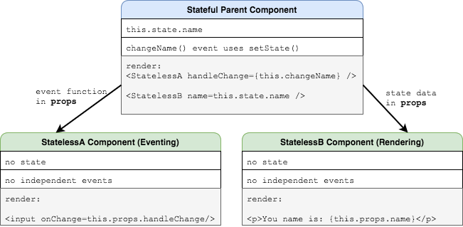

# Component Design

## Learning Goals
- Examine design patterns used by React developers
- Use the functional stateless components design pattern
- Use the container components with presentational components pattern

## Design Patterns
In software engineering, a [design pattern](https://en.wikipedia.org/wiki/Software_design_pattern) is a generic, reusable solution to a commonly occurring problem. In this discussion, we will examine two design patterns in React.

## Functional Stateless Components
The name of this type of component provides some insight into the functionality and behavior of the component.

The two key features of these components are:
- No lifecycle methods, only rendering
- Can utilize `props` but not `state`

These are used to simplify a component when it's only purpose is to render HTML or other nested components. The definition of these components use a simplified arrow-function syntax since they don't need to be a fully functional `class` like other components.

```JavaScript
const MyFunctionalComponent = (props) => {
  return <h1>This is just a header with this name: {props.name}</h1>;
}
```

Notice in the above example we can still pass in props into this component, but we access that variable directly from the parameter passed in, rather than through `this.props` like we would with a class-based React component.

## Container Components with Presentational Components
This design pattern provides us with a common way to organize components within one another. Container components will manage the creation and data sent to presentation components. Presentation components will be solely responsible for displaying data, and not for managing state within themselves. Because of this, these presentation components are often the same as functional stateless components.

One way that this pattern can come about in our React applications, is by using the **container** component to manage **state**, and having two (child) **presentation** components, one which manages **data input and modification** and another which manages the **presentation of this data**.


<!-- https://drive.google.com/a/adadevelopersacademy.org/file/d/15lodApvgPRHN-aE5io1lYJgpdpWu9SuP/view?usp=sharing -->

## Key Takeaway
When we design our React applications, we should consider these design patterns to solve common problems. When our components get larger, it is important to take a step back to see how we can simplify using these patterns.

## Additional Resources
- [Container Components](https://medium.com/@learnreact/container-components-c0e67432e005)
