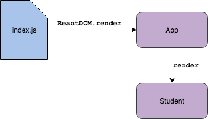

# Creating Components

## Learning Goals
- Create our own component
- Link and render a component from an existing component

Now that we've gotten started with a basic React application, we want to be able to extend it with our own components. We create new components within our applications to encapsulate logic and HTML related to a specific concept or portion of our site. Note that up until this point, we have had very clear lines between HTML, CSS and JavaScript because they're usually in separate files. With React components, these lines can get a little bit blurry since we will potentially have all of these things in a single component file.

Each component will be a small, reusable piece of code that manages its own **content, presentation and behavior**.

### Overview
It is important to understand what is happening currently within the React application so we can model the same pattern with a custom component. Right now, our React application renders the `App` component from the `index.js` file and puts it in the DOM element where the ID is "root". Normally, this is only done **once** in a React application, so we are going to leave this code alone as we build on.

```javascript
ReactDOM.render(<App />, document.getElementById('root'));
```

Next, our `App` component contains a render function which will render a `header` and a `p` using JSX.

```javascript
render() {
    return (
      <div className="App">
        // ... lots of JSX here
      </div>
    );
  }
```

The powerful thing about React is that **any component can render any other component**. That is, we can (and should) **nest our components** within one another to create the most effective React application design.

#### More on Nesting

Let's think about how our existing web applications have been structured. An HTML page is fundamentally a set of **nested tags**. Therefore, we could identify any portion of our webpage and figure out what that portion is contained within.

#### Context
As we continue using this application, we are going to be creating a React application that manages our list of Ada students! We are going to use different components to handle different portions of our student listing.

### Create a new Component
React does not have a nice CLI interface like Rails to create new components for us. We will be creating these manually by creating new files, importing the necessary libraries, and adding the necessary component code. We'll use the `Component` class provided by React and create a class that extends this class in order to leverage this functionality.

We are going to start small, and our first component will be used to display a single student's information.

1. **Create a new folder** called `components` where we'll store all of our custom components. This should be under the existing `src` directory.

1. **Create a new file** in this new folder called `Student.js`
    - Note the name - by convention, React component files are CamelCase

1. **Import the React library** at the top of the new file:
    ```javascript
    import React from 'react';
    ```

1. **Create a function** with the name of the component you want to create. Note that this should match the file name.
    ```javascript
    const Student = () => {
      // Component functions always return JSX
      return (
        <h3>Student Component</h3>
      );
    };
    ```

1. **Export the function** at the bottom of the file. Note that whatever is exported here needs to match the name of the function created in the step above. This will allow us to import this component to use in other files.
    ```JavaScript
    export default Student;
    ```

1. **Verify** - You can't fully test it out quite yet, but you can make sure that your React application compiles (check out the terminal where you ran `npm start`) and does not show you any errors in the browser as confirmation of success. Check in with your seat squad to verify that they are at the same place in setting up their component file.

### Loading a Component into Another
For now, we should have filled in a render function and run `npm start` to verify that our application doesn't have lots of errors. We haven't been able to see the results of our component within our app yet. Let's connect it!

1. In our `App.js` file, we first need to load in the code for our new component. Add the file `import` to the top.
    ```JavaScript
    import Student from './components/Student';
    ```

1. Now we can render our `Student` component within our App component. Add `<Student />` to the existing render function in the App component. Feel free to remove the existing `<header>` element. Note that the render function can only return one outermost element (`<div className="App">`), so the new component must be **nested within** that outermost element.

1. Verify! Run `npm start` to take a look at your application running in the browser and ensure that you see the `<h3>` tag we rendered in the `Student` component.

### Customize our Component

Now that we've verified our two components are talking to each other, we can start properly working on the `Student` component.

With your seat squad, modify the JSX returned by the `Student` component. Make that component render some student data, like name, cohort and class, and birthday. Feel free to hard-code some student data and HTML that you think might be relevant.

### Wrap-up

We used the existing index.js code to render the `App` component that was provided to use by the boilerplate React application. Then, we created a new component and added it to the `App` component's render function to be able to see it within our application.



In the next phase of this application, we are going to extend our application to support multiple students and switch from hard-coded to dynamic data.

## Key Takeaway
Nesting components within one another is the most powerful construct of React. You will structure your React applications using this paradigm, applying additional patterns and skills to it as you learn.

## Additional Resources
- [How to write your first React component](https://medium.freecodecamp.org/how-to-write-your-first-react-js-component-d728d759cabc)
