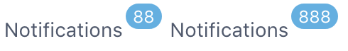
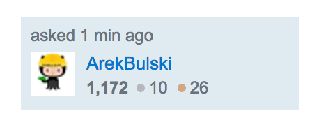

# Worksheet: Building Basic and Nested Components

This worksheet contains prompts for several stateless React components. Practice building components that display information based on the `props` they are given, as well as building components that have other components nested within them.

## Instructions

For this worksheet practice, you should create a new React project with `create-react-app`. There is no need to setup a GitHub repo, as this will not be submitted to Ada.

Once the project has been created, make a new directory within the project called `src/components`. This is where you will create each new component's JavaScript and CSS files. It's totally fine to put all of these components into the same React project, even though they don't all interact with each other.

There are two kinds of components in this practice worksheet: **basic** and **nested**:
* Basic components receive `props` and return pure HTML that will be part of the page.
* Nested components are very similar, except part of their function includes other React components.

In this worksheet the nested components are built using the basic components -- for example the **ProductList** component is built with a list of **Product** components. As a result, you should work through all of the basic components first, and then tackle the nested components.

**NOTE**: The examples listed below are from real-world projects, and designers have worked on their visuals. You are **not** required to spend time on CSS to make your components look like the examples. The focus of this practice is entirely on building a React component which displays the data provided by `props` -- minimize the time you spend on CSS code that is not directly related to the functionality of a component function.

## Basic Components

1. Create an **Avatar** component which takes an image URL and presents that image with a border.
    
    Examples:
    
1. Create a **Badge** component which takes a number and displays that number in a circle. Bonus: have the circle change color based on the value of the number (e.g. red if it's < 50, green otherwise).
    
    Example (the badge is the part with the 88 or 888):

    
1. Create a **Product** component, which takes a name, a product photo URL, a standard price, and a discount price. If the discounted price is less than the standard price then the component should display the discounted price with some visual indicator (e.g. the price text is red).
    
    Example:

    

## Nested Components

1. Create a **UserCard** component which takes a user object. The user object has properties for:
    - User name
    - Avatar image URL
    - Rank - A role or title in the community represented by text e.g. Super Moderator
    - Score

    This component renders a rectangular “card” for the given user. The card itself has the name of the user and their rank, plus it includes an Avatar component (from above) for displaying their avatar image, and a Badge component for displaying their score.
  
    Example:
    

1. Create a **ProductList** component which takes an array of product objects. Each product object has properties for:
    - Product name
    - Product image URL
    - Price
    - Discount price

    This component renders a list of individual Product components (from above). The list display is up to you (e.g. with a single product per row, or multiple products per row).
