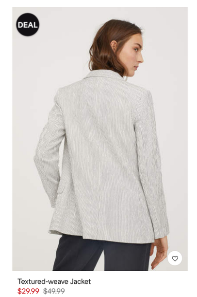

# React Components Worksheet

## Part 1

1. Create an **Avatar** component which takes an image URL and presents that image with a border.
    
    Examples:
    
1. Create a **Badge** component which takes a number and displays that number in a circle. Bonus: have the circle change color based on the value of the number (e.g. red if it's < 50, green otherwise).
    
    Example (the badge is the part with the 88 or 888):

    
1. Create a **Meter** component, which takes a percentage (a floating point number between 0.0 and 1.0, with 1.0 meaning 100%) and displays an “empty” horizontal bar of a fixed width, and on top of that an additional “filled” horizontal bar the length of which is based on the percentage.
    
    Example:

    
1. Create a **Product** component, which takes a name, a product photo URL, a standard price, and a discount price. If the discounted price is less than the standard price then the component should display the discounted price with some visual indicator (e.g. the price text is red).
    
    Example:

    

## Part 2

1. Create a **UserCard** component which takes a user object. The user object has properties for:
    - User name
    - Avatar image URL
    - Rank - A role or title in the community represented by text e.g. Super Moderator
    - Score

    This component renders a rectangular “card” for the given user. The card itself has the name of the user and their rank, plus it includes an Avatar component (from above) for displaying their avatar image, and a Badge component for displaying their score.
    
    Example:

    
1. Create a **ProductList** component which takes an array of product objects. Each product object has properties for:
    - Product name
    - Product image URL
    - Price
    - Discount price

    This component renders a list of individual Product components (from above). The list display is up to you (e.g. with a single product per row, or multiple products per row).
