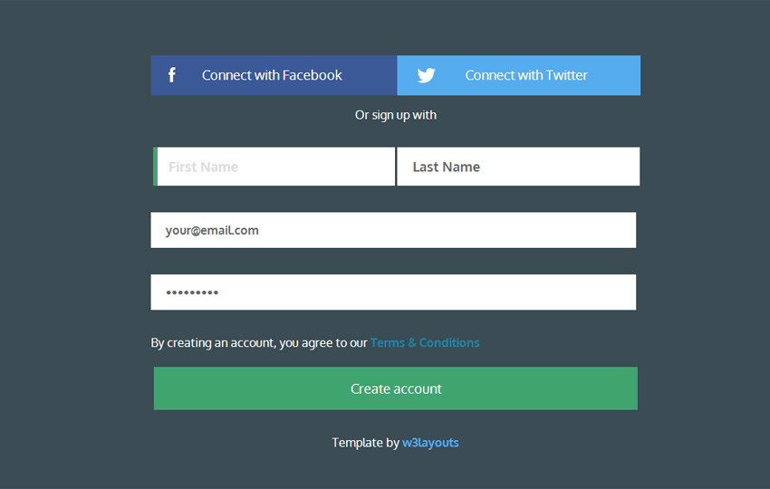

# Controlled Forms Exercise

Controlled forms are an important part of the React style of web programming. Let's get some practice with them!

## Instructions

This is an in-class exercise and will not be submitted.

### Wave 1

Create a new React app with `create-react-app`. This app will have one component called `SignupForm`.

The form should have five input elements:
- First name
- Last name
- Email
- Password
- "Create account" button

The form should be controlled by React, that is, use state and `onChange` event handlers to manage the data.

When the form is submitted, it should log the user's information to the console.

### Wave 2 (Optional)

Style the form to look like this:

Don't worry about the Facebook / Twitter buttons - either leave them out or make them do nothing.

### Wave 3 (Optional)

Create another component, `UserInfo`, that displays the user's name and email (not password). Once the form is submitted, hide the form and display the `UserInfo` component with the user's information instead. Style it slickly.

## Sources

- Signup form image: https://w3layouts.com/signup-form-flat-template/
