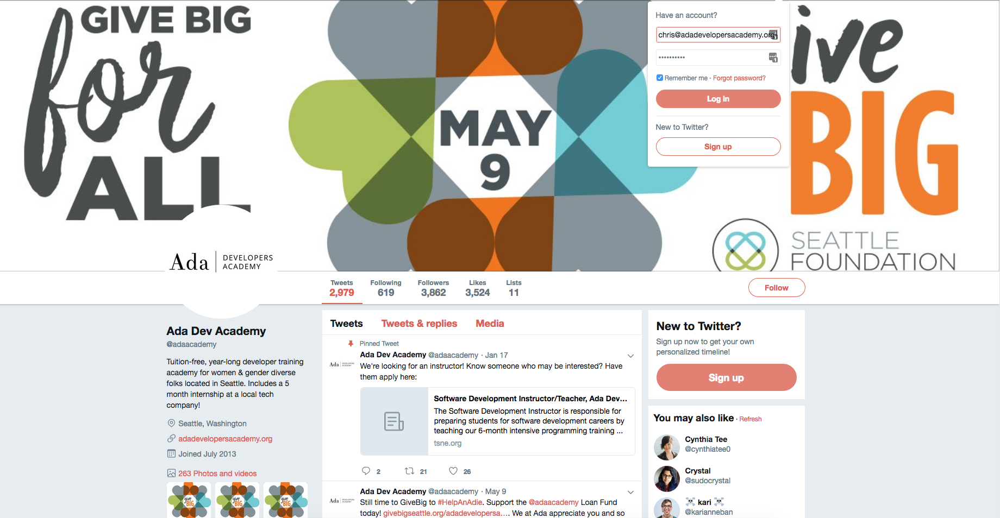

# Identifying Components - Twitter
In this exercise, we will go through twitter and brainstorm how to break down the web application into components.

We will be using Twitter as our example web application.

## Assignment

Twitter is a complicated web application and has a **large** number of potential components.  Pick out a section of the page to do your analysis on.

-   Use paper to draw out the parts of the section and identify the visual "components" the section is composed of.
-   Draw out an outline illustrating which components are nested inside containers.
-   Identify types of components which have multiple instances in the app.
