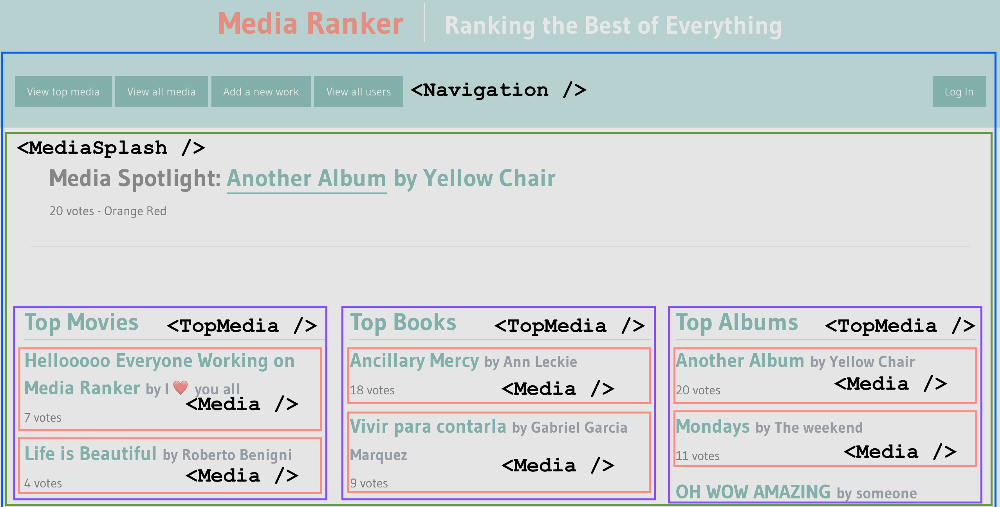

# Identifying Components
In this exercise, we will go through a popular website and brainstorm how to break down the web application into components.

To get you started, we've done an example of this using the MediaRanker application that you're already familiar with.

<!-- https://docs.google.com/drawings/d/1zWLaZfPatvVE7cFS2qdpnOLgsyW45ZJP1YDEGWECi7g/edit -->

Break into pairs and take a look at CraigsList. Identify the visual "components" the website is comprised of. We suggest using using your white board or paper to draw these out on your table!

As you're drawing this out, think about the following questions:
- Where do you see "nested components"? Where do you not?
- Are there any components that share the same structure?
- Of these similar components, what is different about them?
