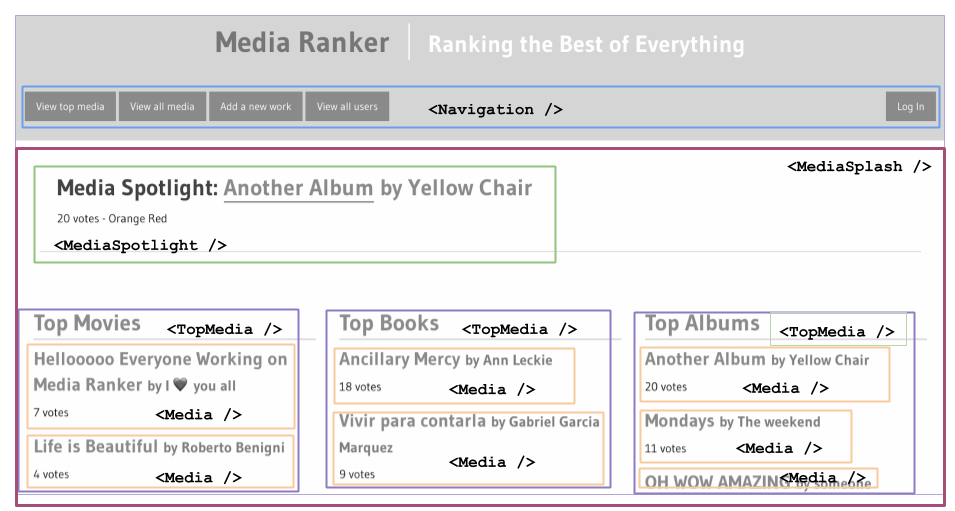

# Identifying Components

## Part One: Do you Agree or Disagree
In this exercise, we will go through a popular website and brainstorm how to break down the web application into components.

To get you started, we've done an example of this using a MediaRanker application.

Look at this screenshot of a MediaRanker application (the site in black and white). We've outline the components in colorful boxes and titles.

<!-- https://docs.google.com/drawings/d/1zWLaZfPatvVE7cFS2qdpnOLgsyW45ZJP1YDEGWECi7g/edit -->

Our list of proposed components from this website is:

- Navigation
- MediaSpotlight
- TopMedia
- Media

Answer the following questions:

- For each component, what is its name, what does it represent?
- For each component, what website elements are inside of it?
- For each component, is it a sibling to another component?
- For each component, are there another components nested inside of it?
- For each component, does it get used more than once in this page? If yes, what are the differences in UI between each time it's used?
- Do you agree with this list of components, what they represent, and how they're named? Do you have any disagreements, or other ideas?

## Part Two: Make a List of Possible Components with CraigsList

Break into pairs and take a look at [CraigsList](https://seattle.craigslist.org/).

Identify the visual "components" the website is comprised of, and create a list of components that a React CraigsList would need, just like above.

We suggest using using your white board or paper to draw these out on your table!

Hint: As you're drawing this out, think about the following questions:

- Which components are repeated (they have the same structure and represent the same thing) throughout the page?
  - Of these repeated components, what is similar between them? What is different between them?
- Where do you see "nested components"? Which components are inside of others? How many layers of components exist?
- Where do you see sibling components? Which components are siblings to each other?
